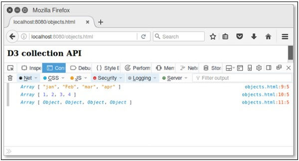
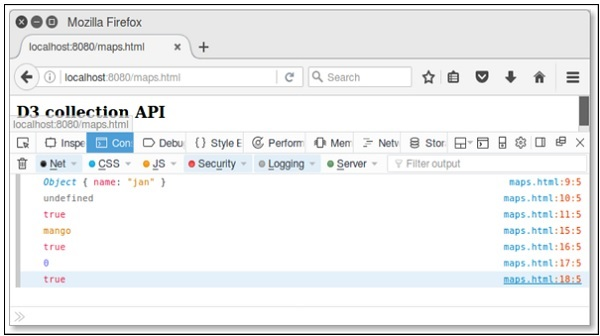
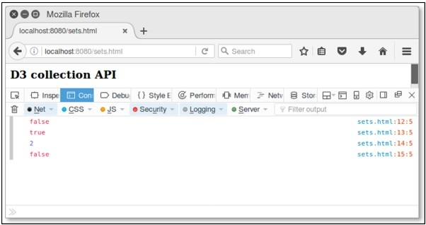

# D3.js - Collections API
A collection is simply an object that groups multiple elements into a single unit. It is also called as a container. This chapter explains about collections API in detail.

## Configuring API
You can configure the API using the following script.

```
<script src = "https://d3js.org/d3-collection.v1.min.js"></script>
<script>

</script>
```
## Collections API Methods
Collections API contains objects, maps, sets and nests. Following are the most commonly used collections API methods.

   * Objects API
   * Maps API
   * Sets API
   * Nests API

Let us go through each of these API in detail.

### Objects API
Object API is one of the important data type. It supports the following methods −

   * **d3.keys(object)** − This method contains the object property keys and returns an array of the property names.
   * **d3.values(object)** − This method contains the object values and returns an array of property values.
   * **d3.entries(object)** − This method is used to return an array containing both keys and values of the specified object. Each entry is an object with a key and value.

**Example** − Let us consider the following code.

```
d3.entries({one: 1})
```
Here, key is one and value is 1.

**Example** − Create a webpage **objects.html** and add the following changes to it.

```
<html>
   <head>
      <script type = "text/javascript" src = "https://d3js.org/d3.v4.min.js"></script>
   </head>

   <body>
      <h3>D3 collection API</h3>
      <script>
         var month = {"jan": 1, "Feb": 2, "mar": 3, "apr": 4};
         console.log(d3.keys(month));
         console.log(d3.values(month));
         console.log(d3.entries(month));
      </script>
   </body>
</html>
```
Now, request the browser and you will see the following response.

<iframe style="margin:5px;" frameborder="0" scrolling="0" width="660px" height="150px" src="../prototype/src/objects.htm"></iframe>



### Maps API
A map contains values based on key and value pairs. Each key and value pair is known as an entry. A Map contains only unique keys. It is useful to search, update or delete elements based on the key. Let us go through the various Maps API methods in detail.

   * **d3.map([object[, key]])** − This method is used to create a new map. Object is used to copy all enumerable properties.
   * **map.has(key)** − This method is used to check whether map has an entry for the specified key string.
   * **map.get(key)** − This method is used to return the value for the specified key string.
   * **map.set(key, value)** − This method is used to set the value for the specified key string. If the map previously had an entry for the same key string, the old entry is replaced with the new value.
   * **map.remove(key)** − It is used to remove the map entry. If the key is not specified, it returns false.
   * **map.clear()** − Removes all entries from this map.
   * **map.keys()** − Returns an array of string keys for every entry in this map.
   * **map.values()** − Returns an array of values for every entry in this map.
   * **map.entries()** − Returns an array of key-value objects for each entry in this map.
   * **(x) map.each(function)** − This method is used to call the specified function for each entry in the map.
   * **(xi) map.empty()** − Returns true if and only if this map has zero entries.
   * **(xii) map.size()** − Returns the number of entries in this map.

**Example** − Create a webpage **maps.html** and add the following changes to it.

```
<html>
   <head>
      <script type = "text/javascript" src = "https://d3js.org/d3.v4.min.js"></script>
   </head>

   <body>
      <h3>D3 collection API</h3>
      <script>
         var month = d3.map([{name: "jan"}, {name: "feb"}], 
            function(d) { return d.name; });
         console.log(month.get("jan")); // {"name": "jan"}
         console.log(month.get("apr")); // undefined
         console.log(month.has("feb")); // true
         
         var map =  d3.map().set("fruit", "mango");
         console.log(map.get("fruit")); // mango
         console.log(map.remove("fruit")); // remove key and return true.
         console.log(map.size());    // size is 0 because key removed.
         console.log(map.empty());   // true
      </script>
   </body>
</html>
```
Now, request the browser and we will see the following response.

<iframe style="margin:5px;" frameborder="0" scrolling="0" width="660px" height="150px" src="../prototype/src/maps.htm"></iframe>



Similarly, you can perform other operations as well.

### Sets API
A Set is a Collection that cannot contain duplicate elements. It models the mathematical set abstraction. Let us go through the various Sets API methods in detail.

   * **d3.set([array[, accessor]])** − This method is used to create a new set. Array is used to add string values. An accessor is optional.
   * **set.has(value)** − This method is used to check whether the set has an entry for the specified value string.
   * **set.add(value)** − It is used to add the specified value string to the set.
   * **set.remove(value)** − It is used to remove the set that contains the specified value string.
   * **set.clear()** − Removes all the values from this set.
   * **set.values()** − This method is used to return an array of values to the set.
   * **set.empty()** − Returns true if and only if this set has zero values.
   * **set.size()** − Returns the number of values in this set.

**Example** − Create a webpage **sets.html** and add the following changes to it.

```
<html>
   <head>
      <script type = "text/javascript" src = "https://d3js.org/d3.v4.min.js"></script>
   </head>

   <body>
      <h3>D3 collection API</h3>
      <script>
         var fruits =  d3.set().add("mango")
          .add("apple").add("orange");
         console.log(fruits.has("grapes")); // return false.
         console.log(fruits.remove("apple")); //true
         console.log(fruits.size());    // size is 2
         console.log(fruits.empty());   // true
      </script>
   </body>
</html>
```
Now, request the browser and we will see the following response on our screen.

<iframe style="margin:5px;" frameborder="0" scrolling="0" width="660px" height="150px" src="../prototype/src/sets.htm"></iframe>



Similarly, we can perform other operations as well.

### Nests API
Nesting API contains elements in array and performs in a hierarchical tree structure. Let us go through the various Nests API methods in detail.

   * **d3.nest()** − This method is used to create a new nest.
   * **nest.key(key)** − This method is used to initialize a new key function. This function is used to invoke each element in an input array and return elements in the group.
   * **nest.sortKeys(comparator)** − This method is used to sort keys in a specified comparator. Function is defined as d3.ascending or d3.descending.
   * **nest.sortValues(comparator)** − This method is used to sort values in a specified comparator. Comparator function sorts leaf elements.
   * **nest.map(array)** − This method is used to apply the specified array and in returning a nested map. Each entry in the returned map corresponds to a distinct key value returned by the first key function. The entry value depends on the number of registered key functions.
   * **nest.object(array)** − This method is used to apply the nest operator to the specified array and return a nested object.
   * **nest.entries(array)** − This method is used to apply the nest operator to the specified array and return an array of key-values entries.

Consider a simple webpage **nest.html** to perform the above discussed nest methods.

**Example** − Let us consider the following example.

```
<html>
   <head>
      <script type = "text/javascript" src = "https://d3js.org/d3.v4.min.js"></script>
   </head>

   <body>
      <h3>D3 Nest API</h3>
      <script>
         var data = [
            {
               "color" : "red",
               "key" : 1
            },
            {
               "color" : "green",
               "key" : 2
            },
            {
               "color" : "blue",
               "key" : 75
            }
         ]
         var nest =  d3.nest()
            .key(function (d) { return d.color; })
            .entries(data)console.log(nest);
         var filter = nest.filter(function (d) { return d.key = = = 'red' })
         console.log(filter);
      </script>
   </body>
</html>
```
Now, check the result in a browser and we will see the following result.

```
Array[3]
0: Object
1: Object
2: Object
length: 3
__proto__: Array[0]

Array[1]
0: Object
length: 1
__proto__: Array[0]
```

[Previous Page](../d3js/d3js_array_api.md) [Next Page](../d3js/d3js_selection_api.md) 
