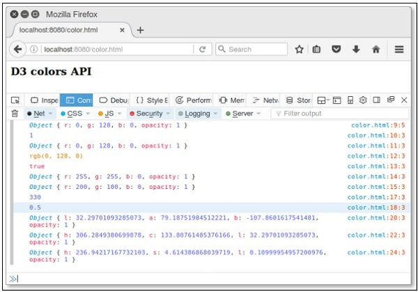

# D3.js - Colors API
Colors are displayed combining RED, GREEN and BLUE. Colors can be specified in the following different ways −

   * By color names
   * As RGB values
   * As hexadecimal values
   * As HSL values
   * As HWB values

The d3-color API provides representations for various colors. You can perform conversion and manipulation operations in API. Let us understand these operations in detail.

## Configuring API
You can directly load API using the following script.

```
<script src = "https://d3js.org/d3-color.v1.min.js"></script>
<script>

</script>
```
## Basic Operations
Let us go through the basic color operations in D3.

**Convert color value to HSL** − To convert color value to HSL, use the following **Example** −

```
var convert = d3.hsl("green");
```
You can rotate the hue by 45° as shown below.

```
convert.h + =  45;
```
Similarly, you can change the saturation level as well. To fade the color value, you can change the opacity value as shown below.

```
convert.opacity = 0.5;
```
## Color API Methods
Following are some of the most important Color API Methods.

   * d3.color(specifier)
   * color.opacity
   * color.rgb()
   * color.toString()
   * color.displayable()
   * d3.rgb(color)
   * d3.hsl(color)
   * d3.lab(color)
   * d3.hcl(color)
   * d3.cubehelix(color)

Let us understand each of these Color API Methods in detail.

### d3.color(specifier)
It is used to parse the specified CSS color and return RGB or HSL color. If specifier is not given, then null is returned.

**Example** − Let us consider the following example.

```
<script>
   var color = d3.color("green");  // asign color name directly
   console.log(color);
</script>
```
We will see the following response on our screen −

```
{r: 0, g: 128, b: 0, opacity: 1}
```
### color.opacity
If we want to fade the color, we can change the opacity value. It is in the range of [0, 1].

**Example** − Let us consider the following example.

```
<script>
   var color = d3.color("green");
   console.log(color.opacity);
</script>
```
We will see the following response on the screen −

```
1
```
### color.rgb()
It returns the RGB value for the color. Let us consider the following example.

```
<script>
   var color = d3.color("green");
   console.log(color.rgb());
</script>
```
We will see the following response on our screen.

```
{r: 0, g: 128, b: 0, opacity: 1}
```
### color.toString()
It returns a string representing the color according to the CSS Object Model specification. Let us consider the following example.

```
<script>
   var color = d3.color("green");
   console.log(color.toString());
</script>
```
We will see the following response on our screen.

```
rgb(0, 128, 0)
```
### color.displayable()
Returns true, if the color is displayable. Returns false, if RGB color value is less than 0 or greater than 255, or if the opacity is not in the range [0, 1]. Let us consider the following example.

```
<script>
   var color = d3.color("green");
   console.log(color.displayable());
</script>
```
We will see the following response on our screen.

```
true
```
### d3.rgb(color)
This method is used to construct a new RGB color. Let us consider the following example.

```
<script>
   console.log(d3.rgb("yellow"));
   console.log(d3.rgb(200,100,0));
</script>
```
We will see the following response on the screen.

```
{r: 255, g: 255, b: 0, opacity: 1}
{r: 200, g: 100, b: 0, opacity: 1}
```
### d3.hsl(color)
It is used to construct a new HSL color. Values are exposed as h, s and l properties on the returned instance. Let us consider the following example.

```
<script>
   var hsl = d3.hsl("blue");
   console.log(hsl.h + =  90);
   console.log(hsl.opacity = 0.5);
</script>
```
We will see the following response on the screen.

```
330
0.5
```
### d3.lab(color)
It constructs a new Lab color. The channel values are exposed as ‘l’, ‘a’ and ‘b’ properties on the returned instance.

```
<script>
   var lab = d3.lab("blue");
   console.log(lab);
</script>
```
We will see the following response on the screen.

```
{l: 32.29701093285073, a: 79.18751984512221, b: -107.8601617541481, opacity: 1}
```
### d3.hcl(color)
Constructs a new HCL color. The channel values are exposed as h, c and l properties on the returned instance. Let us consider the following example.

```
<script>
   var hcl = d3.hcl("blue");
   console.log(hcl);
</script>
```
We will see the following response on the screen.

```
{h: 306.2849380699878, c: 133.80761485376166, l: 32.29701093285073, opacity: 1}
```
### d3.cubehelix(color)
Constructs a new Cubehelix color. Values are exposed as h, s and l properties on the returned instance. Let us consider the following example.

```
<script>
   var hcl = d3.hcl("blue");
   console.log(hcl);
</script>
```
We will see the following response on the screen,

```
{h: 236.94217167732103, s: 4.614386868039719, l: 0.10999954957200976, opacity: 1}
```
### Working Example
Let us create a new webpage – **color.html** to perform all the color API methods. The complete code listing is defined below.

```
<html>
   <head>
      <script type = "text/javascript" src = "https://d3js.org/d3.v4.min.js"></script>
   </head>

   <body>
      <h3>D3 colors API</h3>
      <script>
         var color = d3.color("green");
         console.log(color);
         console.log(color.opacity);
         console.log(color.rgb());
         console.log(color.toString());
         console.log(color.displayable());
         console.log(d3.rgb("yellow"));
         console.log(d3.rgb(200,100,0));
         var hsl = d3.hsl("blue");
         console.log(hsl.h + =  90);
         console.log(hsl.opacity = 0.5);
         var lab = d3.lab("blue");
         console.log(lab);
         var hcl = d3.hcl("blue");
         console.log(hcl);
         var cube = d3.cubehelix("blue");
         console.log(cube);
      </script>
   </body>
</html>
```
Now, request the browser and we will see the following response.

<iframe style="margin:5px;" frameborder="0" scrolling="0" width="660px" height="150px" src="../d3js/src/color.htm"></iframe>




[Previous Page](../d3js/d3js_shapes_api.md) [Next Page](../d3js/d3js_transitions_api.md) 
