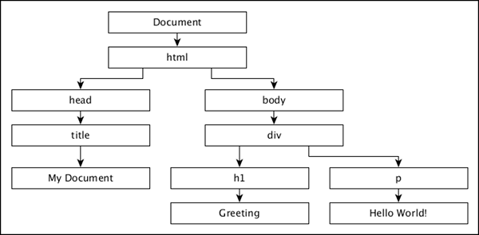

# D3.js - Concepts
D3.js is an open source JavaScript library for −

   * Data-driven manipulation of the Document Object Model (DOM).
   * Working with data and shapes.
   * Laying out visual elements for linear, hierarchical, network and geographic data.
   * Enabling smooth transitions between user interface (UI) states.
   * Enabling effective user interaction.

## Web Standards
Before we can start using D3.js to create visualizations, we need to get familiar with web standards. The following web standards are heavily used in D3.js.

   * HyperText Markup Language (HTML)
   * Document Object Model (DOM)
   * Cascading Style Sheets (CSS)
   * Scalable Vector Graphics (SVG)
   * JavaScript

Let us go through each of these web standards one by one in detail.

### HyperText Markup Language (HTML)
As we know, HTML is used to structure the content of the webpage. It is stored in a text file with the extension “.html”.

**Example** − A typical bare-bones HTML example looks like this

```
<!DOCTYPE html>
<html lang = "en">
   <head>
      <meta charset = "UTF-8">
      <title></title>
   </head>

   <body>
   </body>
</html>
```
### Document Object Model (DOM)
When a HTML page is loaded by a browser, it is converted to a hierarchical structure. Every tag in HTML is converted to an element / object in the DOM with a parent-child hierarchy. It makes our HTML more logically structured. Once the DOM is formed, it becomes easier to manipulate (add/modify/remove) the elements on the page.

Let us understand the DOM using the following HTML document −

```
<!DOCTYPE html>
<html lang = "en">
   <head>
      <title>My Document</title>
   </head>

   <body>
      <div>
         <h1>Greeting</h1>
         <p>Hello World!</p>
      </div>
   </body>
</html>
```
The document object model of the above HTML document is as follows,



### Cascading Style Sheets (CSS)
While HTML gives a structure to the webpage, CSS styles makes the webpage more pleasant to look at. CSS is a **Style Sheet Language** used to describe the presentation of a document written in HTML or XML (including XML dialects like SVG or XHTML). CSS describes how elements should be rendered on a webpage.

### Scalable Vector Graphics (SVG)
SVG is a way to render images on the webpage. SVG is not a direct image, but is just a way to create images using text. As its name suggests, it is a **Scalable Vector**. It scales itself according to the size of the browser, so resizing your browser will not distort the image. All browsers support SVG except IE 8 and below. Data visualizations are visual representations and it is convenient to use SVG to render visualizations using the D3.js.

Think of SVG as a canvas on which we can paint different shapes. So to start with, let us create an SVG tag −

```
<svg width = "500" height = "500"></<svg>
```
The default measurement for SVG is pixels, so we do not need to specify if our unit is pixel. Now, if we want to draw a rectangle, we can draw it using the code below −

```
<svg width = "500" height = "500">
   <rect x = "0" y = "0" width = "300" height = "200"></rect>
</svg>
```
We can draw other shapes in SVG such as − Line, Circle, Ellipse, Text and Path.

Just like styling HTML elements, styling SVG elements is simple. Let us set the background color of the rectangle to yellow. For that, we need to add an attribute “fill” and specify the value as yellow as shown below −

```
<svg width = "500" height = "500">
   <rect x = "0" y = "0" width = "300" height = "200" fill = "yellow"></rect>
</svg>
```
<iframe style="margin:5px;" frameborder="0" scrolling="0" width="660px" height="520px" src="../d3js/src/fill.htm"></iframe>

### JavaScript
JavaScript is a loosely typed client side scripting language that executes in the user's browser. JavaScript interacts with HTML elements (DOM elements) in order to make the web user interface interactive. JavaScript implements the **ECMAScript Standards**, which includes core features based on ECMA-262 specifications as well as other features, which are not based on the ECMAScript standards. JavaScript knowledge is a prerequisite for D3.js.


[Previous Page](../d3js/d3js_installation.md) [Next Page](../d3js/d3js_selections.md) 
