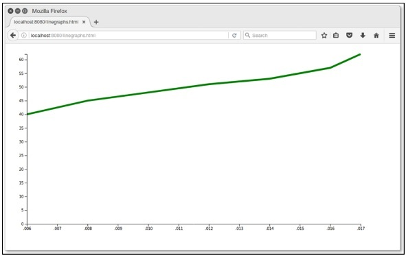

# D3.js - Graphs
A Graph is a 2-dimensional flat space represented as a rectangle. Graphs have a coordinate space where x = 0 and y = 0 coordinates fall on the bottom left. According to mathematical Cartesian coordinate space, graphs have the X coordinate growing from left to right and the Y coordinate growing from bottom to top.

When we talk about drawing a circle with x = 30 and y = 30 coordinates, we go 30 units from the bottom left to the right and then we go 30 units up.

## SVG Coordinate Space
SVG Coordinate Space works in the same way that a mathematical graph coordinate space works, except for two important features −

   * SVG Coordinate space has x = 0 and y = 0 coordinates fall on the top left.
   * SVG Coordinate space has the Y coordinate growing from top to bottom.

### SVG Coordinate Space Graph
When we talk about drawing a circle with x = 30 and y = 30 coordinates in the SVG Coordinate Space, we go 30 units from the top left to the right and then we go down 30 units up. It is defined as follows.

```
var svgContainer = d3
   .select("body")
   .append("svg")
   .attr("width", 200)
   .attr("height", 200);
```
Consider, SVG element as a graph 200 units wide and 200 units tall. We now know that the X and Y zero coordinates are at the top left. We also now know that as the Y coordinate grows, it will move from the top to the bottom of our graph. You can style the SVG elements as shown below.

```
var svgContainer = d3
   .select("body").append("svg")
   .attr("width", 200)
   .attr("height", 200)
   .style("border", "1px solid black");
```
### Graph Example
Let us consider an example of the Line graph.

**Line Graph** − A line graph is used to visualize the value of something over time. It compares two variables. Each variable is plotted along an axis. A line graph has a vertical axis and a horizontal axis.

In this example graph, we can take csv file records as Indian States Population Growth form year 2006 to 2017. Let us first create a **data.csv** to show the population records.

Create a new csv file in your D3 folder −

```
year,population
2006,40
2008,45
2010,48
2012,51
2014,53
2016,57
2017,62
```
Now, save the file and perform the following steps to draw a line graph in D3. Let us go through each step in detail.

**Step 1** − **Adding styles** − Let us add a style to the **line** class using the code given below.

```
.line {
   fill: none;
   stroke: green;
   stroke-width: 5px;
}
```
**Step 2** − **Define variables** − The SVG attributes are defined below.

```
var margin = {top: 20, right: 20, bottom: 30, left: 50},
   width = 960 - margin.left - margin.right,
   height = 500 - margin.top - margin.bottom;
```
Here, the first line defines the four margins, which surround the block where the graph is positioned.

**Step 3** − **Define line** − Draw a new line using the **d3.line()** function, which is shown below.

```
var valueline = d3.line()
   .x(function(d) { return x(d.year); })
   .y(function(d) { return y(d.population); });
```
Here, Year represents the data in the X-axis records and the population refers to the data in the Y-axis.

**Step 4** − **Append SVG attributes** − Append SVG attributes and group elements using the code below.

```
var svg = d3.select("body").append("svg")
   .attr("width", width + margin.left + margin.right)
   .attr("height", height + margin.top + margin.bottom)
   .append("g").attr("transform",
      "translate(" + margin.left + "," + margin.top + ")");
```
Here, we have appended the group elements and applied the transformation.

**Step 5** − **Read data** − Now, we can read data from our dataset **data.csv**.

```
d3.csv("data.csv", function(error, data) {
   if (error) throw error;
}
```
Here, the data.csv is not present, it throws an error.

**Step 6** − **Format data** − Now, format the data using the code below.

```
data.forEach(function(d) {
   d.year = d.year;
   d.population = +d.population;
});
```
This above code ensures that all the values that are pulled out of the csv file are set and formatted correctly. Each row consists of two values − one value for ‘year’ and another value for ‘population’. The function is pulling out values of ‘year’ and ‘population’ one row at a time.

**Step 7** − **Set scale range** − After data formatted, you can set the scale range for X and Y.

```
x.domain(d3.extent(data, function(d) { return d.year; }));
y.domain([0, d3.max(data, function(d) { return d.population; })]);
```
**Step 8** − **Append path** − Append path and data as shown below.

```
svg.append("path").data([data])
   .attr("class", "line").attr("d", valueline);
```
**Step 9** − **Add X-axis** − Now, you can add X-axis using the code below.

```
svg.append("g")
   .attr("transform", "translate(0," + height + ")")
   .call(d3.axisBottom(x));
```
**Step 10** − **Add Y-axis** − We can add Y-axis to the group as shown below.

```
svg.append("g")
   .call(d3.axisLeft(y));
```
**Step 11** − **Working Example** − The complete code is given in the following code block. Create a simple webpage **linegraphs.html** and add the following changes to it.

**graph.html**

```
<!DOCTYPE html>
<html>
   <head>
      <script type = "text/javascript" src = "https://d3js.org/d3.v4.min.js"></script>
      <style> 
         .line {
            fill: none;
            stroke: green;
            stroke-width: 5px;
         }
      </style>
   </head>

   <body>
      <script>
         // set the dimensions and margins of the graph
         var margin = {top: 20, right: 20, bottom: 30, left: 50},
         width = 960 - margin.left - margin.right,
         height = 500 - margin.top - margin.bottom;

         // set the ranges
         var x = d3.scaleTime().range([0, width]);
         var y = d3.scaleLinear().range([height, 0]);

         // define the line
         var valueline = d3.line()
            .x(function(d) { return x(d.year); })
            .y(function(d) { return y(d.population); });

         // append the svg obgect to the body of the page
         // appends a 'group' element to 'svg'
         // moves the 'group' element to the top left margin
         var svg = d3.select("body").append("svg")
            .attr("width", width + margin.left + margin.right)
            .attr("height", height + margin.top + margin.bottom)
            .append("g").attr("transform",
               "translate(" + margin.left + "," + margin.top + ")");

         // Get the data
         d3.csv("data.csv", function(error, data) {
            if (error) throw error;
            // format the data
            data.forEach(function(d) {
               d.year = d.year;
               d.population = +d.population;
            });

            // Scale the range of the data
            x.domain(d3.extent(data, function(d) { return d.year; }));
            y.domain([0, d3.max(data, function(d) { return d.population; })]);

            // Add the valueline path.
            svg.append("path")
               .data([data])
               .attr("class", "line")
               .attr("d", valueline);

            // Add the X Axis
            svg.append("g")
               .attr("transform", "translate(0," + height + ")")
               .call(d3.axisBottom(x));

            // Add the Y Axis
            svg.append("g")
               .call(d3.axisLeft(y));
         });
      </script>
   </body>
</html>
```
Now request the browser and we will see the following result.

<iframe style="margin:5px;" frameborder="0" scrolling="0" width="660px" height="150px" src="../d3js/src/graph.htm"></iframe>




[Previous Page](../d3js/d3js_drawing_charts.md) [Next Page](../d3js/d3js_geographies.md) 
