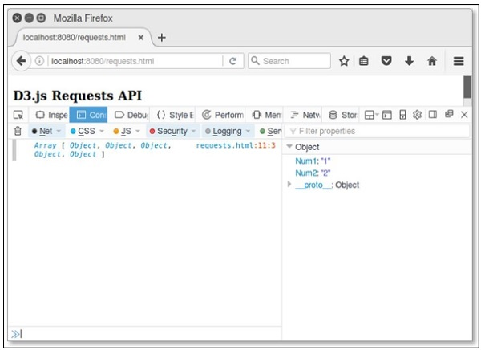
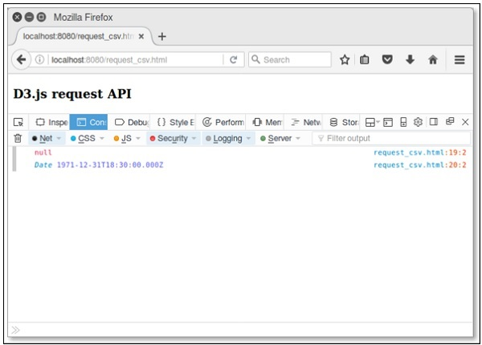

# D3.js - Requests API
D3.js provides a request API to perform the XMLHttpRequest. This chapter explains the various requests API in detail.

## XMLHttpRequest
XMLHttpRequest is the built-in http client to emulate the browser XMLHttpRequest object. It can be used with JS designed for browsers to improve reuse of code and allow the use of existing libraries.

You can include the module in your project and use as the browser-based XHR object as explained below.

```
var XMLHttpRequest = require("xmlhttprequest").XMLHttpRequest;
var xhr = new XMLHttpRequest();
```
It supports both async and synchronous requests and it performs GET, POST, PUT, and DELETE requests.

## Configuring Requests
You can load directly from “d3js.org” using the script below.

```
<script src = "https://d3js.org/d3-request.v1.min.js"></script>
<script>
   d3.json("/path/to/sample.json", callback);
</script>
```
Here, the requests API have built-in support for parsing JSON, CSV and TSV. You can parse additional formats by using the request or text directly.

### Load Text Files
To load a text file, use the following syntax.

```
d3.text("/path/to/sample.txt", function(error, text) {
   if (error) throw error;
   console.log(text); 
});
```
### Parsing CSV files
To load and parse a CSV file, use the following syntax.

```
d3.csv("/path/to/sample.csv", function(error, data) {
   if (error) throw error;
   console.log(data); 
});
```
Similarly, you can load the JSON and TSV files as well.

### Working Example
Let us go through a simple example for how to load and parse a CSV file. Before that, you need to create a CSV file named “sample.csv” in your d3 application folder as shown below.

```
Num1,Num2
1,2
3,4
5,6
7,8
9,10
```
Now, create a webpage “requests.html” using the following script.

```
<!DOCTYPE html>
<html>
   <head>
      <script type = "text/javascript" src = "https://d3js.org/d3.v4.min.js"></script>
   </head>

   <body>
      <h3> D3.js Requests API </h3>
      <script>
         d3.csv("sample.csv", function(data) {
            console.log(data); 
         });
      </script>
   </body>
</html>
```
Now, request the browser and you will see the following response,

<iframe style="margin:5px;" frameborder="0" scrolling="0" width="660px" height="150px" src="../d3js/src/requests.htm"></iframe>



## Requests API Methods
Following are some of the most commonly used Requests API methods.

   * d3.request(url[, callback])
   * request.header(name[, value])
   * request.mimeType([type])
   * request.user([value])
   * request.password([value])
   * request.timeout([timeout])
   * request.get([data])
   * request.post([data])
   * request.send(method[, data])
   * request.abort()
   * d3.csv(url[[, row], callback])

Let us now discuss each of these in brief.

### d3.request(url[, callback])
It returns a new request for the given URL. If a callback is assigned, it is considered as a calling request otherwise request is not yet called. It is defined below.

```
d3.request(url)
   .get(callback);
```
You can post some query parameters using the following syntax.

```
d3.request("/path/to/resource")
   .header("X-Requested-With", "XMLHttpRequest")
   .header("Content-Type", "application/x-www-form-urlencoded")
   .post("a = 2&b = 3", callback);
```
If you wish to specify a request header or a mime type, you must not specify a callback to the constructor.

### request.header(name[, value])
It is used to set the value to the request header with the specified name. If no value is specified, it removes the request header with the specified name. It is defined below.

```
d3.request(url)
   .header("Accept-Language", "en-US")
   .header("X-Requested-With", "XMLHttpRequest")
   .get(callback);
```
Here, X-Requested-With header to XMLHttpRequest is a default request.

### request.mimeType([type])
It is used to assign the mime type to the given value. It is defined below.

```
d3.request(url)
   .mimeType("text/csv")
   .get(callback);
```
### request.user([value])
It is used to assign the username for authentication. If a username is not specified, it defaults to null.

### request.password([value])
If a value is specified, it sets the password for authentication.

### request.timeout([timeout])
If a timeout is specified, it sets the timeout to the specified number of milliseconds.

### request.get([data])
This method is used to send the request with the GET method. It is defined below.

```
request.send("GET", data, callback);
```
### request.post([data])
This method is used to send the request with the POST method. It is defined below.

```
request.send("POST", data, callback);
```
### request.send(method[, data])
This method is used to send the request using the given GET or POST method.

### request.abort()
This method is used to abort the request.

### d3.csv(url[[, row], callback])
Returns a new request for the CSV file at the specified URL with the default Mime type text/csv. The following syntax shows with no callback.

```
d3.request(url)
   .mimeType("text/csv")
   .response(function(xhr) { return d3.csvParse(xhr.responseText, row); });
```
If you specify a callback with the POST method, it is defined below.

```
d3.request(url)
   .mimeType("text/csv")
   .response(function(xhr) { return d3.csvParse(xhr.responseText, row); })
   .post(callback);
```
### Example
Create a csv file named “lang.csv” in your d3 application root folder directory and add the following changes to it.

```
Year,Language,Author
1972,C,Dennis Ritchie
1995,Java,James gosling
2011,D3 js,Mike Bostock
```
Create a webpage “csv.html” and add the following script to it.

```
<!DOCTYPE html>
<html>
   <head>
      <script type = "text/javascript" src = "https://d3js.org/d3.v4.min.js"></script>
   </head>

   <body>
      <h3> D3.js request API</h3>
      <script>
         d3.csv("lang.csv", function(d) {
            return {
               year: new Date(+d.Year, 0, 1), // convert "Year" column to Date
               language: d.Language,
               author: d.Author,
            };
         }, function(error, rows) {
            console.log(error);
            console.log(rows[0].year);
         });
      </script>
   </body>
</html>
```
Now, request the browser and we will see the following response.

<iframe style="margin:5px;" frameborder="0" scrolling="0" width="660px" height="150px" src="../d3js/src/csv.htm"></iframe>




[Previous Page](../d3js/d3js_zooming_api.md) [Next Page](../d3js/d3js_delimiterseparated_values_api.md) 
