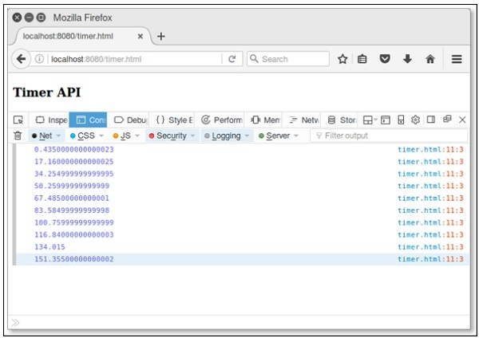

# D3.js - Timer API
Timer API module is used to perform the concurrent animations with synchronized timing delay. It uses **requestAnimationFrame** for animation. This chapter explains Timer API module in detail.

## requestAnimationFrame
This method tells the browser that you wish to perform an animation and requests that the browser call a specified function to update an animation.

## Configuring Timer
We can easily load the timer directly from d3js.org by using the following script.

```
<script src = "https://d3js.org/d3-timer.v1.min.js"></script>
<script>
   var timer = d3.timer(callback);
</script>
```
## Timer API Methods
The Timer API supports the following important methods. All of these are explained in detail as follows.

### d3.now()
This method returns the current time.

### d3.timer(callback[, delay[, time]])
This method is used to schedule a new timer and invokes the timer until stopped. You can set a numeric delay in MS, but it is optional otherwise, it defaults to zero. If time is not specified, it is considered as d3.now().

### timer.restart(callback[, delay[, time]])
Restart a timer with the specified callback and optional delay and time.

### timer.stop()
This method stops the timer, preventing subsequent callbacks.

### d3.timeout(callback[, delay[, time]])
It is used to stop the timer on its first callback. Callback is passed as the elapsed time.

### d3.interval(callback[, delay[, time]])
It is invoked on a particular time delay interval. If delay is not specified, it takes the timer time.

### Example
Create a webpage “timer.html” and add the following script to it.

```
<!DOCTYPE html>
<html>
   <head>
      <script type = "text/javascript" src = "https://d3js.org/d3.v4.min.js"></script>
   </head>

   <body>
      <h3> Timer API </h3>
      <script>
         var timer = d3.timer(function(duration) {
            console.log(duration);
            if (duration > 150) timer.stop();
         }, 100);
      </script>
   </body>
</html>
```
We will see the following response on the screen.

<iframe style="margin:5px;" frameborder="0" scrolling="0" width="660px" height="150px" src="../d3js/src/timer.htm"></iframe>




[Previous Page](../d3js/d3js_delimiterseparated_values_api.md) [Next Page](../d3js/d3js_working_example.md) 
