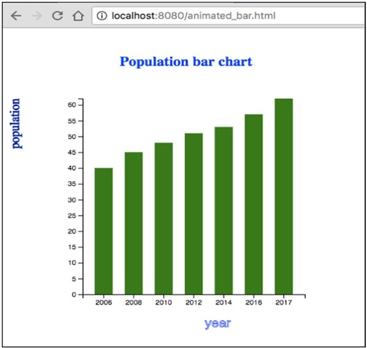

# D3.js - Working Example
Let us perform an animated bar chart in this chapter. For this example, we take the data.csv file used in the previous chapter of the population records as dataset and generate an animated bar chart.

To do this, we need to perform the following steps −

**Step 1** − **Apply styles** − Apply CSS styles using the coding given below.

```
<style>
   .bar {
      fill: green;
   }
   
   .highlight {
      fill: red;
   }
   
   .title {
      fill: blue;
      font-weight: bold;
   }
</style>
```
**Step 2** − **Define variables** − Let us define the SVG attributes using the script below.

```
<script>
   var svg = d3.select("svg"), margin = 200,
   width = svg.attr("width") - margin,
   height = svg.attr("height") - margin;
</script>
```
**Step 3** − **Append text** − Now, append text and apply the transformation using the coding below.

```
svg.append("text")
   .attr("transform", "translate(100,0)")
   .attr("x", 50)
   .attr("y", 50)
   .attr("font-size", "20px")
   .attr("class", "title")
   .text("Population bar chart")
```
**Step 4** − **Create scale range** − In this step, we can create a scale range and append the group elements. It is defined below.

```
var x = d3.scaleBand().range([0, width]).padding(0.4),
   y = d3.scaleLinear()
      .range([height, 0]);
   var g = svg.append("g")
      .attr("transform", "translate(" + 100 + "," + 100 + ")");
```
**Step 5** − **Read data** − We have already created the **data.csv** file in our previous examples. The same file, we have used here.

```
year,population
2006,40
2008,45
2010,48
2012,51
2014,53
2016,57
2017,62
```
Now, read the above file using the code below.

```
d3.csv("data.csv", function(error, data) {
   if (error) {
      throw error;
   }
```
**Step 6** − **Set domain** − Now, set the domain using the coding below.

```
x.domain(data.map(function(d) { return d.year; }));
y.domain([0, d3.max(data, function(d) { return d.population; })]);
```
**Step 7** − **Add X-axis** − Now, you can add the X-axis to the transformation. It is shown below.

```
g.append("g")
   .attr("transform", "translate(0," + height + ")")
   .call(d3.axisBottom(x)).append("text")
   .attr("y", height - 250).attr("x", width - 100)
   .attr("text-anchor", "end").attr("font-size", "18px")
   .attr("stroke", "blue").text("year");
```
**Step 8** − **Add Y-axis** − Add the Y-axis to the transformation using the code given below.

```
g.append("g")
   .append("text").attr("transform", "rotate(-90)")
   .attr("y", 6).attr("dy", "-5.1em")
   .attr("text-anchor", "end").attr("font-size", "18px")
   .attr("stroke", "blue").text("population");
```
**Step 9** − **Append group elements** − Now, append the group elements and apply transformation to Y-axis as defined below.

```
g.append("g")
   .attr("transform", "translate(0, 0)")
   .call(d3.axisLeft(y))
```
**Step 10** − **Select the bar class** − Now, select all the elements in the bar class as defined below.

```
g.selectAll(".bar")
   .data(data).enter()
   .append("rect")
   .attr("class", "bar")
   .on("mouseover", onMouseOver) 
   .on("mouseout", onMouseOut)
   .attr("x", function(d) { return x(d.year); })
   .attr("y", function(d) { return y(d.population); })
   .attr("width", x.bandwidth())
   .transition()
   .ease(d3.easeLinear)
   .duration(200)
   .delay(function (d, i) {
      return i * 25;
   })
   .attr("height", function(d) { return height - y(d.population); });
});
```
Here, we added the listener event for the mouseout and mouseover to perform animation. It applies the animation, when the mouse hovers over a particular bar and goes out of it. These functions are explained in the following step.

The **.ease(d3.easeLinear)** function is used to perform apparent motion in animation. It processes the slow-in and the slow-out motion with a duration of 200. The delay can be calculated using −

```
.delay(function (d, i) {
   return i * 25;
})
```
**Step 11** − **Mouseover event handler function** − Let us create a mouseover event handler to handle a mouse event as shown below.

```
function onMouseOver(d, i) {
   d3.select(this)
      .attr('class', 'highlight');
   d3.select(this)
      .transition()
      .duration(200)
      .attr('width', x.bandwidth() + 5)
      .attr("y", function(d) { return y(d.population) - 10; })
      .attr("height", function(d) { return height - y(d.population) + 10; });
   g.append("text")
      .attr('class', 'val') 
   
   .attr('x', function() {
      return x(d.year);
   })
   
   .attr('y', function() {
      return y(d.value) - 10;
   })
}
```
Here, in the mouseover event, we want to increase the bar width and height, and the bar color of the selected bar to red. For the color, we have added a class ‘highlight’, which changes the color of the selected bar to red.

A transition function to the bar for the duration of 200 milliseconds. When we increase the width of the bar by 5px, and the height by 10px, the transition from the previous width and height of the bar to the new width and height will be for the duration of 200 milliseconds.

Next, we calculated a new ‘y’ value to the bar, so that the bar does not distort due to the new height value.

**Step 12** − **Mouseout event handler function** − Let us create a mouseout event handler to handle a mouse event. It is defined below.

```
function onMouseOut(d, i) {
   d3.select(this).attr('class', 'bar');
   
   d3.select(this)
      .transition()     
      .duration(400).attr('width', x.bandwidth())
      .attr("y", function(d) { return y(d.population); })
      .attr("height", function(d) { return height - y(d.population); });
   
   d3.selectAll('.val')
      .remove()
}
```
Here, in the mouseout event, we want to remove the selection features that we had applied in the mouseover event. Therefore, we revert the bar class to the original ‘bar’ class and restore the original width and height of the selected bar and restore the y value to the original value.

The **d3.selectAll(‘.val’).remove()** function is used to remove the text value we had added during the bar selection.

**Step 13** − **Working Example** − The complete program is given in the following code block. Create a webpage **animated_bar.html** and add the following changes to it.

```
<!DOCTYPE html>
<html>
   <head>
      <style>
         .bar {
            fill: green;
         }
        
         .highlight {
            fill: red;
         }
         
         .title {
            fill: blue;
            font-weight: bold;
         }
      </style>
      <script src = "https://d3js.org/d3.v4.min.js"></script>
      <title> Animated bar chart </title>
   </head>

   <body>
      <svg width = "500" height = "500"></svg>
      <script>
         var svg = d3.select("svg"),
         margin = 200, width = svg.attr("width") - margin,
         height = svg.attr("height") - margin;
         
         svg.append("text")
            .attr("transform", "translate(100,0)")
            .attr("x", 50).attr("y", 50)
            .attr("font-size", "20px")
            .attr("class", "title")
            .text("Population bar chart")
            
         var x = d3.scaleBand().range([0, width]).padding(0.4),
         y = d3.scaleLinear().range([height, 0]);
            
         var g = svg.append("g")
            .attr("transform", "translate(" + 100 + "," + 100 + ")");

         d3.csv("data.csv", function(error, data) {
            if (error) {
               throw error;
            }
               
            x.domain(data.map(function(d) { return d.year; }));
            y.domain([0, d3.max(data, function(d) { return d.population; })]);
                     
            g.append("g")
               .attr("transform", "translate(0," + height + ")")
               .call(d3.axisBottom(x))
               .append("text")
               .attr("y", height - 250)
               .attr("x", width - 100)
               .attr("text-anchor", "end")
               .attr("font-size", "18px")
               .attr("stroke", "blue").text("year");
               
            g.append("g")
               .append("text")
               .attr("transform", "rotate(-90)")
               .attr("y", 6)
               .attr("dy", "-5.1em")
               .attr("text-anchor", "end")
               .attr("font-size", "18px")
               .attr("stroke", "blue")
               .text("population");
                         
            g.append("g")
               .attr("transform", "translate(0, 0)")
               .call(d3.axisLeft(y))

            g.selectAll(".bar")
               .data(data)
               .enter()
               .append("rect")
               .attr("class", "bar")
               .on("mouseover", onMouseOver) 
               .on("mouseout", onMouseOut)   
               .attr("x", function(d) { return x(d.year); })
               .attr("y", function(d) { return y(d.population); })
               .attr("width", x.bandwidth()).transition()
               .ease(d3.easeLinear).duration(200)
               .delay(function (d, i) {
                  return i * 25;
               })
                  
            .attr("height", function(d) { return height - y(d.population); });
         });
          
          
         function onMouseOver(d, i) {
            d3.select(this)
            .attr('class', 'highlight');
               
            d3.select(this)
               .transition()     
               .duration(200)
               .attr('width', x.bandwidth() + 5)
               .attr("y", function(d) { return y(d.population) - 10; })
               .attr("height", function(d) { return height - y(d.population) + 10; });
              
            g.append("text")
               .attr('class', 'val')
               .attr('x', function() {
                  return x(d.year);
               })
               
            .attr('y', function() {
               return y(d.value) - 10;
            })
         }
          
         function onMouseOut(d, i) {
             
            d3.select(this)
               .attr('class', 'bar');
            
            d3.select(this)
               .transition()     
               .duration(200)
               .attr('width', x.bandwidth())
               .attr("y", function(d) { return y(d.population); })
               .attr("height", function(d) { return height - y(d.population); });
            
            d3.selectAll('.val')
               .remove()
         }
      </script>
   </body>
</html>
```
Now, request the browser and we will see the following response.

<iframe style="margin:5px;" frameborder="0" scrolling="0" width="660px" height="150px" src="../d3js/src/animated_bar.htm"></iframe>



If we select any bar, it will be highlighted in red color. D3 is a general-purpose visualization library that deals with the transformation of data into information, documents, elements, etc., and ultimately helps in creating data visualization.


[Previous Page](../d3js/d3js_timer_api.md) [Next Page](../d3js/d3js_quick_guide.md) 
