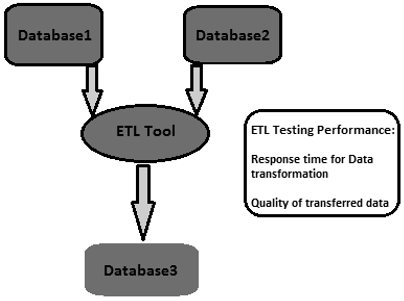

# ETL Testing – Performance
ETL performance tuning is used to ensure if an ETL system can handle an expected load of multiple users and transactions. Performance tuning typically involves server-side workload on the ETL system. It is used to test the server response in multiuser environment and to find bottlenecks. These can be found in source and target systems, mapping of systems, configuration like session management properties, etc.

## How to Perform ETL Testing Performance Tuning?
Follow the steps given below to perform ETL testing performance tuning −

   * **Step 1** − Find the load that is being transformed in production.
   * **Step 2** − Create new data of that same load or move from Production data to your local performance server.
   * **Step 3** − Disable the ETL until you generate the load required.
   * **Step 4** − Take the count of the needed data from the tables of the database.
   * **Step 5** − Note down the last run of ETL and enable the ETL, so that it will get enough stress to transform the entire load created. Run it
   * **Step 6** − After the ETL completes its run, take the count of the data created.

## Key Performance Indicators
   * Find out the total time it took to transform the load.
   * Find out whether performance time has improved or dropped.
   * Check that the entire expected load got extracted and transferred.

[Previous Page](../etl_testing/etl_testing_scenarios.md) [Next Page](../etl_testing/etl_testing_scalability.md) 
