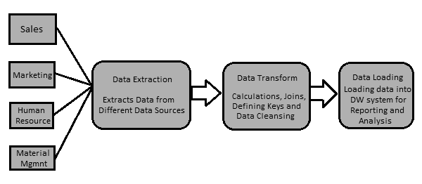
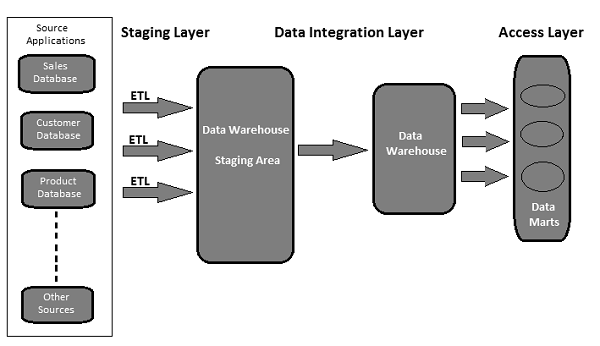

# ETL Testing - Quick Guide
# ETL Testing – Introduction
The data in a Data Warehouse system is loaded with an ETL (Extract, Transform, Load) tool. As the name suggests, it performs the following three operations −

   * Extracts the data from your transactional system which can be an Oracle, Microsoft, or any other relational database,
   * Transforms the data by performing data cleansing operations, and then
   * Loads the data into the OLAP data Warehouse.

You can also extract data from flat files like spreadsheets and CSV files using an ETL tool and load it into an OLAP data warehouse for data analysis and reporting. Let us take an example to understand it better.

### Example
Let us assume there is a manufacturing company having multiple departments such as sales, HR, Material Management, EWM, etc. All these departments have separate databases which they use to maintain information w.r.t. their work and each database has a different technology, landscape, table names, columns, etc. Now, if the company wants to analyze historical data and generate reports, all the data from these data sources should be extracted and loaded into a Data Warehouse to save it for analytical work.

An ETL tool extracts the data from all these heterogeneous data sources, transforms the data (like applying calculations, joining fields, keys, removing incorrect data fields, etc.), and loads it into a Data Warehouse. Later, you can use various Business Intelligence (BI) tools to generate meaningful reports, dashboards, and visualizations using this data.

## Difference between ETL and BI Tools
An ETL tool is used to extract data from different data sources, transform the data, and load it into a DW system; however a BI tool is used to generate interactive and ad-hoc reports for end-users, dashboard for senior management, data visualizations for monthly, quarterly, and annual board meetings.

The most common ETL tools include − SAP BO Data Services (BODS), Informatica – Power Center, Microsoft – SSIS, Oracle Data Integrator ODI, Talend Open Studio, Clover ETL Open source, etc.

Some popular BI tools include − SAP Business Objects, SAP Lumira, IBM Cognos, JasperSoft, Microsoft BI Platform, Tableau, Oracle Business Intelligence Enterprise Edition, etc.

## ETL Process
Let us now discuss in a little more detail the key steps involved in an ETL procedure −

### Extracting the Data
It involves extracting the data from different heterogeneous data sources. Data extraction from a transactional system varies as per the requirement and the ETL tool in use. It is normally done by running scheduled jobs in off-business hours like running jobs at night or over the weekend.



### Transforming the Data
It involves transforming the data into a suitable format that can be easily loaded into a DW system. Data transformation involves applying calculations, joins, and defining primary and foreign keys on the data. For example, if you want % of total revenue which is not in database, you will apply % formula in transformation and load the data. Similarly, if you have the first name and the last name of users in different columns, then you can apply a concatenate operation before loading the data. Some data doesn’t require any transformation; such data is known as **direct move** or **pass through data**.

Data transformation also involves data correction and cleansing of data, removing incorrect data, incomplete data formation, and fixing data errors. It also includes data integrity and formatting incompatible data before loading it into a DW system.

### Loading the Data into a DW System
It involves loading the data into a DW system for analytical reporting and information. The target system can be a simple delimited flat file or a data warehouse.

## ETL Tool Function
A typical ETL tool-based data warehouse uses staging area, data integration, and access layers to perform its functions. It’s normally a 3-layer architecture.

   * **Staging Layer** − The staging layer or staging database is used to store the data extracted from different source data systems.
   * **Data Integration Layer** − The integration layer transforms the data from the staging layer and moves the data to a database, where the data is arranged into hierarchical groups, often called **dimensions**, and into **facts** and **aggregate facts**. The combination of facts and dimensions tables in a DW system is called a **schema**.
   * **Access Layer** − The access layer is used by end-users to retrieve the data for analytical reporting and information.

The following illustration shows how the three layers interact with each other.



# ETL Testing - Tasks
ETL testing is done before data is moved into a production data warehouse system. It is sometimes also called as **table balancing** or **production reconciliation**. It is different from database testing in terms of its scope and the steps to be taken to complete this.

The main objective of ETL testing is to identify and mitigate data defects and general errors that occur prior to processing of data for analytical reporting.

## ETL Testing – Tasks to be Performed
Here is a list of the common tasks involved in ETL Testing −

   * Understand the data to be used for reporting
   * Review the Data Model
   * Source to target mapping
   * Data checks on source data
   * Packages and schema validation
   * Data verification in the target system
   * Verification of data transformation calculations and aggregation rules
   * Sample data comparison between the source and the target system
   * Data integrity and quality checks in the target system
   * Performance testing on data

# ETL vs Database Testing
Both ETL testing and database testing involve data validation, but they are not the same. ETL testing is normally performed on data in a data warehouse system, whereas database testing is commonly performed on transactional systems where the data comes from different applications into the transactional database.

Here, we have highlighted the major differences between ETL testing and Database testing.

## ETL Testing
ETL testing involves the following operations −

   * Validation of data movement from the source to the target system.
   * Verification of data count in the source and the target system.
   * Verifying data extraction, transformation as per requirement and expectation.
   * Verifying if table relations − joins and keys − are preserved during the transformation.

Common ETL testing tools include **QuerySurge, Informatica**, etc.

## Database Testing
Database testing stresses more on data accuracy, correctness of data and valid values. It involves the following operations −

   * Verifying if primary and foreign keys are maintained.
   * Verifying if the columns in a table have valid data values.
   * Verifying data accuracy in columns. **Example** − Number of months column shouldn’t have a value greater than 12.
   * Verifying missing data in columns. Check if there are null columns which actually should have a valid value.

Common database testing tools include **Selenium, QTP**, etc.

The following table captures the key features of Database and ETL testing and their comparison −

# ETL Testing – Categories
ETL Testing categorization is done based on objectives of testing and reporting. Testing categories vary as per the organization standards and it also depends on the client requirements. Generally, ETL testing is categorized based on the following points −

   * **Source to Target Count Testing** − It involves matching of count of records in the source and the target systems.
   * **Source to Target Data Testing** − It involves data validation between the source and the target systems. It also involves data integration and threshold value check and duplicate data check in the target system.
   * **Data Mapping or Transformation Testing** − It confirms the mapping of objects in the source and the target systems. It also involves checking the functionality of data in the target system.
   * **End-User Testing** − It involves generating reports for end-users to verify if the data in the reports are as per expectation. It involves finding deviation in reports and cross-check the data in the target system for report validation.
   * **Retesting** − It involves fixing the bugs and defects in data in the target system and running the reports again for data validation.
   * **System Integration Testing** − It involves testing all the individual systems, and later combine the results to find if there are any deviations. There are three approaches that can be used to perform this: top-down, bottom-up, and hybrid.

Based on the structure of a Data Warehouse system, ETL testing (irrespective of the tool that is used) can be divided into the following categories −

## New DW System Testing
In this type of testing, there is a new DW system built and verified. Data inputs are taken from customers/end-users and also from different data sources and a new data warehouse is created. Later, the data is verified in the new system with help of ETL tools.

## Migration Testing
In migration testing, customers have an existing Data Warehouse and ETL, but they look for a new ETL tool to improve the efficiency. It involves migration of data from the existing system using a new ETL tool.

## Change Testing
In change testing, new data is added from different data sources to an existing system. Customers can also change the existing rules for ETL or a new rule can also be added.

## Report Testing
Report testing involves creating reports for data validation. Reports are the final output of any DW system. Reports are tested based on their layout, data in the report, and calculated values.

# ETL Testing – Challenges
ETL testing is different from database testing or any other conventional testing. One may have to face different types of challenges while performing ETL testing. Here we listed a few common challenges −

   * Data loss during the ETL process.
   * Incorrect, incomplete or duplicate data.
   * DW system contains historical data, so the data volume is too large and extremely complex to perform ETL testing in the target system.
   * ETL testers are normally not provided with access to see job schedules in the ETL tool. They hardly have access to BI Reporting tools to see the final layout of reports and data inside the reports.
   * Tough to generate and build test cases, as data volume is too high and complex.
   * ETL testers normally don’t have an idea of end-user report requirements and business flow of the information.
   * ETL testing involves various complex SQL concepts for data validation in the target system.
   * Sometimes the testers are not provided with the source-to-target mapping information.
   * Unstable testing environment delay the development and testing of a process.

# ETL – Tester's Roles
An ETL tester is primarily responsible for validating the data sources, extraction of data, applying transformation logic, and loading the data in the target tables.

The key responsibilities of an ETL tester are listed below.

## Verify the Tables in the Source System
It involves the following operations −

   * Count check
   * Reconcile records with the source data
   * Data type check
   * Ensure no spam data loaded
   * Remove duplicate data
   * Check all the keys are in place

## Apply Transformation Logic
Transformation logic is applied before loading the data. It involves the following operations −

   * Data threshold validation check, for example, age value shouldn’t be more than 100.
   * Record count check, before and after the transformation logic applied.
   * Data flow validation from the staging area to the intermediate tables.
   * Surrogate key check.

## Data Loading
Data is loaded from the staging area to the target system. It involves the following operations −

   * Record count check from the intermediate table to the target system.
   * Ensure the key field data is not missing or Null.
   * Check if the aggregate values and calculated measures are loaded in the fact tables.
   * Check modeling views based on the target tables.
   * Check if CDC has been applied on the incremental load table.
   * Data check in dimension table and history table check.
   * Check the BI reports based on the loaded fact and dimension table and as per the expected results.

## Testing the ETL Tools
ETL testers are required to test the tools and the test-cases as well. It involves the following operations −

   * Test the ETL tool and its functions
   * Test the ETL Data Warehouse system
   * Create, design, and execute the test plans and test cases.
   * Test the flat file data transfers.

# ETL Testing – Techniques
It is important that you define the correct ETL Testing technique before starting the testing process. You should take an acceptance from all the stakeholders and ensure that a correct technique is selected to perform ETL testing. This technique should be well known to the testing team and they should be aware of the steps involved in the testing process.

There are various types of testing techniques that can be used. In this chapter, we will discuss the testing techniques in brief.

## Production Validation Testing
To perform Analytical Reporting and Analysis, the data in your production should be correct. This testing is done on the data that is moved to the production system. It involves data validation in the production system and comparing it the with the source data.

## Source-to-target Count Testing
This type of testing is done when the tester has less time to perform the testing operation. It involves checking the count of data in the source and the target systems. It doesn’t involve checking the values of data in the target system. It also doesn’t involve if the data is in ascending or descending order after mapping of data.

## Source-to-target Data Testing
In this type of testing, a tester validates data values from the source to the target system. It checks the data values in the source system and the corresponding values in the target system after transformation. This type of testing is time-consuming and is normally performed in financial and banking projects.

## Data Integration / Threshold Value Validation Testing
In this type of testing, a tester validates the range of data. All the threshold values in the target system are checked if they are as per the expected result. It also involves integration of data in the target system from multiple source systems after transformation and loading.

**Example** − Age attribute shouldn’t have a value greater than 100. In the date column DD/MM/YY, the month field shouldn’t have a value greater than 12.

## Application Migration Testing
Application migration testing is normally performed automatically when you move from an old application to a new application system. This testing saves a lot of time. It checks if the data extracted from an old application is same as per the data in the new application system.

## Data Check and Constraint Testing
It includes performing various checks such as data type check, data length check, and index check. Here a Test Engineer performs the following scenarios − Primary Key, Foreign Key, NOT NULL, NULL, and UNIQUE.

## Duplicate Data Check Testing
This testing involves checking for duplicate data in the target system. When there is a huge amount of data in the target system, it is possible that there is duplicate data in the production system that may result in incorrect data in Analytical Reports.

Duplicate values can be checked with SQL statement like −

```
Select Cust_Id, Cust_NAME, Quantity, COUNT (*) 
FROM Customer
GROUP BY Cust_Id, Cust_NAME, Quantity HAVING COUNT (*) >1;
```
Duplicate data appears in the target system due to the following reasons −

   * If no primary key is defined, then duplicate values may come.
   * Due to incorrect mapping or environmental issues.
   * Manual errors while transferring data from the source to the target system.

## Data Transformation Testing
Data transformation testing is not performed by running a single SQL statement. It is time-consuming and involves running multiple SQL queries for each row to verify the transformation rules. The tester needs to run SQL queries for each row and then compare the output with the target data.

## Data Quality Testing
Data quality testing involves performing number check, date check, null check, precision check, etc. A tester performs **Syntax Test** to report invalid characters, incorrect upper/lower case order, etc. and **Reference Tests** to check if the data is according to the data model.

## Incremental Testing
Incremental testing is performed to verify if Insert and Update statements are executed as per the expected result. This testing is performed step-by-step with old and new data.

## Regression Testing
When we make changes to data transformation and aggregation rules to add new functionality which also helps the tester to find new errors, it is called Regression Testing. The bugs in data that that comes in regression testing are called Regression.

## Retesting
When you run the tests after fixing the codes, it is called retesting.

## System Integration Testing
System integration testing involves testing the components of a system individually and later integrating the modules. There are three ways a system integration can be done: top-down, bottom-up, and hybrid.

## Navigation Testing
Navigation testing is also known as testing the front-end of the system. It involves enduser point of view testing by checking all the aspects of the front-end report − includes data in various fields, calculation and aggregates, etc.

# ETL Testing – Process
ETL testing covers all the steps involved in an ETL lifecycle. It starts with understanding the business requirements till the generation of a summary report.

The common steps under ETL Testing lifecycle are listed below −

   * Understanding the business requirement.
   * Validation of the business requirement.
   * Test Estimation is used to provide the estimated time to run test-cases and to complete the summary report.
   * Test Planning involves finding the Testing technique based on the inputs as per business requirement.
   * Creating test scenarios and test cases.
   * Once the test-cases are ready and approved, the next step is to perform pre-execution check.
   * Execute all the test-cases.
   * The last step is to generate a complete summary report and file a closure process.

# ETL Testing – Scenarios
ETL Test Scenarios are used to validate an ETL Testing Process. The following table explains some of the most common scenarios and test-cases that are used by ETL testers.

# ETL Testing – Performance
ETL performance tuning is used to ensure if an ETL system can handle an expected load of multiple users and transactions. Performance tuning typically involves server-side workload on the ETL system. It is used to test the server response in multiuser environment and to find bottlenecks. These can be found in source and target systems, mapping of systems, configuration like session management properties, etc.


## How to Perform ETL Testing Performance Tuning?
Follow the steps given below to perform ETL testing performance tuning −

   * **Step 1** − Find the load that is being transformed in production.
   * **Step 2** − Create new data of that same load or move from Production data to your local performance server.
   * **Step 3** − Disable the ETL until you generate the load required.
   * **Step 4** − Take the count of the needed data from the tables of the database.
   * **Step 5** − Note down the last run of ETL and enable the ETL, so that it will get enough stress to transform the entire load created. Run it
   * **Step 6** − After the ETL completes its run, take the count of the data created.

## Key Performance Indicators
   * Find out the total time it took to transform the load.
   * Find out whether performance time has improved or dropped.
   * Check that the entire expected load got extracted and transferred.

# ETL Testing – Scalability
The goal of ETL testing is to achieve credible data. Data credibility can be attained by making the testing cycle more effective.

A comprehensive test strategy is the setting up of an effective test cycle. The testing strategy should cover test planning for each stage of ETL process, every time the data moves and state the responsibilities of each stakeholder, e.g., business analysts, infrastructure team, QA team, DBA’s, Developers and Business Users.

To ensure testing readiness from all aspects, the key areas a test strategy should focus on are −

   * Scope of testing − Describe testing techniques and types to be used.
   * Setting up the test environment.
   * Test data availability − It is recommended to have production like data covering all/critical business requirement.
   * Data quality and performance acceptance criteria.

# ETL Testing – Data Accuracy
In ETL testing, data accuracy is used to ensure if data is accurately loaded to the target system as per the expectation. The key steps in performing data accuracy are as follows −

## Value Comparison
Value comparison involves comparing the data in source and target system with minimum or no transformation. It can be done using various ETL Testing tools, for example, Source Qualifier Transformation in Informatica.

Some expression transformations can also be performed in data accuracy testing. Various set operators can be used in SQL statements to check data accuracy in the source and the target systems. Common operators are Minus and Intersect operators. The results of these operators can be considered as deviation in value in the target and the source system.

## Check Critical Data Columns
Critical data columns can be checked by comparing distinct values in the source and the target systems. Here is a sample query that can be used to check critical data columns −

```
SELECT cust_name, Order_Id, city, count(*) FROM customer 
GROUP BY cust_name, Order_Id, city;
```
# ETL Testing – Metadata
Checking the metadata involves validating the source and the target table structure w.r.t. the mapping document. The mapping document has details of the source and target columns, data transformations rules and the data types, all the fields that define the structure of tables in the source and the target systems.

## Data Length Check
The length of target column data type should be equal to or greater than the source column data type. Let us take an example. Suppose you have the first names and the last names in the source table and the data length for each is defined as 50 characters. Then, the target data length for full name column in the target system should be a minimum of 100 or more.

## Data Type Check
Data type checking involves verifying the source and the target data type and ensuring that they are same. There is a possibility that the target data type is different from the source data after a transformation. Hence there is a need to check the transformation rules as well.

## Constraint / Index Check
Constraint checking involves verifying the index values and constraints as per the design specification document. All the columns that cannot have Null values should have Not Null constraint. Primary keys columns are indexed as per the design document.

# ETL Testing – Data Transformations
Performing data transformations is a bit complex, as it cannot be achieved by writing a single SQL query and then comparing the output with the target. For ETL Testing Data Transformation, you may have to write multiple SQL queries for each row to verify the transformation rules.

To start with, make sure the source data is sufficient to test all the transformation rules. The key to perform a successful ETL testing for data transformations is to pick the correct and sufficient sample data from the source system to apply the transformation rules.

The key steps for ETL Testing Data Transformation are listed below −

   * The first step is to create a list of scenarios of input data and the expected results and validate these with the business customer. This is a good approach for requirements gathering during design and could also be used as a part of testing.
   * The next step is to create the test data that contains all the scenarios. Utilize an ETL developer to automate the entire process of populating the datasets with the scenario spreadsheet to permit versatility and mobility for the reason that the scenarios are likely to change.
   * Next, utilize data profiling results to compare the range and submission of values in each field between the target and source data.
   * Validate the accurate processing of ETL generated fields, e.g., surrogate keys.
   * Validating the data types within the warehouse are the same as was specified in the data model or design.
   * Create data scenarios between tables that test referential integrity.
   * Validate the parent-to-child relationships in the data.
   * The final step is to perform **lookup transformation**. Your lookup query should be straight without any aggregation and expected to return only one value per the source table. You can directly join the lookup table in the source qualifier as in the previous test. If this is not the case, write a query joining the lookup table with the main table in the source and compare the data in the corresponding columns in the target.

# ETL Testing – Data Quality
Checking data quality during ETL testing involves performing quality checks on data that is loaded in the target system. It includes the following tests −

## Number check
The Number format should be same across the target system. For example, in the source system, the format of numbering the columns is **x.30**, but if the target is only **30**, then it has to load not prefixing **x.** in target column number.

## Date Check
The Date format should be consistent in both the source and the target systems. For example, it should be same across all the records. The Standard format is: yyyy-mm-dd.

## Precision Check
Precision value should display as expected in the target table. For example, in the source table, the value is 15.2323422, but in the target table, it should display as 15.23 or round of 15.

## Data Check
It involves checking the data as per the business requirement. The records that don’t meet certain criteria should be filtered out.

**Example** − Only those records whose date_id &gt;=2015 and Account_Id != ‘001’ should load in the target table.

## Null Check
Some columns should have Null as per the requirement and possible values for that field.

**Example** − Termination Date column should display Null unless and until its Active status Column is “T” or “Deceased”.

## Other Checks
Common checks like From_Date should not greater than To_Date can be done.

# ETL Testing – Data Completeness
Checking Data Completeness is done to verify that the data in the target system is as per expectation after loading.

The common tests that can be performed for this are as follows −

   * Checking Aggregate functions (sum, max, min, count),
   * Checking and validating the counts and the actual data between the source and the target for columns without transformations or with simple transformations.

## Count Validation
Compare the count of number of records in the source and the target tables. It can be done by writing the following queries −

```
SELECT count (1) FROM employee; 
SELECT count (1) FROM emp_dim;
```
## Data Profile Validation
It involves checking the aggregate functions such as count, sum, and max in the source and target tables (fact or dimension).

## Column Data Profile Validation
It involves comparing the distinct values and the count of rows for each distinct value.

```
SELECT city, count(*) FROM employee GROUP BY city; 
SELECT city_id, count(*) FROM emp_dim GROUP BY city_id;
```
## Duplicate Data Validation
It involves validating the primary key and the unique key in a column or in combination of columns that should be unique as per the business requirements. You can use the following query to perform duplicate data validation −

```
SELECT first_name, last_name, date_of_joining, count (1) FROM employee
GROUP BY first_name, last_name HAVING count(1)>1;
```
# ETL Testing – Backup Recovery
Backup recovery for a system is planned to ensure that system is restored as soon as possible from a failure and operations are resumed as early as possible without losing any important data.

ETL Backup recovery testing is used to ensure that the Data Warehouse system recovers successfully from hardware, software, or from a network failure with losing any data.

A proper backup plan must be prepared to ensure maximum system availability. Backup systems should be able to restore with ease and should take over the failed system without any data loss.

ETL Testing Backup recovery involves exposing the application or the DW system to extreme conditions for any hardware component, software crash, etc. The next step is to ensure that recovery process is initiated, system verification is done, and data recovery is achieved.

# ETL Testing – Automation
ETL testing is mostly done using SQL scripts and gathering the data in spreadsheets. This approach to perform ETL testing is very slow and time-consuming, error-prone, and is performed on sample data.

## Technical Challenge in Manual ETL Testing
Your ETL test team writes SQL queries to test data in a warehouse system and they need to execute them manually using a SQL editor and then put the data into an Excel spreadsheet and compare them manually. This process is time-consuming, resourceintensive, and inefficient.

There are various tools available in the market to automate this process. The most common ETL Testing tools are QuerySurge and Informatica Data Validation.

## QuerySurge
QuerySurge is a data testing solution designed for testing Big Data, Data Warehouses, and the ETL process. It can automate the entire process for you and fit nicely into your DevOps strategy.

The key features of QuerySurge are as follows −

   * It has Query Wizards to create test QueryPairs fast and easily without the user having to write any SQL.
   * It has a Design Library with reusable Query Snippets. You can create custom QueryPairs as well.
   * It can compare data from source files and data stores to the target Data Warehouse or Big Data store.
   * It can compare millions of rows and columns of data in minutes.
   * It allows the user to schedule tests to run (1) immediately, (2) any date/time, or (3) automatically after an event ends.
   * It can produce informative reports, view updates, and auto-email results to your team.

To automate the entire process, your ETL tool should start QuerySurge through command line API after the ETL software completes its load process.

QuerySurge will run automatically and unattended, executing all tests and then emailing everyone on the team with results.

Just like QuerySurge, Informatica Data Validation provides an ETL testing tool that helps you to accelerate and automate the ETL testing process in the development and production environment. It allows you to deliver complete, repeatable, and auditable test coverage in less time. It requires no programming skills!

# ETL Testing - Best Practices
To test a data warehouse system or a BI application, one needs to have a data-centric approach. ETL Testing best practices help to minimize the cost and time to perform the testing. It improves the quality of data to be loaded to the target system which generates high quality dashboards and reports for end-users.

We have listed here a few best practices that can be followed for ETL Testing −

## Analyze the Data
It is extremely important to analyze the data to understand requirements in order to set up a correct data model. Spending time to understand the requirements and having a correct data model for the target system can reduce the ETL challenges. It is also important to study the source systems, data quality, and build correct data validation rules for ETL modules. An ETL strategy should be formulated based on the data structure of the source and the target systems.

## Fix Bad Data in the Source System
End-users are normally aware of data issues, but they have no idea on how to fix them. It is important to find these errors and correct them before they reach the ETL system. A common way to resolve this is at the ETL execution time, but the best practice is to find the errors in the source system and take steps to rectify them at the source system level.

## Find a Compatible ETL Tool
One of the common ETL best practices is to select a tool that is most compatible with the source and the target systems. The ETL tool’s capability to generate SQL scripts for the source and the target systems can reduce the processing time and resources. It allows one to process transformation anywhere within the environment that is most appropriate.

## Monitor ETL Jobs
Another best practice during ETL implementation is scheduling, auditing, and monitoring of ETL jobs to ensure that the loads are performed as per expectation.

## Integrate Incremental Data
Sometimes, data warehouse tables are larger in size and it is not possible to refresh them during every ETL cycle. Incremental loads ensure that only records changed since the last update are brought into the ETL process and it puts a huge impact on the scalability and the time taken to refresh the system.

Normally the source systems don’t have timestamps or a primary key to identify the changes easily. Such problems can be very costly, if identified at the later stages of the project. One of the ETL best practices is to cover such aspects in the initial source system study. This knowledge helps the ETL team to identify changed data capture problems and determine the most appropriate strategy.

## Scalability
It is best practice to make sure the offered ETL solution is scalable. At the time of implementation, one needs to ensure that ETL solution is scalable with the business requirement and its potential growth in future.


[Previous Page](../etl_testing/etl_testing_interview_questions.md) [Next Page](../etl_testing/etl_testing_useful_resources.md) 
