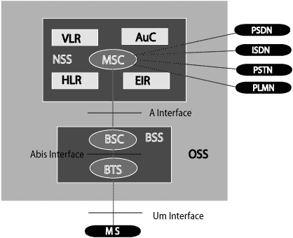
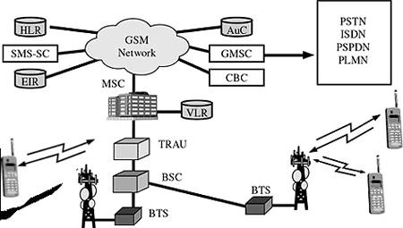

# GSM - Architecture
A GSM network comprises of many functional units. These functions and interfaces are explained in this chapter. The GSM network can be broadly divided into:

   * [The Mobile Station (MS)](/gsm/gsm_mobile_station.htm) 
   * [The Base Station Subsystem (BSS)](/gsm/gsm_base_station_subsystem.htm) 
   * [The Network Switching Subsystem (NSS)](/gsm/gsm_network_switching_subsystem.htm) 
   * [The Operation Support Subsystem (OSS)](/gsm/gsm_operation_support_subsystem.htm) 

Given below is a simple pictorial view of the GSM architecture.

The additional components of the GSM architecture comprise of databases and messaging systems functions:

   * Home Location Register (HLR)
   * Visitor Location Register (VLR)
   * Equipment Identity Register (EIR)
   * Authentication Center (AuC)
   * SMS Serving Center (SMS SC)
   * Gateway MSC (GMSC)
   * Chargeback Center (CBC)
   * Transcoder and Adaptation Unit (TRAU)

The following diagram shows the GSM network along with the added elements:

The MS and the BSS communicate across the Um interface. It is also known as the  or the . The BSS communicates with the Network Service Switching (NSS) center across the  interface.

## GSM network areas
In a GSM network, the following areas are defined:

   * **Cell** : Cell is the basic service area; one BTS covers one cell. Each cell is given a Cell Global Identity (CGI), a number that uniquely identifies the cell.
   * **Location Area** : A group of cells form a Location Area (LA). This is the area that is paged when a subscriber gets an incoming call. Each LA is assigned a Location Area Identity (LAI). Each LA is served by one or more BSCs.
   * **MSC/VLR Service Area** : The area covered by one MSC is called the MSC/VLR service area.
   * **PLMN** : The area covered by one network operator is called the Public Land Mobile Network (PLMN). A PLMN can contain one or more MSCs.

[Previous Page](../gsm/gsm_overview.md) [Next Page](../gsm/gsm_specification.md) 
