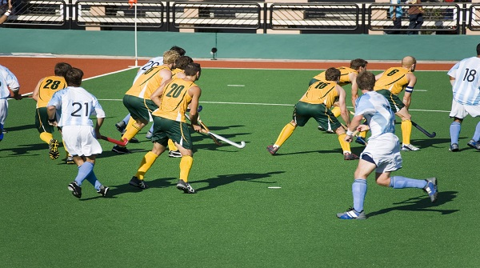

# Hockey - Overview
Hockey is normally played on grass field or turf field or an indoor stadium. Hockey is predominantly a stick and ball game (stick made of wood). Hockey is also the National Game of India.

The objective of this game is to pass the ball with a bat to the goal of opposite players’ court. Other players will be trying to take the ball away and make their goal. The players in the team will be assigned positions for which the duties will be defined earlier. The task of each player in the team is to get the ball in the opponent’s goal point. All the players should be co-operative in scoring more goals.

## Team Size
The Hockey is either played girls against girls or boys against boys. The team consists of 11 members and each player is assigned with a particular position and task. Like most games, team work is the basic element of winning and the entire team’s contribution is crucial for success.

The 11 players consist of Goalkeepers, Defenders and Strikers. Individual player has got their tasks to work on in the game. The hockey squad will be having a total of 16 players as the game allows rolling substitutions under necessary conditions. The rest 5 players will be a backup most of the time.

## History of Hockey
Hockey, as a sport of stick and ball, dates back to middle-age. Some of the carvings of this sport were found in Ireland and Greece in 1200 and 600 BC respectively. It is assumed that the sport existed some 4000 years ago. However, hockey took its actual form with government organization to recognize the sport. Hence, specific rules of the game were introduced in early 19 century. Countries like England, Germany, Argentina, Spain, India, Malaysia, and Pakistan have international teams and take part in all the annual events organized by International Hockey Federation (FIH) formed in 1924.

## Participating Countries
As Hockey was literally originated in England, Scotland and Netherlands, it was encouraged by various other countries as they participated in the game. The International Hockey Federation governs the sport all over the globe. Men and women represent in competitions including Olympics Games, Champions Trophy, World League and Junior World Cup with many countries which run masters’, senior and junior club competitions. This body is responsible for rules development for the game.

Most countries take part in this game. There are more than 50 countries that participate in hockey. But to consider the countries that are termed as the **Big Eight** include Canada, Sweden, USA, Russia, Finland, Czech Republic, Slovakia and Switzerland. As Canada invented the game, they are the best in it. More than 60% of National Hockey League players are from Canada. It’s a right that if you are born in Canada, you are born for Hockey.

The top twenty hockey playing countries are Canada, Sweden, United States of America, Russia, Finland, Czech Republic, Slovakia, Switzerland, Germany, Latvia, India, China, North Korea, United Kingdom, Belarus, Denmark, Mongolia, Japan, South Korea and Indonesia. India was ranked as the eleventh country in Hockey playing.

[Previous Page](../hockey/index.md) [Next Page](../hockey/hockey_playing_environment.md) 
