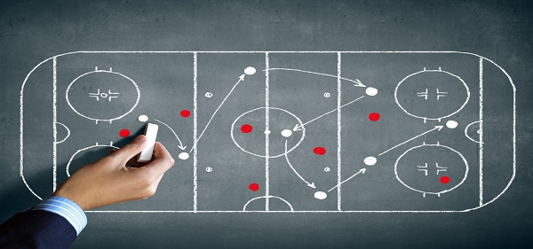
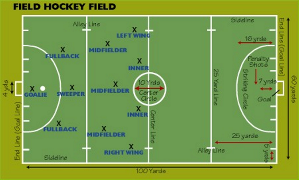

# Hockey - Playing Environment
## Ground Design
Hockey is a speed demanding game. It demands speed from its players and also from its playing surface. No other sport beats the surface like hockey does and hence, the surface should be incredibly durable handling the wear and tear of hockey sport. The surface has to be maintained to enable a top-level game to the players. The base design is to be maintained in any of the two designs namely **Diagonal fall design** and **Crown design**.

The diagonal fall design directs all the surface water to a collection pit at the corner. Whereas, the crown design flows the surface water to all the four corners allowing them to collect there like the crown in the center. It allows the water to collect at a corner or all the four corners for cleaning and slightly tilting the ground. This is the base design of the ground and is followed in all the ground designs.

After the base is finished, In-situ shock pad is to be installed over the base. It consists of black SBR granules and polyurethane binder. This is mixed on site and laid to specified depth. This gives a firm hold of the ground and the strength. The hardness below the ground makes it sustainable from the beatings of the hockey bat during the play. As per the requirement of the FIH (Federation International Hockey) the ground is made to shock absorbent.

After the base is designed, there goes Grass Installation Process. Joining Tapes are being located and fixed. For ‘wet’ field installation, glue is stripped between the rolls. The grass edges are being folded back and 2-pack PU adhesive is used to joining tape. Lay back grass edges and the seaming is to be matched.

## Dimensions
Earlier, the game was played on a natural turf or grass field. But now-a-days it is played on artificial turfs. In the 1970’s, the transition into artificial turfs came into existence and its being made mandatory since 1976. All the markings, lines, and goals are specified by the International Hockey Federation in the **Rules of Hockey**. The foul game is played in a 23 meter area.

Standard pitch measurements are given as 91.4 by 55.0 meters i.e., 100 yards by 60 yards. The total area of the field is 5027 square meters (1.24 acres). The hockey pitch is shaped in rectangular manner. The long perimeter side is named as **side lines** and the short perimeter edges are named as **back lines**. The portion between goal posts is known as **Goal Lines**. All lines are colored white with 75mm wide. At all the corners of the pitch, a flag of max 300 mm square is attached to a post of height 1.20 to 1.50 meters.

The inner edge of the goal post must be equal to 3.66meters (4yards) apart. The lower edge of the crossbar should be 2.14 meters height above the ground. The goalposts and crossbar should be white and rectangular and should be 50mm wide and 50 to 75mm deep. The goal post should be 460mm or 18 inches wide. There is a net to stop the ball at the posts and crossbar.

With the specified dimensions, the design of the hockey field is finished. These are the standard dimensions that are given by the International Hockey Federation in the rules of hockey. During the first few games held, the dimensions vary from the present calculations. Then in 1987, the lengths were changed to the present dimensions and they were now followed in every game.

[Previous Page](../hockey/hockey_overview.md) [Next Page](../hockey/hockey_equipment.md) 
