# Hockey - Quick Guide
# Hockey - Overview
Hockey is normally played on grass field or turf field or an indoor stadium. Hockey is predominantly a stick and ball game (stick made of wood). Hockey is also the National Game of India.

The objective of this game is to pass the ball with a bat to the goal of opposite players’ court. Other players will be trying to take the ball away and make their goal. The players in the team will be assigned positions for which the duties will be defined earlier. The task of each player in the team is to get the ball in the opponent’s goal point. All the players should be co-operative in scoring more goals.

## Team Size
The Hockey is either played girls against girls or boys against boys. The team consists of 11 members and each player is assigned with a particular position and task. Like most games, team work is the basic element of winning and the entire team’s contribution is crucial for success.

The 11 players consist of Goalkeepers, Defenders and Strikers. Individual player has got their tasks to work on in the game. The hockey squad will be having a total of 16 players as the game allows rolling substitutions under necessary conditions. The rest 5 players will be a backup most of the time.

## History of Hockey
Hockey, as a sport of stick and ball, dates back to middle-age. Some of the carvings of this sport were found in Ireland and Greece in 1200 and 600 BC respectively. It is assumed that the sport existed some 4000 years ago. However, hockey took its actual form with government organization to recognize the sport. Hence, specific rules of the game were introduced in early 19 century. Countries like England, Germany, Argentina, Spain, India, Malaysia, and Pakistan have international teams and take part in all the annual events organized by International Hockey Federation (FIH) formed in 1924.

## Participating Countries
As Hockey was literally originated in England, Scotland and Netherlands, it was encouraged by various other countries as they participated in the game. The International Hockey Federation governs the sport all over the globe. Men and women represent in competitions including Olympics Games, Champions Trophy, World League and Junior World Cup with many countries which run masters’, senior and junior club competitions. This body is responsible for rules development for the game.

Most countries take part in this game. There are more than 50 countries that participate in hockey. But to consider the countries that are termed as the **Big Eight** include Canada, Sweden, USA, Russia, Finland, Czech Republic, Slovakia and Switzerland. As Canada invented the game, they are the best in it. More than 60% of National Hockey League players are from Canada. It’s a right that if you are born in Canada, you are born for Hockey.

The top twenty hockey playing countries are Canada, Sweden, United States of America, Russia, Finland, Czech Republic, Slovakia, Switzerland, Germany, Latvia, India, China, North Korea, United Kingdom, Belarus, Denmark, Mongolia, Japan, South Korea and Indonesia. India was ranked as the eleventh country in Hockey playing.

# Hockey - Playing Environment
## Ground Design
Hockey is a speed demanding game. It demands speed from its players and also from its playing surface. No other sport beats the surface like hockey does and hence, the surface should be incredibly durable handling the wear and tear of hockey sport. The surface has to be maintained to enable a top-level game to the players. The base design is to be maintained in any of the two designs namely **Diagonal fall design** and **Crown design**.

The diagonal fall design directs all the surface water to a collection pit at the corner. Whereas, the crown design flows the surface water to all the four corners allowing them to collect there like the crown in the center. It allows the water to collect at a corner or all the four corners for cleaning and slightly tilting the ground. This is the base design of the ground and is followed in all the ground designs.

After the base is finished, In-situ shock pad is to be installed over the base. It consists of black SBR granules and polyurethane binder. This is mixed on site and laid to specified depth. This gives a firm hold of the ground and the strength. The hardness below the ground makes it sustainable from the beatings of the hockey bat during the play. As per the requirement of the FIH (Federation International Hockey) the ground is made to shock absorbent.

After the base is designed, there goes Grass Installation Process. Joining Tapes are being located and fixed. For ‘wet’ field installation, glue is stripped between the rolls. The grass edges are being folded back and 2-pack PU adhesive is used to joining tape. Lay back grass edges and the seaming is to be matched.

## Dimensions
Earlier, the game was played on a natural turf or grass field. But now-a-days it is played on artificial turfs. In the 1970’s, the transition into artificial turfs came into existence and its being made mandatory since 1976. All the markings, lines, and goals are specified by the International Hockey Federation in the **Rules of Hockey**. The foul game is played in a 23 meter area.

Standard pitch measurements are given as 91.4 by 55.0 meters i.e., 100 yards by 60 yards. The total area of the field is 5027 square meters (1.24 acres). The hockey pitch is shaped in rectangular manner. The long perimeter side is named as **side lines** and the short perimeter edges are named as **back lines**. The portion between goal posts is known as **Goal Lines**. All lines are colored white with 75mm wide. At all the corners of the pitch, a flag of max 300 mm square is attached to a post of height 1.20 to 1.50 meters.

The inner edge of the goal post must be equal to 3.66meters (4yards) apart. The lower edge of the crossbar should be 2.14 meters height above the ground. The goalposts and crossbar should be white and rectangular and should be 50mm wide and 50 to 75mm deep. The goal post should be 460mm or 18 inches wide. There is a net to stop the ball at the posts and crossbar.

With the specified dimensions, the design of the hockey field is finished. These are the standard dimensions that are given by the International Hockey Federation in the rules of hockey. During the first few games held, the dimensions vary from the present calculations. Then in 1987, the lengths were changed to the present dimensions and they were now followed in every game.

# Hockey - Equipment
Hockey stick and ball are the most important equipment without which the sport cannot be played. There are many other equipment like shin guard, helmet, glove, shoes, etc., that a hockey player uses during the match.

The following are the equipment used in the hockey game by the goalie and the players.

**Hockey Stick** − It is a wooden stick with length varying from 26’’ to 38.5’’ depending on height of the player. The bat has a hooked shape at the head. There are mostly four types of variations namely **shorti**, **midi**, **maxi** and the **J Hook** depending on the efficiency of the player holding the ball.

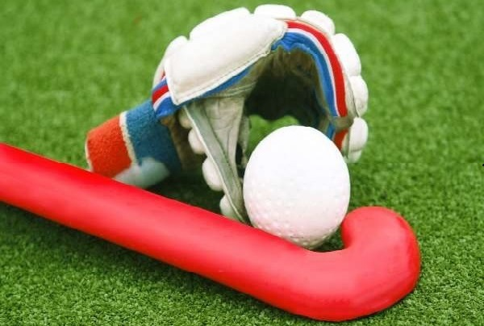

   * **The shorti type** is used by players, who take an extreme control over the ball to increase the manoeuvrability. Generally, the players at the mid field position use this type of bat in the game.
   * **The midi type** is used by the players who hit the ball more often and need to be strong on the reverse side. Strikers use midi predominantly.
   * **The maxi type** is used by the players who act as defenders or attackers. This bat is similar to the midi type but the surface area is being increased. For stopping the ball, its strength allows it to be much more efficient in doing that.
   * **The J Hook type** has a much larger surface area. However, it doesn’t possess the efficiency of the midi type in striking the ball. But, for stopping the ball it has an increased thickness. This head type is preferred by the defenders.

**Ball** − The hockey ball is a plastic spherical shaped material made of cork core usually white colored. The color varies based on the color of the ground on which the game is played. The circumference of the ball is generally 224 to 235mm. It weighs around 156 to 163gms. To reduce aquaplaning, the ball is covered with indentations so that on wet grounds the inconsistent ball speed cannot occur.

**Shin guards** − It is worn in front of a player’s shin for protection from injury.

**Mouth guards** − It is to protect the mouth and teeth during the game while playing.

**Helmet and throat protector** − These equipment are used to protect head and throat from getting injured.

**Cleats (Shoes)** − There are special types of shoes which enhance the free walk and run over the ground.

**Goggles, Gloves, Head bands** − Goggles and gloves are used by the goalies whereas; head bands are used by the players except the goal keepers.

**Goalie sticks and heads** − For hitting the ball and striking it, the goal keepers use a different type of bat.

**Face Mask** − It is one of the latest equipment in hockey. It exposes only the eyes and covers rest of the face. Again, this is also made of fiber. It has elastic band or belt to fit firmly.

**Body Pad or Chest Protector** − The body pad covers the ribs from getting hurt. This is worn inside the uniform.

**Pads** − The pads are worn to protect knees and lower part of limbs.

**Kicker** − Kicker is a unique show used by goalkeepers. They are strong enough to protect the toes when goalkeeper tries to kick or block the ball to prevent goal.

These are the equipment used for playing hockey and most of the equipment are used by the goalkeepers. The goalkeeper is given much protection in comparison to other players as they have to move continuously and weight of the equipment may slow down their movement.

# Hockey - Terms
This chapter provides information about all the important terms used during a game of hockey. Understanding these terms makes it much easier to know the game closely.

**16 yard hit** − If a player from attacking team hits the ball over end line, from the goal, the free hit goes at 16 yards.

**Advancing** − It is a penalty laid for hitting the ball with any body part.

**Attack (Attacker)** − A player who always tries to score a goal is called attacker.

**Back-line** − The line along the goal post or line that marks the width of the field is called backline.

**Bully** − When there is an injury or the game is stopped for any reason, and if the possession is unclear, the match is restarted by placing the ball in between the players.

**Center pass** − It is a free hit which is played after a goal is scored. It is also known as **pass-back**.

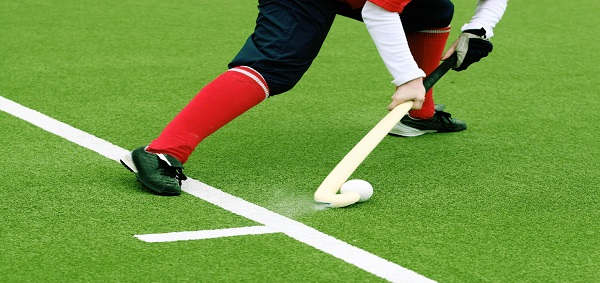

**Circle** − The area enclosed within quarter circle that covers some portion of backline and goal post in the centre.

**Clearing** − When the ball is hit away from the goal, it is called clearing.

**Cross** − When the ball is passed in front of opponent’s goal in order to score points.

**Dangerous Play** − It is any action in the game that may result in injuries of other players.

**Defense (Defender)** − An on-field player of a team who tackles attackers of opposition team and tries to block them from scoring a goal.

**Dribble** − Player moving forward or sideways while changing the position of the ball from left side to right side just to elude the defenders.

**Drive** − Hit harder with the swinging of stick.

**Field Player** − A player on the field other than goal keeper is called field player.

**Field Player with Goalkeeping Privileges** − An on-field player who has special privilege of goal keeping other than goalkeeper. She/he wears a unique color shirt to be spotted easily by players on field.

**Flagrant Foul** − When a player hurts another player intentionally, it is called flagrant foul. The player is suspended from the game.

**Flick** − The player holds the stick firmly and flicks the ball to lob it in air and pass it to your team players. The ball travels at good pace in this shot. Here the ball must not rise above 18 inches.

**Free Hit** − It is awarded to the defending team if the attacking makes foul outside the shooting circle. Here the opposing time should be five yards away from the ball.

**Goalkeeper** − A team member who wears additional protective gear and guards the goal by not letting opponent to score is called goalkeeper.

**Goal-line** − The line between the two goal posts is called goal-line.

**Hit** − It is to hit the ball with the swinging stick. The hard hit is known as a drive.

**Long Hit** − It is a free hit from the corner for any offense.

**Mark** − If the offending team enters the defending zone then the defenders position themselves in a way to prevent the ball from reaching the goal. This tactic is applied till the time the ball is moved away from the defending zone.

**Misconduct** − If a player misbehaves with players of his team or the opponent team by using obscene language or hurting intentionally, a penalty is awarded to him. This penalty can be a green card for warning, yellow card for five-minute suspension or red card for disqualification from the game.

**Obstruction** − Penalty for using the bat or the person’s body to prevent other player to pursue the ball.

**Penalty Corner** − When a team makes foul inside the striking circle, a penalty corner is awarded to other team. It is a hit made from a distance of ten yards from the goal. Where attacking team is outside the goal. Five players of the defense team stand behind the end line and res stand behind the centre line. When the defense takes the ball under control, the penalty corner ends.

**Penalty Stroke** − When a goal is prevented by a foul, a one-on-one free shot is awarded.

**Push** − It is a method where the ball is in contact with both bat and the ground and the player moves the ball along the field.

**Raised Ball** − Scooping, flicking and chipping the ball into the air is called raised ball.

**Scoop** − It is a method of passing or shooting the ball by picking it up into the air and fling it.

**Side in** − When the opponent hits the ball outside through side line, a free hit is awarded to the team.

**Side-line** − The line that marks the length of the hockey field is considered as side-line.

**Striker** − The player who shoots the ball is called striker.

**Tackle** − It is a defense action to take the ball from the opponent.

**Undercutting** − Penalty for swinging harder under the ball to raise it.

# Hockey - Players and their Roles
Hockey has started its course from the English Public Schools to Olympics level. Each hockey team must have 11 members who should always be ready on the field to start the match. Total number of members in a team are 16 of which five are substitute. The guidelines on how to play the game is given by the International Federation of Hockey.

Substitution of players can be done any number of times. At any point of time, the team can give rest to a player and call a substitute on his behalf. The 11 players consist of one goal keeper, and the rest shall be in the field. The breakdown of suggested attributes for each player is as follows −

## Goalkeeper
Arguably, the goalkeeper is the most important player in the whole team. The responsibility of the goalkeeper is to defend the goal post and prevent the other team from hitting a goal.

The key responsibilities of the Goal Keeper are listed as follows −

   * Should be fast and also agile.
   * Should be proficient at both right and left foot.
   * Should be able to judge the shooting angle and close them down.
   * Should be a good communicator and be able to organize the defense.
   * Should be able to go down in a correct manner at defensive moments and at required moment should remain in standing position.

The position of the goalkeeper needs to meet the following requirements.

   * Should be able to save the straight shots towards the goal.
   * Should be able to minimize the attacking team’s score by organizing the defensive attacks.
   * Should establish good communication with other defenders.

## Defenders
The defenders are positioned at four locations. They are right half, left half, right back and left back. The chief role of the defenders is to defend the back four. They should work as a team and try to minimize the score of their opponent.

The main attributes of a defender are as follows −

   * Should be able to turn sideways and get back swiftly.
   * Should be having strong basic skills. Effective in trapping the opponent, passing the ball and tackling the situation.
   * Should be able to prevent opponent attack and put the ball away from the danger zone.
   * Should understand both man-to-man as well as zonal defense and decide the correct approach to use.
   * Should be able to have a good vision of other players and gather knowledge of best passing opportunities.

## Midfield
The three distributions in the midfield positions are inside right, inside left and center half. The midfield is the team’s engine room. It links the attackers and the defenders. It should avoid opponents to have clean breaks through the middle of the field. Midfielders should be major game distributors and have a great awareness of the game.

Attributes of a midfielder are as follows −

   * Should possess a great acceleration with fitness, fast and agile.
   * Should possess strong all-round basic knowledge of hockey.
   * Should have a good knowledge in passing, ball carrying, receiving and shooting.
   * Should have a great awareness and vision of the game.
   * Should be able to switch play or change the point of attack.
   * Should be able to understand the defenses and choose the right one at right time.
   * Should be able to understand the lines and angles of attack and defense in the play at midfield.

## Strikers
The first role of a striker is to generate opportunities of scoring. These must be done by working as a team, creating width and depth on the attack, create a link with midfield and taking the best of all the possible opportunities.

Specific attributes of a good striker are as follows −

   * Should be able to get a clear view on the lines and angles of attack and defense.
   * Should be able to deploy pressure on the opponent defenders.
   * Should be able to move fast and should be agile with high acceleration and pace change.
   * Should have a good vision on the game and awareness of moves.
   * Should have a constant movement where the key actions are creating space, attacking opportunities and leading the team.
   * Should be able to execute and identify the best opportunity for shooting.

# How to Play Hockey?
Hockey is played outdoors in rectangular field. Two teams of 11 players each play the game. One of them wears helmet, pads, and stands in-front of goal with a J-shaped hockey stick. The sport requires lot of stamina stand athleticism as one has to run along with ball and stick to score the goal.

## Getting Ready
The game begins with a toss where both captains are present. One of them calls it correctly and gets the choice to pass first or choose a particular end of the field; just like the toss in other games.

The game is played for 75 minutes that includes a five minute half-time interval. Both sessions are played for 35 minutes each. The time is paused in between the game for substitutions, treatment for injury, etc., and then resumes.

## Quick Glimpse of the Game
The hockey players take their respective positions on the field. One of the teams starts the game with a centre pass and continues to attack opponent to score a goal. The player taking centre pass can only stand in the other half of field while his team members should stand within their half of defending goal. The player taking centre pass is permitted to hit the ball in any direction.

   * The team members keep passing the ball and look for opportunities to score the goal while the opponents tackle them and try to take control of the ball.
   * If the game is paused any moment for injury or substitution, it resumes by the player passing the ball from nearest spot of stoppage of play. This is called **bully**.
   * A player from each team stands close to the ball with defending goals on their right to take a bully. Both players tap faces of their sticks and one of the players is allowed to hit the ball.
   * A free-hit situation arises when a player hits the ball outside the sideline or baseline. Free-hit is taken by a defender by placing the ball 15 meters in line to the centre of goal.

   * If a ball is hit outside the sideline by a player then defender of the opponent team will take free hit by placing the ball in line within 15 meters from where the ball has crossed.
   * If the ball is hit outside the back line by a player then defender of opponent team will take free hit by placing the ball within 15 meters from centre of goal.
   * If the ball is hit outside the back line by opponent player then a penalty corner is awarded to the team attacking the goal. The ball is placed in line to back line and to right of goal post at a distance of 15 meters.
   * If the ball is hit outside the back line by goal keeper of opponent team then a corner is awarded to attacking team. The ball is then placed in line to 23 meters line and hit by player of attacking team.

## Duration of a Match
A regular hockey match takes place for 70 minutes consisting two halves each of 35 minutes. Also, sometimes matches end in draw. But the official matches should have a winner unlike other matches. If in any case, the game is a tie then extra time is given. If there is tie again then penalty flick competition decides the winner of the match.

A player passes the ball among them to progress it towards the goal using a triangle method of passing system. This prevents the opponent to intercept the ball.

# Hockey - Penalties
A more specific requirement of a hockey player is that he/she should be able to shoot, pass, stop, push and control the ball with their hockey stick. These skills are much impressing but without the help of other mates in the team, it is merely impossible to step towards success.

## No Feet
The most important thing about the game is that the players are not allowed to touch the ball with feet or other parts of the body. The goalkeeper alone can use the hands for catching the ball. Goalkeeper can use any part of the body to deflect the incoming ball when defending.

## Scoring
It is very interesting thing to learn how to score in hockey. Specific ways to win a score are penalty corner, field goal, and penalty stroke.

### Taking a Penalty Corner
Only four players are allowed along with a goal keeper. They must be behind the baseline inside or outside the goal. The other defending players must be behind the half way line or on the line. Any number of players from the attacking team can be there to attack but most probably seven will be the attacking players. One player will be injecting the ball from baseline.

The presence of a stopper at the top of D depends on the set-up of the team. When the injection of the ball takes place before it re-enters D and shot at goal, it must go out of D first. For the first strike to be counted, it must be below the back board, if it is a drag or a deflection, it can end anywhere inside the goal and it can also be counted.

### Taking a Penalty Stroke
When there is an infringement inside of D, the penalty stroke is given if there was a definite goal scoring chance. It is a free shot that was taken by one attacker against one goal keeper only and from a distance of 6.4 meters straight in front of the goal. The duration of the match is stopped when there is a penalty stroke taken.

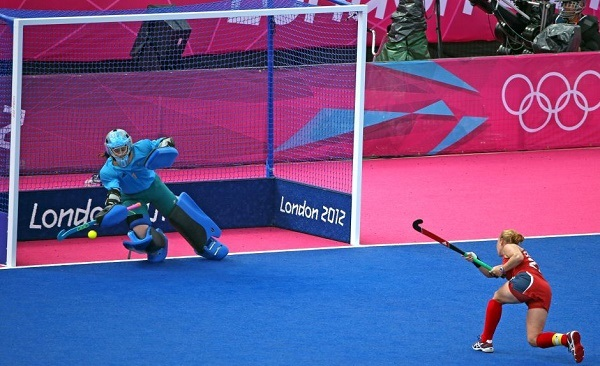

## Fouls
The on-field players are not allowed to control or stop the ball with feet or any other body part. A free-hit is awarded to a team if ball hits the opponent player’s body. The hockey ball is often scooped by players to pass it to their team members directly. However, the same shot is given as foul by the referee if it is played dangerously.

Apart from these, there are tackling fouls where players are found to be little rough with opponent players to take control of ball. The game is observed very closely by referee to declare fouls and make important decisions. The referees in the game display cards in three colors, each of which indicates the level of foul or offence committed by a player.

   * **Green card** − The player may not leave the pitch (international standards say that the player may leave the pitch for two minutes), but further infractions indulge in a red or yellow card.

   * **Yellow card** − It is a suspension where the time is decided by the card issuing umpire. Mostly, five minutes will be the chosen time by any umpire. But, if the offense is serious the time may exceed or the player is replaced.
   * **Red card** − It is a permanent exclusion from the game. Here the player is banned for some time or for a few matches. The player should leave the pitch in this case.

# Hockey - Variants
As every game has its faces, hockey too has various flavors. Hockey entertains its audience in various forms such as Ice hockey, Sledge Hockey, and Roller Hockey. The objective of all the game is the same; to score more goals in the given time defending the opponent. But the environment and methods of each game varies from each other.

## Field Hockey
This game is played on ground with grass or artificial synthetic ground. It is predominantly for women in some countries like Europe. But due to the absence of hand gloves, injuries at fingers sometimes hamper the players to continue in the game. But advancement in the game and its rules resulted in security precautions of total body while playing.

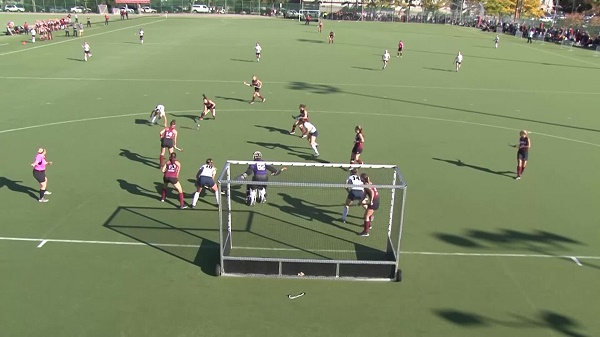

## Ice Hockey
The same principle of pushing the ball into the goal post but instead of ground, the game takes place on ice. The players use skates to skate over ice and earn points. Their bats also differ in shape and size. The ball is actually not spherical in shape but a disc like solid that is used to roll over ice. It is fun watching this game and even more to take part.

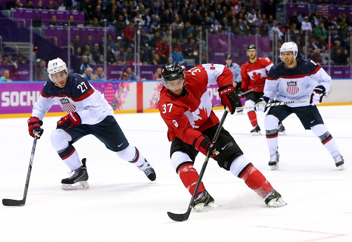

## Sledge Hockey
For disabled people who want to enjoy the fun of playing ice hockey, this game was invented. It has a board on which the player will be resting and with the help of skates it will be rolling on ice and the rest is same as ice hockey. It is also played by normal people sitting on the boards.

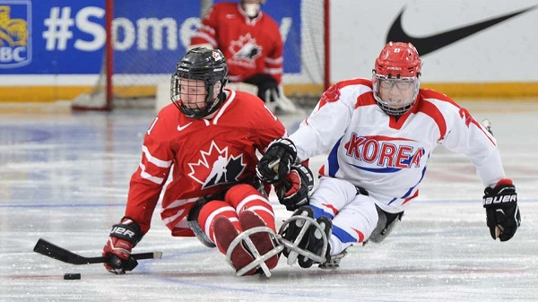

## Roller Hockey (Quad and In-line)
Roller hockey has two forms; quad and in-line. The players in quad variant wear quad skates while playing the game. A ball is used to play and the equipment used by goal keeper is different from other variants. This version of hockey is played in more than 60 countries.

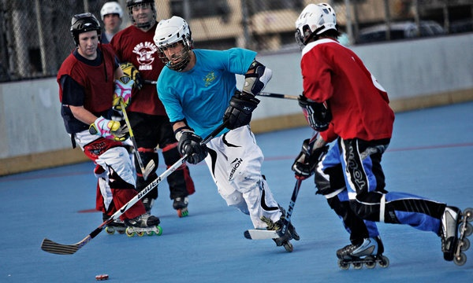

Players use in-line skates for the later version. This game has originated from quad subtype that existed decades ago. In-line hockey is easier version when compared to quad. The game is played in three intervals of fifteen minutes each.

## Bandy
Bandy is Russian version of hockey and also the national sport. It became so popular across Europe that a bandy federation was formed during mid-20 century. The major difference from other versions is that Bandy is played in a field that is almost equal to the size of football field. This sport also took birth from ice hockey. Gradually by end of 20 century, Bandy was played professionally in parts of Asia and North America.

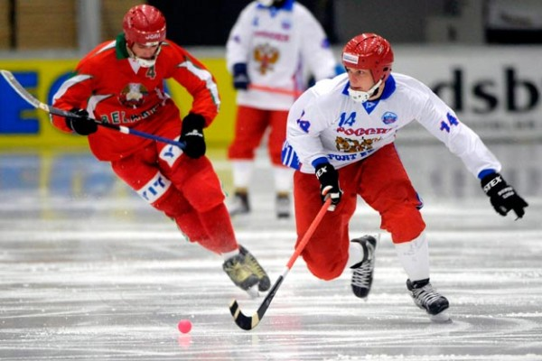

## Street Hockey
The most casual form of hockey that is played in streets without any protective gear. It is played on hard surfaces with a ball.

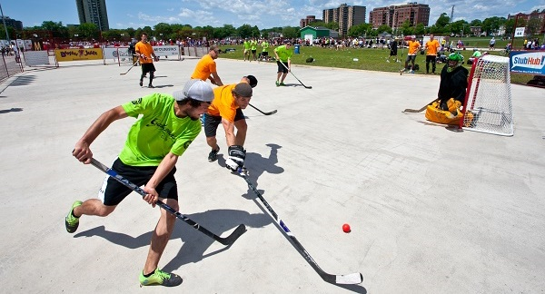

# Hockey - Champions
In this chapter, we will provide a brief description about some of the great players of Hockey who brought laurels to their country by playing at the highest level.

Hockey is the national game of India and the country has produced a few terrific players like Dhyan Chand, Leslie Claudius, Balbir Singh Sr., and Dhanraj Pillay.

## Santi Freixa (Spain)
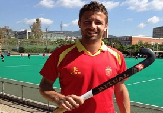

Santi is another great player from Europe. He has represented Spain in 2008 Olympic Games and won silver medal for the country. He has also won the FIH award for best young player.

He is the captain of Spain’s hockey national team. He is also known for his off-the-field social activity campaign Stick for India that supports children of Anantapur with education and hockey skills.

## Teun de Nooijer (Netherlands)
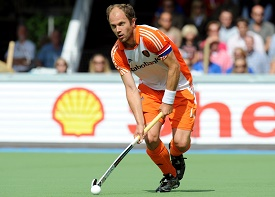

The Dutch player had won four medals in Olympic Games; two each of gold and silver. In addition, he was also instrumental in winning European Cup in 2000 and nine national championships.

After achieving so many records, Nooijer retired from the sport recently. He inspired the young generation with his dedication and skill of playing hockey at the highest level.

## Dhyan Chand (India)
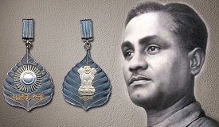

Dhyan Singh alias Dhyan Chand was believed to be the best hockey player ever. His ability to control the ball and break the defense of opposition with ease was the prime attraction. The way he carried himself both on and off the field brought him respect all over the world.

He led Indian hockey team to three consecutive gold medals in Olympic Games. Many people around the globe followed and admired Chand’s stick play; some fondly called him magician of hockey.

## Leslie Claudius (India)
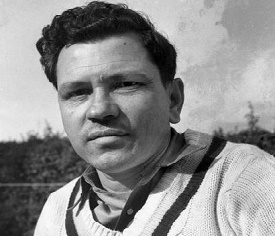

Another Indian legend who was born to play hockey only, as few experts of the game described. Claudius was short in stature and had bundles of stamina. He never used to get tired.

Leslie holds a Guinness World Record for being part of a Hockey team that won maximum number of Medals at the Olympic Games.

He took part in four Olympic Games and won four medals; three gold medals in 1948, 1952, 1956, and a silver medal in 1960 under his captaincy.

## Ties Kruize (Netherlands)

This Dutch player was simply superb on the field. He scored 167 goals in just over 200 international matches. He met with an accident during his prime and doctors told that he can never play the sport again.

Surprisingly, he recovered to full health and returned to the sport only to stun the world with victories in World Championship (1973), two Champions Trophies in 1981-82, and European Championship in 1983.

## Jamie Dwyer (Australia)
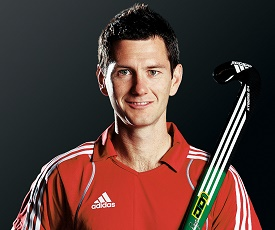

Dwyer was one of the legends of hockey in modern era. He was very quick on the feet with great skill to manoeuvre ball with the stick. He was nick named as foetus for his ability to shift positions from being an attacker to defender in a flash.

He played for Australia to achieve hockey gold medal in Olympics after a long gap of 48 years. He also won World Cup and Commonwealth Games gold for his national side. Dwyer won world player of the year award five times.

## Hassan Sardar (Pakistan)

Hassan Sardar was regarded as the best hockey player during late 20 century. He was the finest dribbler during his time and created multiple scoring opportunities by breaking through opposition defense.

He has won the player of the tournament award for World Cup, Asian Games, and Asia Cup in 1982, and again during Olympic Games in 1984. He has unique record of scoring goals in all the finals. He led Pakistan to a string titles in span of two years.

## Luciana Aymar (Argentina)

Aymar is considered as the greatest ever female hockey player. She was the finest dribbler when compared to her counterparts. She played an important role for her national side to win World Cup titles in 2002 and 2010. She also won eight FIH world player of the year titles.

At junior level also she played very well and helped her team to win many tournaments. She represented Argentina as a flag-bearer for 2012 Olympics and was the second hockey player to receive this honour.

## Natascha Keller (Germany)

Natascha is one of the most popular female hockey players in the world with an Olympic gold medal to her kitty. She represented Germany in more than 400 matches.

She won the gold medal in 2004 Olympic Games and was the flag bearer of Germany in 2012. Her family has an illustrious career in field hockey and that boosted her to play and represent the country at international level.

[Previous Page](../hockey/hockey_champions.md) [Next Page](../hockey/hockey_useful_resources.md) 
