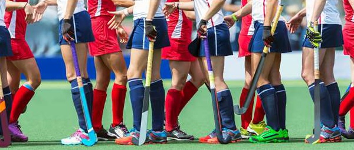
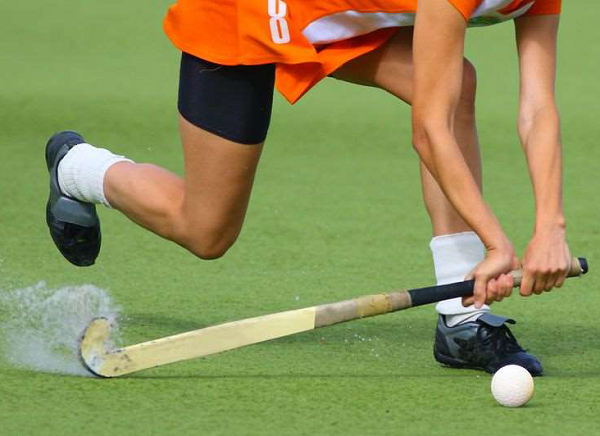

# How to Play Hockey?
Hockey is played outdoors in rectangular field. Two teams of 11 players each play the game. One of them wears helmet, pads, and stands in-front of goal with a J-shaped hockey stick. The sport requires lot of stamina stand athleticism as one has to run along with ball and stick to score the goal.

## Getting Ready
The game begins with a toss where both captains are present. One of them calls it correctly and gets the choice to pass first or choose a particular end of the field; just like the toss in other games.

The game is played for 75 minutes that includes a five minute half-time interval. Both sessions are played for 35 minutes each. The time is paused in between the game for substitutions, treatment for injury, etc., and then resumes.

## Quick Glimpse of the Game
The hockey players take their respective positions on the field. One of the teams starts the game with a centre pass and continues to attack opponent to score a goal. The player taking centre pass can only stand in the other half of field while his team members should stand within their half of defending goal. The player taking centre pass is permitted to hit the ball in any direction.

   * The team members keep passing the ball and look for opportunities to score the goal while the opponents tackle them and try to take control of the ball.
   * If the game is paused any moment for injury or substitution, it resumes by the player passing the ball from nearest spot of stoppage of play. This is called **bully**.
   * A player from each team stands close to the ball with defending goals on their right to take a bully. Both players tap faces of their sticks and one of the players is allowed to hit the ball.
   * A free-hit situation arises when a player hits the ball outside the sideline or baseline. Free-hit is taken by a defender by placing the ball 15 meters in line to the centre of goal.

   * If a ball is hit outside the sideline by a player then defender of the opponent team will take free hit by placing the ball in line within 15 meters from where the ball has crossed.
   * If the ball is hit outside the back line by a player then defender of opponent team will take free hit by placing the ball within 15 meters from centre of goal.
   * If the ball is hit outside the back line by opponent player then a penalty corner is awarded to the team attacking the goal. The ball is placed in line to back line and to right of goal post at a distance of 15 meters.
   * If the ball is hit outside the back line by goal keeper of opponent team then a corner is awarded to attacking team. The ball is then placed in line to 23 meters line and hit by player of attacking team.

## Duration of a Match
A regular hockey match takes place for 70 minutes consisting two halves each of 35 minutes. Also, sometimes matches end in draw. But the official matches should have a winner unlike other matches. If in any case, the game is a tie then extra time is given. If there is tie again then penalty flick competition decides the winner of the match.

A player passes the ball among them to progress it towards the goal using a triangle method of passing system. This prevents the opponent to intercept the ball.

[Previous Page](../hockey/hockey_players_and_their_roles.md) [Next Page](../hockey/hockey_penalties.md) 
