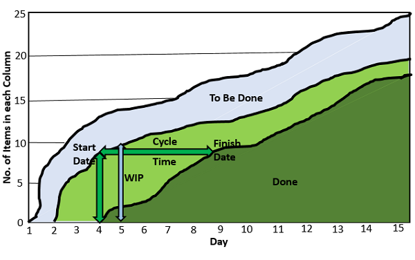

# Kanban - Quick Guide
# Kanban - Introduction
Kanban is a Japanese word that literally means “visual card”. Kanban cards were originally used in Toyota to limit the amount of inventory tied up in “work in progress” on a manufacturing floor. Kanban not only reduces excess inventory waste, but also the time spent in producing it. In addition, all of the resources and time freed by the implementation of a Kanban system can be used for future expansions or new opportunities. The original author of Kanban was Taiichi Ohno.

## What is Kanban?
Kanban term came into existence using the flavors of “visual card,” “signboard,” or “billboard”, “signaling system” to indicate a workflow that limits Work In Progress (WIP). Kanban has been used in Lean Production for over `half-century.

The core concept of Kanban includes −

   * Visualize Workflow
   * Split the entire work into defined segments or states, visualized as named columns on a wall.
   * Write each item on a card and put in a column to indicate where the item is in the workflow.
   * Limit WIP
   * Assign explicit limits to how many items can be in progress at each workflow segment / state. i.e., Work in Progress (WIP) is limited in each workflow state.
   * Measure the Lead Time
   * Lead Time, also known as cycle time is the average time to complete one item. Measure the Lead Time and optimize the process to make the Lead Time as small and predictable as possible.

This concept of Kanban is a direct implementation of a Lean Pull Scheduling System. An item can move to the next segment / state only when it obtains a slot in there.

### Kanban - Lean Practices
The implementation of Kanban, as well as other Lean Manufacturing Methods, such as Kaizen, can have significant benefits for almost any type of work. Kanban is more effective because it visually indicates when the production should start and stop. It is faster, more efficient, and saves significant money over most other production models. It is also far more directly responsive to customer demand.

## Kanban - Benefits
Kanban has the following commonly observed benefits −

   * Bottlenecks become clearly visible in real-time. This leads people to collaborate to optimize the whole value chain rather than just their part.
   * Useful for situations where operations and support teams have a high rate of uncertainty and variability.
   * Tends to spread throughout the organization naturally, including sales and management. This increases visibility of everything that is going on at the company.
   * Reduces inventory in the range of 25%-75%, thereby reducing company costs.
   * Since all segments/states in the workflow are visually organized, the required items, reducing the wait times and ensuring speed, continually support all the tasks in the workflow.
   * Overproduction of inventory is avoided, thereby saving resources and time as well. This is termed as eliminating waste.

## Alignment with Agile
In agile, if values are combined with Kanban characteristics, the outcome would be Agile Kanban. This practice is gaining popularity in Software Development wherein the Agile iteration approach and Kanban value stream focus are combined.

# Kanban - Characteristics
In this chapter, we will learn the characteristics of Kanban.

## Flexibility in Planning
Kanban provides improvements in the workflow. With visual representation of the workflow, speed of moving from one task to another is reduced. This is accomplished through the creation of clearly marked flow lanes, Kanban cards and clearly marked columns to indicate where each item is in the workflow. If a task needs longer duration, it is allowed to execute without hindrance, and at the same time, the tasks that are completed will flow to the next state.

This allows −

   * Sufficient duration for longer tasks that cannot be broken down logically.
   * Preservation of value of such longer tasks.
   * Effort required by each role to be expended.
   * Continuous flow of the tasks that are completed without wait time.

Hence, planning is flexible and not time-boxed.

## Limits Work-In-Progress (WIP)
Explicit limits are assigned to number of items that can be in progress at each workflow state, indicated by a column.

This allows −

   * Reducing wait time.
   * Avoiding stress on resources at a workflow state.
   * Identifying bottlenecks causing an item to be in a workflow state than the anticipated time (usually average cycle time) immediately.
   * Resolving bottlenecks with collaboration of the entire team.
   * Decreasing dependencies in completing a task by splitting it into sub-tasks, so that the sub-task is tracked independently.

## Pull Approach
When you have two teams and the first one is performing better than the second one, it is likely that it pushes more work than the other can actually handle. This often creates friction between the teams. A solution to this is the Pull approach.

In Pull Approach, the next team pulls work only when it is ready for it. Pull Approach is implemented by adding a buffer with limited capacity between the two teams.

The benefits of Pull Approach are −

   * Avoids piling-up of work.
   * Reduces wait time.
   * Facilitates a team to maintain constant pace and focus on quality.
   * Provides resource balancing.

## Minimize Cycle Time
The cycle time for each task is measured and the process is optimized to reduce the cycle times.

   * The bottlenecks are identified immediately and resolved collaboratively by the entire team.
   * The correction loops are considered to reduce rework.

## Continuous Delivery
Benefits of continuous delivery are −

   * Short release cycles result in continuous delivery of growing product at regular intervals.
   * Continuous interactions with the customer.
   * To understand what customer wants.
   * Not to produce anything that the customer does not need.
   * Feedback on delivered modules.
   * Limited requirements in each release cycle.
   * Developers are not overloaded with requests. This enables them to focus on the delivery.
   * There is no partially completed work.
   * Focus is on finishing work than on starting work.
   * This enables focus on sustaining pace and quality of the product.
   * Deliver before the customer changes mind.
   * Optimize flow of Work from beginning to end.
   * Helps in incremental process improvements.

## Visual Metrics
Visually organized workflows (on Kanban Boards) facilitate −

   * Scheduling as per WIP limits on a workflow state.
   * Tracking status and progress continually.
   * Assigning resources dynamically based on the role requirements.

### Advantages of Visual Metrics
Each day, for each column, mark how many tasks are in it, you will see a mountain-like chart. This chart shows the past performance and allows predicting future results.

You can gather the following information from the chart −

   * Measure cycle time for each feature (or story) by marking a start date when the feature is scheduled and an end date when the feature finishes.
   * Evaluate the quality of the growing product from technical, functional and user perspectives at regular time-boxes.
   * Evaluate the pace of development by looking at the number of development items completed and looking at the average cycle time per development item.
   * Adjust the pace of development by calculating the ratio of developer days per completed development item. You can use this ratio to estimate the completion time for the yet-to-develop items and adjust the development plan as necessary.
   * Evaluate and adjust the process by using a collaborative session to identify changes that can be made to improve the quality of the product, or to improve the pace of development.
   * Identify and resolve un-validated decisions by looking at the cycle time of validated decisions and focusing on the correction loops that are usually the invisible backed-up queues.

## Efficiency Through Focus
By focusing on what a customer wants, the scope becomes clear. The focus is on delivering value to the customer.

Efficiency can be achieved in the following ways −

   * A customer’s expectations can be made realistic and focused with continuous interactions with the customer.
   * Focus on the tasks is ensured with a limit on work-in-progress (WIP).
   * The Pull approach enables resources to complete the tasks at hand before a new task is taken up.
   * Optimizing lead-time (cycle time) results in faster delivery.
   * Visualization of the workflow with Kanban board draws immediate attention to any bottlenecks that can be resolved immediately.
   * Empowerment of the team makes the team accountable for the success.

# Kanban - Project Management
Kanban is adapted to software development as a project management approach. Kanban in software development supports a continuous workflow, termed as Value Stream.

## Value Stream
The Value Stream consists of all actions required to bring a project from creation to completion.

The actions can −

   * Add Value to the project
   * Add no Value, but unavoidable
   * Add no Value, avoidable (termed as waste)

## Elimination of Waste
Anything that does not add any value to the project is known as Waste. Kanban facilitates elimination of waste.

In software development, there are three types of waste −

   * Waste in code development
   * Waste in project management
   * Waste in team potential

### Waste in Code Development
Waste in code development is due to the following reasons −

   * **Partially completed work** − The partially completed work can become outdated and unusable. It can be eliminated with iterative cycles and with modular code that completes within the iteration.
   * **Defects** − In developing a code, correction and retesting requires time and resources. It can be eliminated with up-to-date test suite, completing testing within the iteration and continuous customer feedback.

### Waste in Project Management
Waste in project management is due to the following reasons −

   * **Extra Processes** − Unnecessary documentation that requires time and resources. It can be eliminated with −
   * Pre-planning of what processes are relevant and necessary.
   * Documentation review, that ensures relevant and necessary processes are followed.
   * **Code Handoffs** − means passing the work from one person or team to another, after the first person’s work is complete. It may give rise to lack of knowledge. It can be eliminated by keeping the flowcharts and wireframes visible and clear.
   * **Extra Functions** − These are features that are not required by the customer. Effort and time are wasted in developing the functions required to implement the features that the customer does not want. It can be eliminated with continuous interaction with customer and testers involving in the requirements gathering as they can better visualize the scenarios and expected behavior of the system.

### Waste in Team Potential
Waste in team potential is due to the following reasons −

   * **Task Switching** − It leads to the danger of multi-tasking, which is a waste. It can be eliminated with focus on a task with every release. Large process steps are segmented into tasks to −
   * Improve visibility
   * Reduce dependencies
   * Enable easy flow of work
   * Focus on the cycle-time of delivered work
   * Give a way to detect and resolve bottlenecks
   * **Waiting** − Time for getting instructions or information – Team is subjected to sit idle if the decisions are not made by the team, or if the information provided to the team (developers, testers, etc.) are expensive resources. It can be eliminated by allowing the team members (developers, testers, etc.) to −
   * Take decisions so that they do not have to wait for instructions
   * Have access to information so that it can be used as and when required

# Kanban - Agile
Agile Kanban is Agile Software Development with Kanban approach. In Agile Kanban, the Kanban board is used to visualize the workflow. The Kanban board is normally put up on a wall in the project room. The status and progress of the story development tasks is tracked visually on the Kanban board with flowing Kanban cards.

## Kanban Board
Kanban board is used to depict the flow of tasks across the value stream. The Kanban board −

   * Provides easy access to everyone involved in the project.
   * Facilitates communication as and when necessary.
   * Progress of the tasks are visually displayed.
   * Bottlenecks are visible as soon as they occur.

### Advantages of Kanban board
The major advantages of using a Kanban board are −

   * **Empowerment of Team** − This means −
   * Team is allowed to take decisions as and when required.
   * Team collaboratively resolves the bottlenecks.
   * Team has access to the relevant information.
   * Team continually communicates with customer.
   * **Continuous Delivery** − This means −
   * Focus on work completion.
   * Limited requirements at any point of time.
   * Focus on delivering value to the customer.
   * Emphasis on whole project.

The tasks and stories are represented by Kanban cards. The current status of each task is known by displaying the cards in separate columns on the board. The columns are labeled as **To Do, Doing**, and **Done**. Each task moves from **To Do** to **Doing** and then to **Done**.

Kanban Board is updated on a daily basis as the team progresses through the development.

### WIP Limit
The label in the Doing column also contains a number, which represents the maximum number of tasks that can be in that column at any point of time. i.e., the number associated with the **Doing** column is the WIP (Work-In-Progress) Limit.

### Pull Approach
Pull approach is used as and when a task is completed in the Doing column. Another card is pulled from the To Do column.

### Self-directing
In Agile Development, the team is responsible for planning, tracking, reporting and communicating in the project. Team is allowed to make decisions and is accountable for the completion of the development and product quality. This is aligned to the characteristic of empowerment of the team in Kanban.

### Continuous Flow
In Agile development, there is no gate approach and the work flows across the different functions without wait-time. This contributes in minimizing the cycle time characteristic of Kanban.

### Visual Metrics
In Agile Kanban, the metrics are tracked visually using −

   * Kanban Board
   * Burndown Chart

### Uses of Kanban board
Kanban Board is used to −

   * Measure the cycle times, that can be used to optimize average cycle time.
   * Track WIP limit to eliminate waste.
   * Track resource utilization to eliminate waste.

### Uses of Burndown chart
Burndown chart is used to capture −

   * The current status of the tasks and stories.
   * The rate of progress of completing the remaining tasks.

As Kanban Board is updated daily, it contains all the information that is required by the Burndown charts.

# Kanban - Lean and Agile
In Agile Kanban, the user stories are broken into tasks and Kanban cards are used to track the tasks on the Kanban board. Agile Kanban has a concept of iteration that is not present in Kanban. Further, no processes are considered.

## Kanban in Value Stream
Kanban is defined to be executed in value stream with focus on delivery of value. Kanban in software development can be visualized as the features flowing across the value stream. All the Kanban characteristics (Refer Chapter - Characteristics of Kanban in this Tutorial) are met in the Kanban approach for software development.

### Feature Kanban Board
Feature Kanban Board is used to track the Feature Driven Development with Kanban Approach. Each Feature is assigned to a particular release. The columns in the Kanban board represent releases. Hence, each column contains all the features assigned to the release represented by it.

Each feature is broken into stories. Each release is broken into iterations. The iteration is executed in an Agile Development approach. This can be treated as a sub-stream in the value stream, with the stories to be completed within that iteration assigned to it.

### Agile Kanban in Sub-stream
Agile Kanban approach is followed within each sub-stream that is implemented as an iteration. Each story is broken into tasks in the iteration. Task Kanban board is used to track the status and progress of the story development tasks. The current status of each task is known by displaying the cards in separate columns on the board. The columns are labeled as To Do, Doing, and Done. Each task moves from To Do to Doing and then to Done.

### Continuous Delivery
Continuous delivery to the customer is ensured with features tracked on feature Kanban board and stories representing features tracked on task Kanban board.

Delivery through a release is accomplished by −

   * Continuous tracking
   * Constant communication with the customer
   * Adjusting development plan as required
   * Focusing on delivery of value to the customer

Agile development as well as Kanban maintain team collaboration. This, in turn helps in identifying and resolving Bottlenecks immediately as required by Kanban. This results in accomplishment of all the needed tasks within the iteration to deliver quality product, which meets customer expectations.

### Continuous Process Improvement
Kanban supports process improvements to enhance the delivery approach continuously.

Consider a requirement that is a change or addition to the product. In such a case, Kanban cards can be used to visualize the requirement passing through the processes of analysis, design, development, product integration and testing. This is different from the Waterfall approach in the sense that it does not require completion of one process for all the requirements to flow to the next process in the sequence.

Such an implementation of Kanban in product maintenance allows maintainability, reliability and integrity of the product. The required process improvements are gathered at regular intervals and implemented on a continuous basis.

# Kanban - Scrum
In this chapter, we will learn the similarities and differences between Kanban and Scrum. These similarities and differences will help you in choosing the correct method for your project.

## Kanban and Scrum - Similarities
Similarities between Kanban and Scrum are −

   * Both are Agile.
   * Both use pull scheduling.
   * Both limit WIP, Kanban at task level and Scrum at sprint level.
   * Both use transparency across the development.
   * Both focus on delivering releasable software early.
   * Both are based on self-organizing teams.
   * Both require breaking the work into pieces.
   * In both the methods, the release plan is continuously optimized based on empirical data (Scrum – Velocity, Kanban - Lead Time/Cycle Time).

## Kanban and Scrum - Differences
The differences between Kanban and Scrum are as follows −

## Kanban vs. Scrum
The following advantages can help you choose between Kanban and Scrum −

   * You need to choose Kanban if you already have working processes and you want to improve without disturbing the whole system whereas you need to choose Scrum if you want to introduce a new process in the organization.
   * You can use Kanban in the product development with Feature Driven Development to track the workflows in the value stream whereas you can use Scrum for the development in each iteration.
   * You need to define the WIP Limits in Kanban explicitly whereas you need to define the sprint length in scrum that imposes WIP limits implicitly.
   * Both Kanban and Scrum are adaptive but Scrum is more prescriptive than Kanban.
   * Kanban imposes only two Rules: Visualize workflow and limit WIP whereas Scrum imposes more constraints such as time-boxed Sprints.
   * Kanban leads to organizational process improvements, both in management and development. Kanban also supports maintenance activities. Scrum leads to high throughput in small development teams. It does not contribute to product development and maintenance workflows that are longer in duration with unpredictability on the size of work units and changes. Scrum does not emphasize on optimizing management activities.
   * In Kanban, you can choose when to do planning, process improvement, and release. You can choose to do these activities on a regular basis or on-demand. Scrum iteration is one single time-boxed Sprint combining three different activities: planning, process improvement, and release (if required).

Thus, Kanban and Scrum are effective tools in their specific contexts. You can combine Kanban and Scrum to derive maximum benefits from both.

## Adapting Kanban and Scrum Together
You can use Kanban and Scrum together by implementing those characteristics that will suit your needs. The constraints of both need to be considered before adapting them. For instance, Scrum requires Time-boxed Sprints and if you do away with those, you cannot say that you have implemented Scrum. Both give you a basic set of constraints to drive your own process improvement.

# Kanban - Tools 1
Several project management tools that follow Kanban approach are available. In this chapter, you can have an overview of the following Kanban Tools −

   * Kanban Tool
   * Kanbanery
   * LeanKit
   * JIRA Software
   * Earliz
   * Targetprocess

You can get more information on these tools at the respective sites. A comparison of these tools and some more can be found at [https://www.getapp.com/project-management-planning-software/](https://www.getapp.com/project-management-planning-software/) .

## Kanban Tool
Kanban tool is a visual project management tool. Use Kanban cards, colors, swim-lanes, tags and due dates to compose work on Kanban board. Analyze and constantly improve your process to increase business efficiency.

Following are the important features of the Kanban tool −

   * Online Kanban Boards
   * Insightful analytics
   * Visual Project Management
   * Online Documents
   * Drag &amp; Drop Tasks
   * To-Do Lists

For more information, visit the site [http://kanbantool.com/](http://kanbantool.com/) 

## Kanbanery
Kanbanery is a visual project management tool that helps you work more effectively, alone and together, by visualizing work.

Features of Kanbanery include −

   * GitHub integration
   * Create or copy task boards easily with templates
   * iPhone and iPad apps
   * API and several third party apps
   * Advanced reporting
   * Content-rich tasks
   * Work with existing systems
   * Real-time updates

For more information, visit the site, [https://kanbanery.com/](https://kanbanery.com/) 

## LeanKit
LeanKit supports Kanban-based visual management. It can be used in distributed environment with access to the CEO of a company, to all employees, customers, and partners.

Features of LeanKit include −

   * Visualize workflow using virtual Kanban boards.
   * Plan and track work using the workflow and calendar views.
   * Effective virtual and visual team collaboration.
   * Stay connected on-the-go with a browser or mobile device.
   * Align strategic initiatives with team-level execution using visual tiered board approach.
   * Measure effectiveness using powerful reporting and analytics.
   * Real-time updates and automated reports and notifications.
   * Cloud-hosted and supports calendar and workflow views.
   * Improve flow of work with Kanban capabilities such as policies, class of service, and WIP limits.
   * Role-based security controls.
   * Integrate with other systems such as Microsoft Project server, TFS, and VS online, GitHub, JIRA, Buildmaster, Oracle Primavera, and so on. Zapier offers hundreds of pre-built integrations between LeanKit and web apps, such as Google, Salesforce and Zendesk.

For more information, visit the site [http://leankit.com/](http://leankit.com/) 

## JIRA Software
JIRA Software is an Agile project management tool designed for teams of every shape and size.

Features of JIRA software include −

   * **Plan** − Flexible planning using Scrum or Kanban or a mixed methodology.
   * **Accurate Estimations** − Estimations that help the team become more accurate and efficient. JIRA supports user story points, hours, t-shirt sizes, or any other estimation technique.
   * **Value-driven prioritization** − JIRA allows prioritization of user stories, issues, and bugs in the product backlog with a simple drag and drop. This facilitates ensuring that the user stories of high customer value to be on the top.
   * **Track** − Team's work in full context is maintained with complete visibility irrespective of the geographic locations.
   * **Release** − Ship with confidence and sanity knowing that the information available is always updated.
   * **Report** − Improve team performance with actions based on real-time, visual data that gives the team critical insight into their agile process.
   * **Workflow** − Choose a workflow that matches the way the team works or that is an out-of-the-box workflow.
   * **Add-ons** − Enhance JIRA with add-ons such as portfolio for JIRA, Tempo Timesheets, Zephyr, and over 800 other add-ons that can help to get the most out of JIRA software.
   * **Integrate workflow with other tools** − Upgrade your workflow with Confluence, Bitbucket, Bamboo, HipChat, and hundreds of other developer tools.

For more information, visit the site [https://www.atlassian.com/software/jira](https://www.atlassian.com/software/jira) 

## Earliz
Earliz is an online project management and monitoring software that supports smart project management and collaboration.

Features of Earliz include −

   * **Gantt / Agile** − For each new project, choose between a Gantt (steps) or Agile (sprints) interface. You can change this project method any time during your project.
   * **Task Management** − Structure your project by listing the different steps (or stories) of your project by dividing them into tasks.
   * **Board** − Manage your project daily using the board. Based on the Kanban method, the board shows the status of all the tasks and their assignment to the project participants.
   * **Synchronization** − The content of your project is automatically synced between all connected members.
   * **Notifications** − Notifications alert you of project updates.
   * **Project Progression** − Monitor daily the progress of your projects, the velocity of the team, and know at any time whether commitments are fulfilled.
   * **Team Workload** − Visualize workloads of team members for each project and time period.
   * **Time Spent** − Track and analyze participant timesheets for each project.
   * **Custom Indicators** − Create indicators tailored to your needs and share them easily with stakeholders.
   * **Access Right Management** − For each report, you can easily specify which members of your workspace are allowed to access it.
   * **Newsfeed** − Follow all the news of your workspace, contacts, and projects.
   * **Dashboard** − Get an immediate summary of what you planned for the day: meetings, tasks, and project deadlines.
   * **Chats and Discussion Forums** − Debate topics linked to your projects or workspace in discussion forums and chats.
   * **Document sharing** − Store your documents in the Earliz workspace and make them available to team members.
   * **Planning** − Create teams, assign them to projects and manage the planning of each participant.

## Targetprocess
Targetprocess is a software tool to visualize and manage Agile projects with full and natural support for Scrum, Kanban or a customized Agile method. With enhanced visualization functionality, Targetprocess gives the visibility you need across the teams, projects, and the entire organization.

Features of Targetprocess include −

   * iOS and Android apps
   * High-level planning and tracking across the entire portfolio
   * Burndown, CFD, custom graphical reports
   * Release planning and Sprint planning
   * REST
   * Backlog story map view
   * Kanban, Scrum, SAFe
   * Graphical reports and dashboards
   * Custom views, cards, reports, dashboards
   * QA, bug tracking, test case management
   * Ideal for Agile testing and quality centered teams
   * Visibility of progress across multiple projects and teams
   * Visualization of project data

For more information, visit the site [http://agile-project-management-tool.targetprocess.com/](http://agile-project-management-tool.targetprocess.com/) 

# Kanban - Tools 2
Several project management tools that follow Kanban approach are available. In this chapter, you can have an overview of the following Kanban Tools −

   * Projectplace
   * Wrike
   * smartQ
   * Accelo Projects
   * Trello

## Projectplace
Projectplace is a no-installation project management tool that provides comprehensive solution allowing teams and organizations to plan, visualize, and keep track of their projects in real time.

Features of Projectplace include −

   * Securely store, share, version manage, discuss, review files.
   * Keep track of goals and scheduled work and set priorities.
   * Manage all issues on a Kanban board.
   * Share screen with up to 100 people regardless of location.
   * Available in 8 languages.
   * The Enterprise plan allows unlimited number of projects.
   * Create plans, organize work and track personal tasks.
   * Complete overview of how all your projects are performing.
   * All project management tools in one place.
   * Customized or predefined templates, e.g. Prince2.
   * Visibility of commitments and resource availability.
   * Simple user account provisioning.
   * Utilize lessons learned with project templates.
   * Compare actual time spent with original estimations.
   * Execute on your plan together with your team.
   * Project planning tools.
   * Kanban boards.
   * Task management.
   * Issue management.
   * Gantt tool.
   * Document management.
   * Desktop add-ons for document management.
   * Project management app for Android and iOS.
   * Project overview.
   * Communication tools.
   * Online meeting tool.
   * Meeting management.
   * Project management templates.
   * Project portfolio management.
   * Resource management tool.
   * Time management.
   * Report management.
   * Single Sign-On (SSO).
   * Industry leading security.
   * Customize your collaboration experience using our APIs.

For more information, visit the site [https://www.projectplace.com/](https://www.projectplace.com/) 

## Wrike
Wrike combines project management with a real-time workspace for collaboration, discussion and document sharing.

Features of Wrike include −

   * Advanced task management.
   * Live dashboard project overview.
   * File sharing and editing.
   * Create subtasks.
   * Real-time activity stream.
   * Progress reports.
   * Task-related discussions.
   * Branded workspace.
   * Email-to-task syncing.
   * Branded e-mail notifications.
   * Automate recurring tasks and projects.
   * Third party integrations with Gmail, Google Drive, Dropbox, etc.
   * Project timeline view (Gantt chart).
   * Workload view and scheduling.
   * Calendar integrations with Outlook, Google and iCalendar.
   * Time tracking.
   * Android and iPhone app.
   * Custom reports.
   * Add-ins for Google and Apple Mail.
   * Security and privacy.
   * Encryption.
   * Access control.
   * Data policy.

For more information, visit the site [https://www.wrike.com/](https://www.wrike.com/) 

## smartQ
smartQ is an agile project management tool built around a visual task board (Kanban Board). It allows you to easily distribute work, track its progress and collaborate with the team online. smartQ can track tasks, issues, tickets, i.e. it is customizable to fit any workflow.

Features of Wrike include −

   * Share notes and files.
   * Tickets by e-mail or form.
   * iPhone app.
   * Ticket form designer.
   * Threaded discussions and file attachments.
   * Project Performance Report.
   * External access for non-registered users.
   * Track tasks, issues, tickets.
   * Email notifications and private notes.
   * Mark tickets with three-color stars.
   * Customize your ticket fields.
   * Customize your workflow.
   * Unified notes and files area across all the tickets.
   * Board view, ticket view and list view.
   * Export tickets to CSV and Excel.
   * Customize project roles.
   * Team roles.
   * Assign people to each role.

For more information, visit the site [http://www.getsmartq.com/](http://www.getsmartq.com/) 

## Accelo Projects
Accelo Projects is a Cloud Project Management Software that facilitates planning and tracking, automation and change management.

Features of Accelo Projects include −

   * Project planning with Gantt charts.
   * Track milestones, tasks and budgets.
   * Powerful Gmail and Outlook/Office365 integrations.
   * Templates and reusable project plans.
   * Track time and expenses.
   * Forecasts, reports and dashboards.
   * Record notes, schedule meetings and calls.
   * Advanced approval for time.
   * Allocate time and resources.
   * Create invoices for all work planned or done.
   * Invoicing and payments.
   * Stripe and authorize .net integrations.
   * Custom fields and categories.
   * Custom project types and business processes.
   * Automatic e-mail attachment storage.
   * Smart and shared client database.
   * Client signoffs and approvals.
   * Client portal.
   * Task boards.
   * Calendar and task sync with Google Apps and Microsoft.

For more information, visit the site [https://www.accelo.com/products/projects/](https://www.accelo.com/products/projects/) 

## Trello
Trello is a project management software that utilizes the concept of boards to represent projects and within boards, cards to represent tasks. Trello supports Team Collaboration enabling members to discuss a project in real-time. It keeps everybody informed through task assignments, activity log, and e-mail notifications.

Features of Trello include −

   * Free or zero pricing for the basic service.
   * Quick overview on front and back of cards.
   * Easy organization with tags, labels and categories.
   * Drag and drop functionality.
   * In-line editing.
   * Checklists, with progress meter.
   * Easy uploading of files and attachments.
   * Data filtering.
   * Archiving of card records (e.g. comments and changes).
   * Deadline reminders.
   * E-mail notifications.
   * Activity log.
   * Assign tasks.
   * Voting feature.
   * Information retrieval and back-up.
   * SSL encryption of data.
   * Texts and visuals fit any screen size.
   * Search function.
   * Mobile functionality to access boards on-the-go.
   * Developer API.

For more information, visit the page [https://trello.com/](https://trello.com/) 

[Previous Page](../kanban/kanban_tools2.md) [Next Page](../kanban/kanban_useful_resources.md) 
