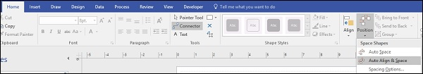

# Microsoft Visio - Aligning Smartshapes
Often, inserting and deleting shapes can disturb the alignment of the diagram. It can also make the elements of the diagram space out unevenly. To get around this, Visio provides tools that automatically align and space the shapes in your diagram so that it looks perfect.

## Align and Space Shapes
To automatically align and space shapes in a diagram, go to the Position dropdown menu in the Arrange section of the Home tab. Click either Auto Space or Auto Align &amp; Space depending on the requirement. You can also hover the mouse on these commands to preview how the diagram would look after alignment.

After alignment, you can still move the shapes in your diagram, if you’d like a more customized appearance.

[Previous Page](../microsoft_visio/microsoft_visio_connected_smartshapes.md) [Next Page](../microsoft_visio/microsoft_visio_relayout_page.md) 
