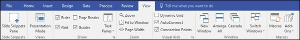
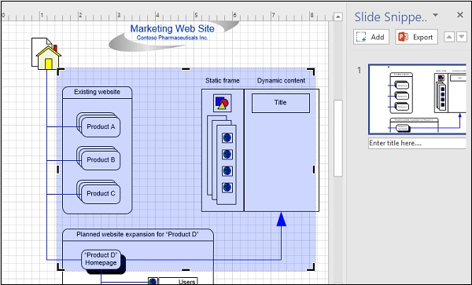

# Microsoft Visio - Changing View Modes
Visio has a few options for changing how you view the drawing. The View tab lists all the possible view options that you can use on the canvas. We will look at some of the commands that are useful in changing view modes.

## Slide Snippets
The Slide Snippets Pane is available only in the latest Office 365 version of Visio. Basically, slide snippets allow you to directly export a Visio diagram as a PowerPoint slide.

To take a slide snippet, click the Slide Snippets Pane in the View tab to open it. Then, select an area of the drawing that you want to export to a PowerPoint slide and click the Add button in the Slide Snippets Pane. Add a title in the Enter title here... field and click Export to export the captured drawing to a PowerPoint slide.

## Presentation Mode
The Presentation Mode shows a full screen view of the drawing without any distractions. This mode can also be toggled by pressing F5 on the keyboard.

## Ruler, Grid and Guides
You can toggle between showing the vertical and horizontal rulers, the grid, and the guides by toggling the corresponding checkboxes in the Show area of the View tab. The scaling of the rulers and grid can also be adjusted. The grid allows to easily snap objects so that they are placed correctly on the canvas.

## Zoom
The Zoom section comprises of commands that allow you to change the zoom levels of the canvas. You can also fit the contents to window or adjust the contents to fill the page width.

## Window
The Window section lists commands that allow to arrange multiple windows on your screen. You can directly open a new window or arrange windows side by side. You can also cascade windows for easy switching between them.

[Previous Page](../microsoft_visio/microsoft_visio_customizing_ui.md) [Next Page](../microsoft_visio/microsoft_visio_creating_arranging_smartshapes.md) 
