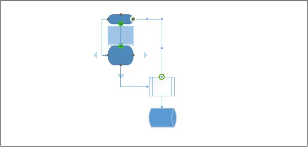

# Microsoft Visio - Connected Smartshapes
Newer versions of Visio have built-in intelligence to help you place shapes between other shapes. Visio automatically adds the required spacing and connectors to ensure that the new shape is inserted in the correct position.

To insert a shape between two shapes, drag the new shape in between the desired shapes, till you see green squares on the connectors and release the mouse. The new shape will be inserted with equal spacing and appropriate connections.

If you delete the inserted shape, the connector extends all the way till the next shape.

[Previous Page](../microsoft_visio/microsoft_visio_connecting_smartshapes.md) [Next Page](../microsoft_visio/microsoft_visio_aligning_smartshapes.md) 
