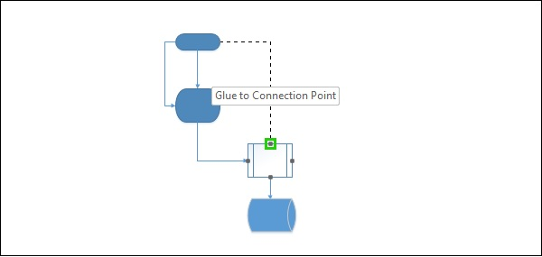

# Microsoft Visio - Connecting Smartshapes
SmartShapes allows to automatically connect shapes. If you want to connect shapes that are not directly related, you can manually connect them.

To manually connect shapes, click the Connector tool in the Tools section of the Home tab. The mouse pointer now changes into a connector.

Draw a connecting line from the originating shape to the destination. You will notice a dotted line representing the connector. You can either glue this connector to the connection point or glue it to the destination shape. Gluing it to the shape will enable you to move the shape to a different location on the canvas along with the connector.

Click the Pointer Tool in the Tools section of the Home tab to return the mouse pointer back to normal.

[Previous Page](../microsoft_visio/microsoft_visio_creating_arranging_smartshapes.md) [Next Page](../microsoft_visio/microsoft_visio_connected_smartshapes.md) 
