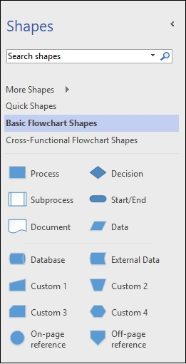
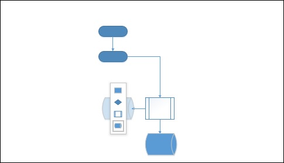

# Creating and Arranging Smartshapes
SmartShapes provide contextual shapes which relate to the selected shape. SmartShapes are connected to the original shape and the connector also moves whenever the SmartShape is moved.

## Creating a SmartShape
Start with a blank document (in this case a flowchart diagram). You will notice that the Shapes pane has different shapes that are applicable to flowcharts. Click and drag a shape onto the empty canvas. You can resize or rotate the shape as desired. You can even align the shape with the help of the alignment guides.

When you drag a shape onto the canvas, you will notice that there are four arrows along the shape. Hovering over any of these arrows will show possible shapes that can be created and linked to this shape.

Click the desired shape to create the shape. You will also notice that the shape is automatically connected to the initial shape. If you were to drag the shape manually, you will need to connect it manually as well. The connections between the shapes are dynamic and they will move in relation to the placement of the shape.

## Arranging SmartShapes
The SmartShape arrow lists the first four shapes for the diagram that are seen in the Shapes pane. You might want to customize which shapes appear in the four SmartShape options depending on your workflow. To set the shapes that you prefer as SmartShapes, first select the desired shape in the Shapes pane and drag it to one of the first four shapes within the pane.

In this example, let us assume that the Database shape needs to be in the first four. Click and drag the Database shape into one of the first four positions.

Now, when you create a SmartShape, you will find that the Database shape is made available.

[Previous Page](../microsoft_visio/microsoft_visio_changing_view_modes.md) [Next Page](../microsoft_visio/microsoft_visio_connecting_smartshapes.md) 
