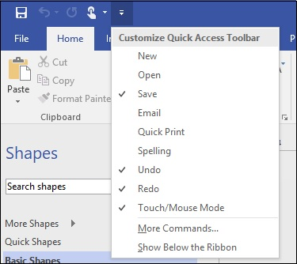

# Microsoft Visio - Customizing the UI
Visio’s UI is entirely customizable. You can show or hide elements in the UI to whatever suits you best.

## The Quick Access Toolbar
The Quick Access Toolbar allows you to easily add often-used commands so that they are always available within reach. Apart from the standard Undo, Redo, and Save commands, you can add additional buttons, such as a toggle between Touch and Mouse mode depending on your display by clicking the arrow icon in the Quick Access Toolbar. You can also add more commands by clicking the option More Commands...

## The Ribbon
The Ribbon can be collapsed to allow more real estate for the canvas. You can reduce or expand the Shapes pane by clicking and dragging the edge of the pane inwards or outwards respectively.

The Ribbon can be customized just like the Quick Access Toolbar but to do so, you need to navigate to the File menu and click Options. Then click Customize Ribbon. You can select the tabs that you wish to display on the workspace. You can also create a new tab or group by clicking New Tab or New Group to accommodate the commands that you use frequently.

You can export these customizations and import them to a new instance of Visio by clicking the Import/Export dropdown menu and selecting Export Customizations.

[Previous Page](../microsoft_visio/microsoft_visio_opening_files.md) [Next Page](../microsoft_visio/microsoft_visio_changing_view_modes.md) 
