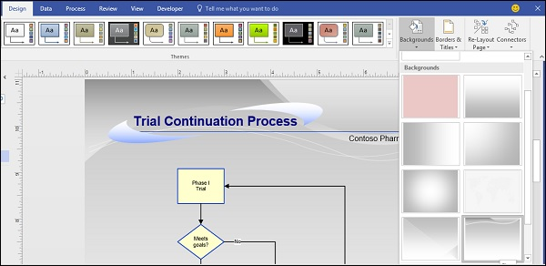

# Microsoft Visio - Inserting Backgrounds
Backgrounds are inserted using pages called background pages. Background pages can contain graphics or text such as copyright info and other information. Background pages are always separate but appear overlaid on the main page.

## Inserting a Background Page
You can change the background of a document by choosing from preset backgrounds or using your own background template. To insert a background, click the Background dropdown menu from the Design tab on the Ribbon and choose a background preset.

This creates a new page in addition to the diagram page. You can right-click the newly created background page to rename it. The new background will be automatically applied to all newly created pages in the document.

[Previous Page](../microsoft_visio/microsoft_visio_inserting_text.md) [Next Page](../microsoft_visio/microsoft_visio_inserting_graphics.md) 
