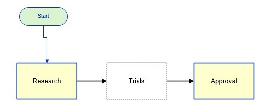
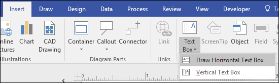

# Microsoft Visio - Inserting Text
Visio allows inserting text either within the shapes or in the document. You also get to do text formatting just like any other text editor.

## Inserting Text in a Shape
It is easy to insert text within a shape. Just double-click within a shape to type the text. The text automatically wraps according to the shape, however, you can also press hard returns if you’d like to have your own wrapping. Notice that Visio automatically zooms into the shape to enable typing and zooms out when you click outside the shape.

## Inserting Text in a Document
To insert a text in a document such as a heading for the chart, click the Text Box dropdown menu in the Insert tab on the Ribbon and select either horizontal or vertical text box.

Then place the cursor on the document and draw a text box to start typing.

[Previous Page](../microsoft_visio/microsoft_visio_relayout_page.md) [Next Page](../microsoft_visio/microsoft_visio_inserting_backgrounds.md) 
