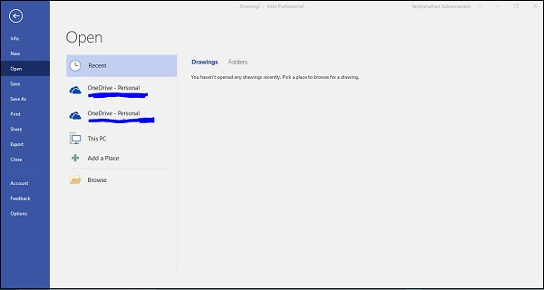
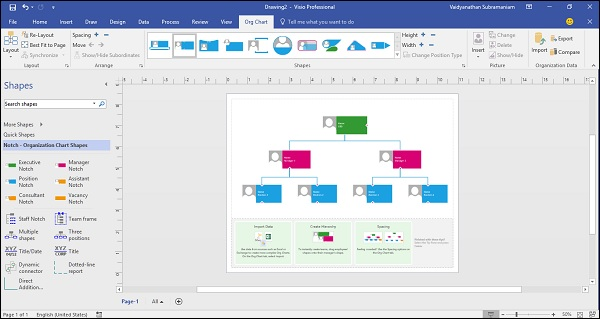

# Microsoft Visio - Opening Files
To open a file in Visio, go to the File menu, which opens the backstage view and click Open. The **Recent** section lets you directly access the recent drawings that you have opened or saved.

Based on your setup, the Open menu lists some of the file locations that you can browse for Visio drawings. Click Add a Place to add Office 365 SharePoint or OneDrive location for quick access. Alternatively, click Browse and select the Visio drawing from a local or network folder. Visio files have the extension **.vsdx**.

Once you open a Visio drawing, you will see that the user interface changes according to the drawing.

In the following example, we have opened an org chart and you can observe that the shape stencils corresponding to the org chart are now available in the Shapes pane. In case of this file, you will also notice an Org Chart tab in the Ribbon that gives you additional options for working with the shapes in the chart, and also allows linking the shapes to data from external sources such as Excel.

You can adjust the spacing between individual shapes and also change the height and width of all shapes in one click.

You can customize the layout of this Org chart and add additional shapes, if needed.

The Compare command in the Organization Data section of the Org Chart tab lets you compare the contents of this org chart with another org chart or diagram open in Visio. The output is generated as an HTML file, which lists out the similarities and differences between the two diagrams.

[Previous Page](../microsoft_visio/microsoft_visio_user_interface.md) [Next Page](../microsoft_visio/microsoft_visio_customizing_ui.md) 
