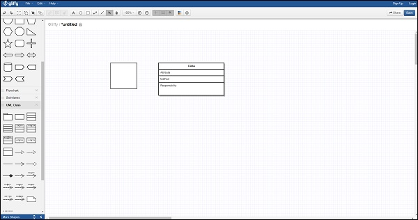
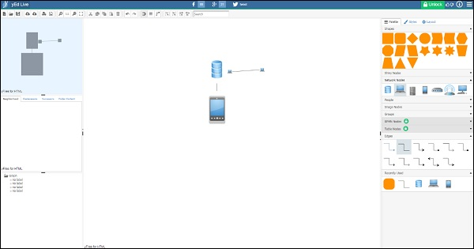
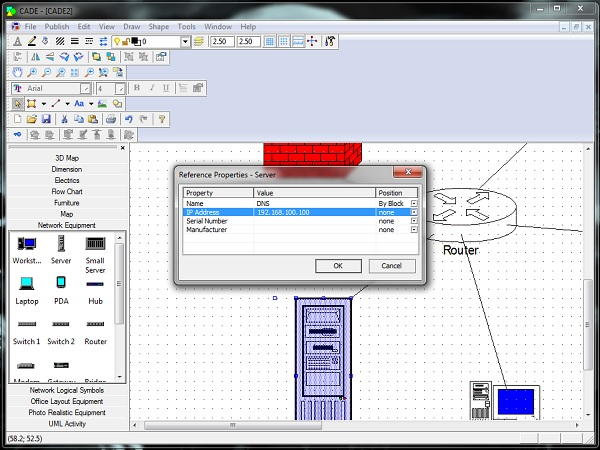
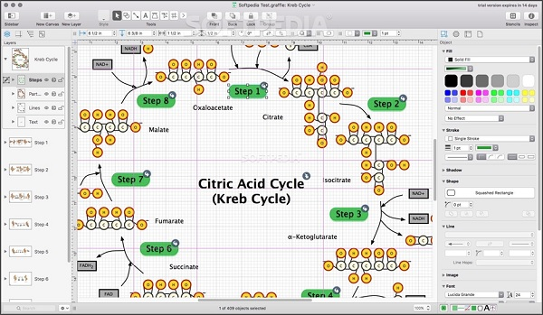

# Microsoft Visio - Overview
**Computer diagramming** is the process of creating scalable diagrams on a PC that can be used in various applications such as layout design, organization charts, timelines, floor plans and even prototype software user interfaces. Diagrams are made of shapes, objects and stencils, which when combined together correctly, can help project a lot of useful information.

Modern computer diagramming relies on using vector-based shapes instead of raster shapes. Raster shapes or bitmaps do not scale well, and their resolution and quality deteriorates with every edit. However, vector shapes are mathematical representations of a shape and hence scale well. Vector shapes are not affected by edits and are the most appropriate to use when precise measurements are required.

Computer diagramming can be shape-based artwork or more complex drafting often seen in CAD (Computer Aided Design) programs. CAD contains a lot more information such as the materials, processes, and specific conventions of the diagram. Shape-based artwork is more commonly used to depict lesser technical information.

## Popular Diagramming Software
Microsoft Visio is the most popular diagramming software, however, there are alternatives that are often as good and in some cases, free. For simple diagramming requirements, the following tools should work just fine.

### Gliffy
Gliffy is a popular online diagramming tool. Gliffy supports floor plans, venn diagrams, flow charts, network diagrams, etc. and is compatible with most modern web browsers. Gliffy can import Microsoft Visio documents and integrate with Google Drive to enable saving documents in the cloud and easy collaboration.

There are many themes and templates to choose from, making Gliffy a solid online alternative to Visio. Gliffy can be used freely for up to 5 diagrams or 2 MB file size. There are monthly plans that can be purchased depending on the number of diagrams needed.

### yEd
yEd is an open-source free diagramming tool that runs on virtually any Java enabled platform. It can import Visio documents and work with very complex diagrams such as biological pathways.

yEd has automatic layouts and support for most graphical standards making it a viable alternative to Visio for anyone looking to create diagrams for free. There is also an online version called yEd Live that works in any modern HTML5 compatible web browser.

### CADE
CADE works great for networking diagrams and as a 2D vector graphics editor for Windows. CADE is free to download and supports most of Visio’s basic functionalities. It is optimized for large CAD drawings and allows easy collaboration and sharing. CADE can be exported to popular formats such as EMF, JPG, PDF and XAML. There are many sample diagrams and templates to help you get started as well.

### OmniGraffle
Visio is not available for Mac OS leaving OmniGraffle as the only premium alternative for Mac users. OmniGraffle is a comprehensive diagramming software that can create visually appealing designs at a significantly cheaper price than Visio. It supports importing Visio documents and exporting to a ton of popular formats including SVG. There are extensive options for stencils, canvases, templates, and objects allowing to easily create wireframe diagrams, trees, floor plans, and a whole lot more.

The latest version supports scripting in AppleScript or JavaScript to automate almost every aspect of the software. It also supports Touch Bar on the latest MacBooks. The Standard version of OmniGraffle retails for $99.99, while the Pro version retails for $199.99.

## Introduction to Microsoft Visio
Microsoft Visio is one of the most popular diagramming software that empowers diagramming, data visualization, and process modelling in a familiar interface. Visio comes with an array of templates and built-in shapes that allow creating virtually any diagram of any complexity. Visio also allows users to define their own shapes and import them into the drawing.

Visio has been more of an enterprise-class software as home users rarely would need to use the advanced diagramming functions in Visio. However, many home users are purchasing the Standard edition of Visio to better visualize simple diagrams such as family trees or floor layout plans.

Visio owes its success in the enterprise due to its tight integration with other Microsoft Office products such as Word, Excel, and Access. Data can be directly imported from these softwares and converted into meaningful diagrams, which change in real-time in accordance with the data. For example, an Excel spreadsheet might have information about current flows through an electrical line. Visio can be used to diagrammatically represent this and whenever the Excel data gets updated, the same will be reflected in the Visio diagram as well.

Newer versions of Visio from Visio 2013 onwards support .vsdx format that allows enhanced compression and many other features compared to the older .vsd format supported by Visio 2010 and earlier versions. Visio can be purchased standalone in two versions — a Standard version, which retails for $299, and a Professional version, which retails for $589.99. The latest version of Visio can also be purchased as part of the Office 365 subscription with access to the online Visio viewer as well. Getting Visio as part of Office 365 is the best choice in order to keep up-to-date with the latest features and enhancements.

## MS Visio - New Features
Visio being part of the Office 365 suite, is updated continuously throughout the year. If you have a qualifying Office 365 subscription, you are entitled to regular updates automatically. Users who purchase the standalone versions of Visio do not however, receive feature updates and must upgrade separately to a higher version when released.

The most recent update of Visio 2016 Professional (Office 365 version) has the following new features −

### Data Visualizer
Data Visualizer helps in automatically creating process diagrams from Excel data. Premade or custom Excel templates containing information that fit into diagrams can be imported directly into Visio using the Data Visualizer and transformed into a Visio diagram. Any changes made to the original Excel file reflects in the Visio diagram as well.

### Visualize Database Structures From Source Data
The latest version of Visio enables reverse engineering of databases to create a visual representation of the database. Visio can connect to various databases such as MySQL, SQL Server, Oracle, etc. and can update the diagrams in sync with the changes in the database.

### Templates for Industry Specific Diagrams
The latest update to Visio for Office 365 comes with many new standardized templates catering to industries such as business processes, software development, IT and education. These templates are supplied by both Microsoft and other third parties extending the capabilities of Visio 2016.

### Visio Online and Visio on iPad
Visio diagrams stored on SharePoint or OneDrive for business can now be opened for review in any modern web browser with Visio Online available with Office 365 or in the free Visio Viewer app for the iPad.

[Previous Page](../microsoft_visio/index.md) [Next Page](../microsoft_visio/microsoft_visio_user_interface.md) 
