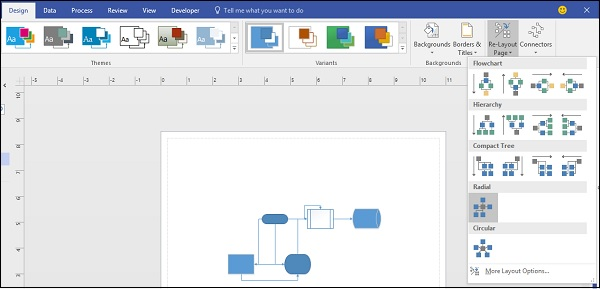
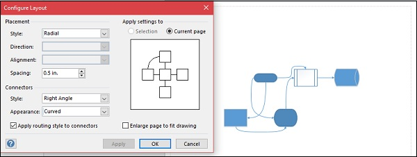

# Microsoft Visio - Re-layout Page
Visio provides options for automatically changing the layout of the diagram with the ReLayout Page command. The Re-Layout Page command provides commonly used layouts. You can also customize some of the aspects of the layout as needed.

## Changing the Diagram Layout
Open the diagram and navigate to the Design tab on the Ribbon. Click the Re-Layout Page dropdown menu and select a layout as needed. You will see that the diagram now changes to the selected layout. You can also preview the look before clicking by hovering the mouse over the layout style.

## Customizing the Layout
You can further customize the layout by clicking More Layout Options… in the Re-Layout Page dropdown menu. This opens a dialog box in which you can configure the layout properties.

You can change the spacing between the shapes by manually changing the values in the Spacing field.

You can also change the appearance of the connectors to curved by selecting Curved in the Appearance dropdown menu. Remember to select the Apply routing style to connectors checkbox to be able to change the appearance of the connectors.

[Previous Page](../microsoft_visio/microsoft_visio_aligning_smartshapes.md) [Next Page](../microsoft_visio/microsoft_visio_inserting_text.md) 
