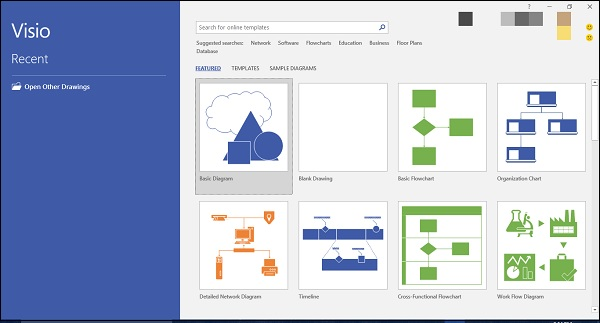
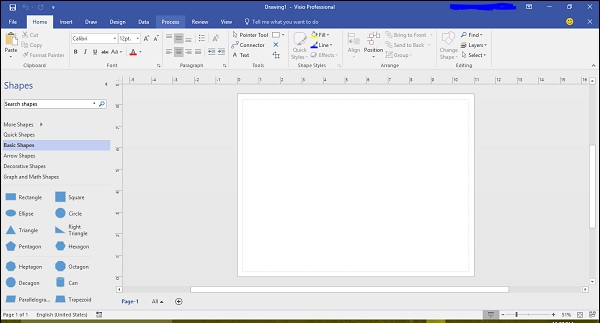
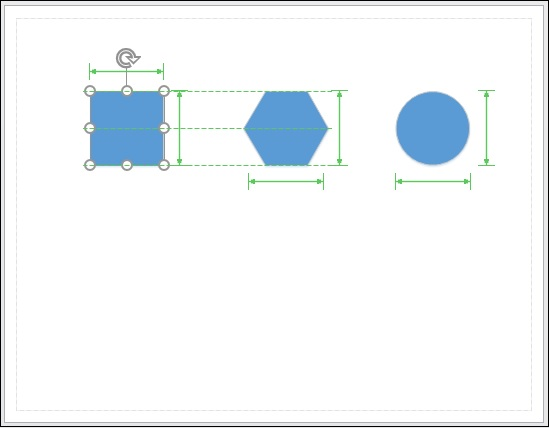

# Microsoft Visio - User Interface
In this chapter, we will learn about the user interface in Visio. It is important to properly understand the user interface to get the most out of this tool.

## Start Screen
The user interface of Visio is similar to that of other programs in the Office suite. You will be greeted with a Start page that lists some of the recent documents you have opened along with featured templates for creating common diagram types.

You can also search for templates on the Microsoft website right from the Start screen.

The top right corner shows the Microsoft account you are connected to, if you are an Office 365 subscriber.

Apart from the featured templates, you can also click Templates to browse through the template categories.

## Document Interface
Clicking any of the above templates opens the template document.

The document interface of Visio is similar to other Office programs such as Word or Excel. On the top, you have the Quick Access toolbar, which contains common commands, such as Save, Undo, and Redo. This can be customized as needed.

Below the Quick Access toolbar is the familiar Office Ribbon. The Home tab lists common commands for working with the document. We will learn more about other tabs as we go along.

On the left-hand pane, there is Shapes, which lists the common shapes that go well with the template. To insert a shape, just click and drag the shape onto the canvas. There are many shapes available in Visio and we will get more familiar with them as we move ahead.

Of course, you can also search for more shapes, if needed online, using the built-in search tool.

When you place shapes onto the canvas, you will see guides that help you align the shapes with respect to the objects already on the canvas. You also have a ruler on the top and left of the canvas. This gives a sense of perspective and lets you create perfectly aligned diagrams.

Shapes in Visio are basically vector graphics and as such you can enlarge or shrink the size as needed without loss of quality. You also get an idea of the relative dimensions of all the other shapes (indicated by green arrows) when you try to change the dimensions of any shape.

[Previous Page](../microsoft_visio/microsoft_visio_overview.md) [Next Page](../microsoft_visio/microsoft_visio_opening_files.md) 
