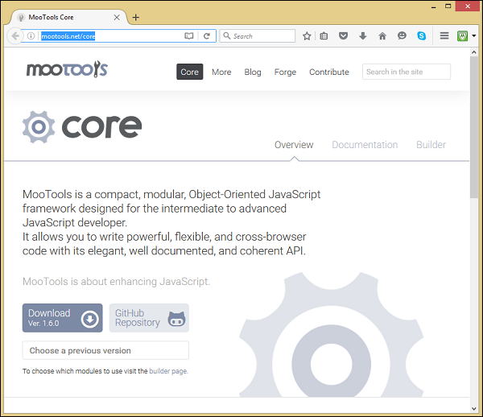
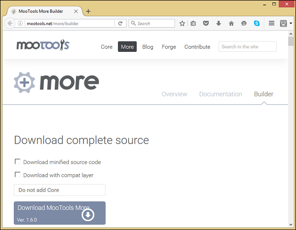

# MooTools - Installation
MooTools is a powerful, JavaScript library to design DOM objects using object-oriented paradigm. This chapter explains how to install and use MooTools library along with JavaScript.

To install MooTools library, follow the steps given below −

### Step 1: Download MooTools Core and MooTools More library
You can download the latest version of MooTools Core and MooTools More libraries from the following link [MooTools-Core](http://mootools.net/core)  and [MooTools-More](http://mootools.net/more/builder) . When you click on the links, you will be directed to the following screens in your browser −



And,



Click on the download buttons, you will get the latest version of MooTools libraries. For this tutorial, we are using **MooTools-Core-1.6.0.js** and **MooTools-More-1.6.0.js** libraries.

### Step 2: Upload the MooTools Core and More libraries into the server
You now have the MooTools libraries in your file system. We have to copy these libraries into the server (the workspace) where the application web pages are available. For this tutorial, we are using **C:\MooTools\workspace\** directory location.

Therefore, copy the **MooTools-Core-1.6.0.js** and **MooTools-More-1.6.0.js** files into the given directory location.

### Step 3: Link the MooTools Core and More libraries into the script tag
The JavaScript library is a **.js** file. If you include this library into your JavaScript code, include it with the script tag as follows. Take a look at the following code snippet.

```
<script type = "text/javascript" src = "MooTools-Core-1.6.0.js"></script>
<script type = "text/javascript" src = "MooTools-More-1.6.0.js"></script>
```

[Previous Page](../mootools/mootools_introduction.md) [Next Page](../mootools/mootools_program_structure.md) 
