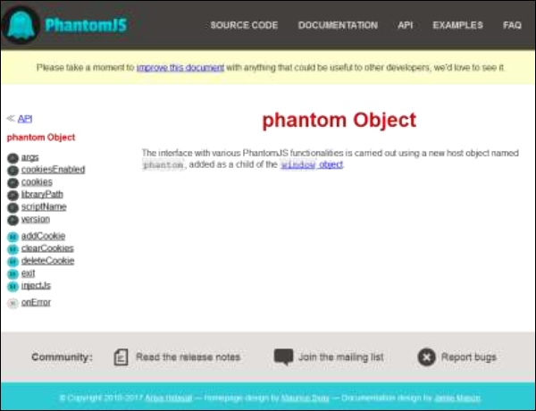
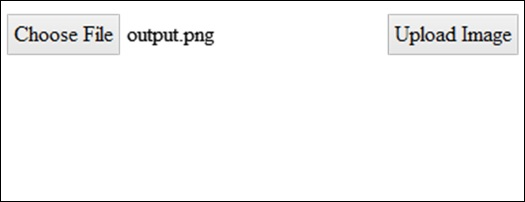
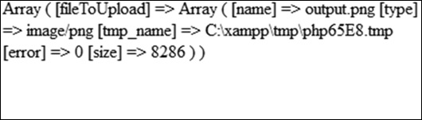

# PhantomJS - Examples
In this chapter, we are providing a few more practical examples to understand some important features of PhantomJS.

## Example 1 - Find the Page Speed
In this example, we will use PhantomJS to find the **page speed** for any given page URL.

```
var page = require('webpage').create(), 
   system = require('system'), 
   t, address;  

if (system.args.length === 1) { 
   console.log('Usage: loadspeed.js <some URL>'); 
   phantom.exit(1); 
} else { 
   t = Date.now(); 
   address = system.args[1]; 
   
   page.open(address, function (status) { 
      if (status !== 'success') { 
         console.log('FAIL to load the address'); 
      } else { 
         t = Date.now() - t; 
         
         console.log('Page title is ' + page.evaluate(function () { 
            return document.title; 
         })); 
         console.log('Loading time ' + t + ' msec'); 
      } 
      phantom.exit(); 
   }); 
}
```
The above program generates the following **output**.

**Command** − phantomjs pagespeed.js [http://www.google.com](http://www.google.com) 

```
Page title is Google 
Loading time 1396 msec
```
## Example 2 - Send a Click Event to a Page
In the following example, we will use PhantomJS to send a **click event** to a page.

```
var page = require('webpage').create(); 
page.onConsoleMessage = function(str) { 
   console.log(str); 
} 
page.open('http://phantomjs.org/api/phantom/', function(status) { 
   page.render('beforeclick.png'); 
   console.log(page.url); 
   
   var element = page.evaluate(function() {   
      return document.querySelector('img[src = "http://phantomjs.org/img/phantomjslogo.png"]'); 
   }); 
   page.sendEvent('click', element.offsetLeft, element.offsetTop, 'left'); 
   
   window.setTimeout(function () { 
      console.log(page.url); 
      page.render('afterclick.png'); 
      phantom.exit(); 
   }, 5000); 
   console.log('element is ' + element); 
});
```
The above program generates the following **output**.

```
http://phantomjs.org/api/phantom/ 
element is [object Object] 
http://phantomjs.org/
```
Our program will create the following two **png** images in the **bin** folder. These two images show the difference before and after the execution of the above program.




## Example 3 - Submit a Form
The following example shows how to submit a form using PhantomJS.

```
var wpage = require('webpage').create();  
wpage.open("http://localhost/tasks/submitform.html", function(status) { 
   console.log(status); 
   wpage.uploadFile('input[name = fileToUpload]', 'output.png'); 
   wpage.render("sform.png");  
   
   var element = wpage.evaluate(function() {   
      return document.querySelector('input[type = "submit"]');   
      // getting details of submit button using queryselector. 
   }); 
   wpage.sendEvent('click', element.offsetLeft, element.offsetTop, 'left');  
   
   // sendevent is used to send click event and also giving the left and top 
      position of the submit button. 
   
   window.setTimeout(function () { 
      console.log(wpage.url); 
      wpage.render("submit.png");  // screenshot is saved in submit.png 
      phantom.exit(); 
   }, 5000);  
   console.log('element is ' + element);  
});
```
### submitform.html
The following code shows how to use the **submitform.html** file.

```
<html> 
   <head>
      <title>Window 2</title>
   </head> 

   <body>
      <form action = "submitform.php" method = "post" enctype = "multipart/form-data" 
         id = "form1">  
         <input type = "file" name = "fileToUpload" id = "fileToUpload"> 
         <input type = "submit" value = "Upload Image" name = "submit"> 
      </form> 
   </body>  
   
</html>
```
Once the form is submitted, it goes to **submitform.php**.

### submitform.php
submitform.php is just printing the details of the files.

```
<?php 
   print_r($_FILES); 
?>
```
The above program generates the following **output**.

```
Success 
element is [object Object] 
http://localhost/tasks/submitform.php
```
## Images
Following are the images for **file upload** and **form submit**.







[Previous Page](../phantomjs/phantomjs_repl.md) [Next Page](../phantomjs/phantomjs_quick_guide.md) 
