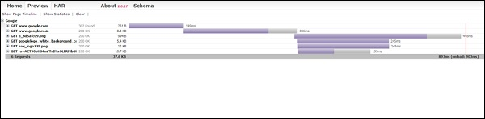

# PhantomJS - Network Monitoring
With help of PhantomJS, we can monitor the network and validate the behavior and performance of a particular webpage. There are callbacks in PhantomJS, i.e., **onResourceRequested** and **onResourceReceived**, which help in monitoring the traffic for a given page.

## Example
The following example shows how you can use PhantomJS to monitor traffic for a given page.

```
function createHAR(address, title, startTime, resources) {  
   
   // this function formats the data which is coming from 
      onresourcerequest and onresourcereceived 
   var entries = []; 
   
   resources.forEach(function (resource) { 
      var request = resource.request, startReply = resource.startReply, 
         endReply = resource.endReply;  
      
      if (!request || !startReply || !endReply) { 
         return; 
      }  
      
      // Exclude Data URI from HAR file because 
      // they aren't included in specification 
      if (request.url.match(/(^data:image\/.*)/i)) { 
         return; 
      }  
      entries.push ({ 
         startedDateTime: request.time.toISOString(), 
         time: endReply.time - request.time, 
         
         request: { 
            method: request.method, 
            url: request.url, 
            httpVersion: "HTTP/1.1", 
            cookies: [], headers: request.headers, 
            queryString: [], 
            headersSize: -1, 
            bodySize: -1 
         }, 
         response: { 
            status: endReply.status, 
            statusText: endReply.statusText, 
            httpVersion: "HTTP/1.1", 
            cookies: [], 
            headers: endReply.headers, 
            redirectURL: "", 
            headersSize: -1, 
            bodySize: startReply.bodySize, 
            
            content: { 
               size: startReply.bodySize, 
               mimeType: endReply.contentType 
            } 
         }, 
         cache: {}, 
         timings: { 
            blocked: 0, 
            dns: -1, 
            connect: -1, 
            send: 0, 
            wait: startReply.time - request.time, 
            receive: endReply.time - startReply.time, 
            ssl: -1 
         }, 
         pageref: address 
      }); 
   });  
   return { 
      log: { 
         version: '1.2', creator: { 
            name: "PhantomJS", 
            version: phantom.version.major + '.' + phantom.version.minor + 
               '.' + phantom.version.patch 
         }, 
         pages: [{ 
            startedDateTime: startTime.toISOString(), 
            id: address, 
            title: title, 
            
            pageTimings: { 
               onLoad: page.endTime - page.startTime 
            } 
         }], 
         entries: entries 
      } 
   }; 
}  
var page = require('webpage').create(), system = require('system'); 
var fs = require('fs');   

if (system.args.length === 1) { 
   console.log('Usage: netsniff.js <some URL>'); 
   phantom.exit(1); 
} else { 
   page.address = system.args[1]; 
   page.resources = []; 
   
   page.onLoadStarted = function () {  // called when page is loaded 
      page.startTime = new Date(); 
   };  
   page.onResourceRequested = function (req) {  
      // called when any files are requested from given page url 
      page.resources[req.id] = { 
         request: req, 
         startReply: null, 
         endReply: null 
      }; 
   };  
   page.onResourceReceived = function (res) {  
      //called when any files are received. 
      if (res.stage === 'start') { 
         page.resources[res.id].startReply = res; 
      } 
      if (res.stage === 'end') { 
         page.resources[res.id].endReply = res; 
      } 
   };  
   page.open(page.address, function (status) {  // open given page url 
      var har; 
      
      if (status !== 'success') { 
         console.log('FAIL to load the address'); 
         phantom.exit(1); 
      } else { 
         page.endTime = new Date(); 
         
         page.title = page.evaluate(function () { // gets the page title 
            return document.title; 
         });             
         har = createHAR(page.address, page.title, page.startTime, page.resources);  
         
         // calls the function createHAR with page url, starttime, and page resources. 
         // console.log(JSON.stringify(har, undefined, 4)); 
         fs.write('log.txt', JSON.stringify(har, undefined, 4), 'w');  
         
         // logs are collected in log.txt file. 
         phantom.exit(); 
      } 
   }); 
}
```
## Example of log.txt given to HAR preview
```
{ 
   "log": { 
      "version": "1.2", 
      "creator": { 
         "name": "PhantomJS", 
         "version": "2.1.1" 
      }, 
      "pages": [ 
         { 
            "startedDateTime": "2017-05-21T13:41:21.824Z", 
            "id": "http://www.sample.com", 
            "title": "Free Sample Products – Sample.com ≫ Free Samples, 
               Free Product Samples, Product Test Marketing", 
            "pageTimings": { 
               "onLoad": 11081 
            } 
         } 
      ], 
      "entries": [ 
         { 
            "startedDateTime": "2017-05-21T13:41:21.815Z", 
            "time": 1999, 
            
            "request": { 
               "method": "GET", 
               "url": "http://www.sample.com/", 
               "httpVersion": "HTTP/1.1", 
               "cookies": [], 
               
               "headers": [ 
                  { 
                     "name": "Accept", 
                     "value": "text/html,application/xhtml+xml,
                        application/xml;q = 0.9,*/*;q = 0.8" 
                  }, 
                  
                  { 
                     "name": "User-Agent", 
                     "value": "Mozilla/5.0 (Windows NT 6.2; WOW64) AppleWebKit/538.1 
                        (KHTML, like Gecko) PhantomJS/2.1.1 Safari/538.1"  
                  } 
               ], 
               
               "queryString": [], 
               "headersSize": -1, 
               "bodySize": -1 
            }, 
            "response": { 
               "status": 301, 
               "statusText": "Moved Permanently", 
               "httpVersion": "HTTP/1.1", 
               "cookies": [], 
               
               "headers": [ 
                  { 
                     "name": "Date", 
                     "value": "Sun, 21 May 2017 13:41:25 GMT" 
                  }, 
                  
                  { 
                     "name": "Server", 
                     "value": "Apache/2.2.14 (Ubuntu)" 
                  }, 
                  
                  { 
                     "name": "Location", 
                     "value": "http://sample.com//" 
                  }, 
                  
                  { 
                     "name": "Vary", 
                     "value": "Accept-Encoding" 
                  }, 
                  
                  { 
                     "name": "Content-Encoding", 
                     "value": "gzip" 
                  }, 
                  
                  { 
                     "name": "Keep-Alive", 
                     "value": "timeout = 15, max = 100" 
                  },
                  
                  { 
                     "name": "Connection", 
                     "value": "Keep-Alive" 
                  }, 
                  
                  { 
                     "name": "Content-Type", 
                     "value": "text/html; charset = iso-8859-1" 
                  } 
               ],  
               "redirectURL": "", 
               "headersSize": -1, 
               "bodySize": 307, 
               
               "content": { 
                  "size": 307, 
                  "mimeType": "text/html; charset = iso-8859-1" 
               } 
            }, 
            
            "cache": {}, 
            "timings": { 
               "blocked": 0, 
               "dns": -1, 
               "connect": -1, 
               "send": 0, 
               "wait": 1999, 
               "receive": 0, 
               "ssl": -1 
            }, 
            "pageref": "http://www.sample.com" 
         }, 
      ]   
      { 
         "startedDateTime": "2017-05-21T13:41:24.898Z", 
         "time": 885, 
         
         "request": { 
            "method": "GET", 
            "url": "http://sample.com/", 
            "httpVersion": "HTTP/1.1", 
            "cookies": [], 
            
            "headers": [ 
               { 
                  "name": "Accept", 
                  "value": "text/html,application/xhtml+xml,
                     application/xml;q = 0.9,*/*;q = 0.8" 
               }, 
               
               { 
                  "name": "User-Agent", 
                  "value": "Mozilla/5.0 (Windows NT 6.2; WOW64) AppleWebKit/538.1 
                     (KHTML, like Gecko) PhantomJS/2.1.1 Safari/538.1" 
               } 
            ], 
            "queryString": [], 
            "headersSize": -1, 
            "bodySize": -1 
         }, 
         "response": { 
            "status": 200, 
            "statusText": "OK", 
            "httpVersion": "HTTP/1.1", 
            "cookies": [], 
            
            "headers": [ 
               { 
                  "name": "Date", 
                  "value": "Sun, 21 May 2017 13:41:27 GMT" 
               }, 
               
               { 
                  "name": "Server", 
                  "value": "Apache/2.2.14 (Ubuntu)" 
               }, 
               
               { 
                  "name": "X-Powered-By", 
                  "value": "PHP/5.3.2-1ubuntu4.29" 
               }, 
               
               {
                  "name": "X-Pingback", 
                  "value": "http://sample.com/xmlrpc.php" 
               }, 
               
               { 
                  "name": "Link", 
                  "value": "<http://sample.com/wp-json/>; 
                     rel = \"https://api.w.org/\", <http://wp.me/P6Jj5H-4>; 
                     rel = shortlink" 
               }, 
               
               { 
                  "name": "Vary", 
                  "value": "Accept-Encoding"  
               }, 
               
               { 
                  "name": "Content-Encoding",
                  "value": "gzip" 
               },

               { 
                  "name": "Keep-Alive",
                  "value": "timeout = 15, max = 99"
               },

               {
                  "name": "Connection",
                  "value": "Keep-Alive"
               },

               { 
                  "name": "Content-Type",
                  "value": "text/html; charset = UTF-8"
               }
            ],

            "redirectURL": "",
            "headersSize": -1,
            "bodySize": 1969,

            "content": {
               "size": 1969,
               "mimeType": "text/html; charset = UTF-8"
            }
         },

         "cache": {},
         "timings": {
            "blocked": 0,
            "dns": -1,
            "connect": -1,
            "send": 0,
            "wait": 869,
            "receive": 16,
            "ssl": -1
         },

         "pageref": http://www.sample.com
      },

      {
         "startedDateTime": "2017-05-21T13:41:25.767Z",
         "time": 388,

         "request": {
            "method": "GET",
            "url": "http://sample.com/wpcontent/themes/samplecom/style.css",
            "httpVersion": "HTTP/1.1",
            "cookies": [],

            "headers": [
               {
                  "name": "Accept",
                  "value": "text/css,*/*;q = 0.1"
               },

               {
                  "name": "Referer",
                  "value": "http://sample.com/"
               },

               {
                  "name": "User-Agent",
                  "value": "Mozilla/5.0 (Windows NT 6.2; WOW64) AppleWebKit/538.1 
                     (KHTML, like Gecko) PhantomJS/2.1.1 Safari/538.1"
               }
            ],

            "queryString": [],
            "headersSize": -1,
            "bodySize": -1
         },

         "response": {
            "status": 200,
            "statusText": "OK",
            "httpVersion": "HTTP/1.1",
            "cookies": [],

            "headers": [
               {
                  "name": "Date",
                  "value": "Sun, 21 May 2017 13:41:27 GMT"
               },

               {
                  "name": "Server",
                  "value": "Apache/2.2.14 (Ubuntu)"
               },

               {
                  "name": "Last-Modified",
                  "value": "Fri, 22 Apr 2011 00:32:22 GMT"
               },

               {
                  "name": "ETag",
                  "value": "\"e1d7-1836-4a176fdbbd180\""
               },

               {
                  "name": "Accept-Ranges",
                  "value": "bytes"
               },

               {
                  "name": "Vary",
                  "value": "Accept-Encoding"
               },

               {
                  "name": "Content-Encoding",
                  "value": "gzip"
               },

               {
                  "name": "Keep-Alive",
                  "value": "timeout = 15, max = 98"
               },

               {
                  "name": "Connection",
                  "value": "Keep-Alive"
               },

               {
                  "name": "Content-Type",
                  "value": "text/css"
               }
            ],

            "redirectURL": "",
            "headersSize": -1,
            "bodySize": 3174,
            
            "content": {
               "size": 3174,
               "mimeType": "text/css"
            }
         },

         "cache": {},
         "timings": {
            "blocked": 0,
            "dns": -1,
            "connect": -1,
            "send": 0,
            "wait": 388,
            "receive": 0,
            "ssl": -1
         },
         
         "pageref": "http://www.sample.com"
      }
   }
}
```
## Output
The above program generates the following output.



All the logs are collected in a **.txt file** and later, the same is converted as above using the HAR preview, for example, ([http://www.softwareishard.com/har/viewer/)](http://www.softwareishard.com/har/viewer/) 


[Previous Page](../phantomjs/phantomjs_page_automation.md) [Next Page](../phantomjs/phantomjs_testing.md) 
