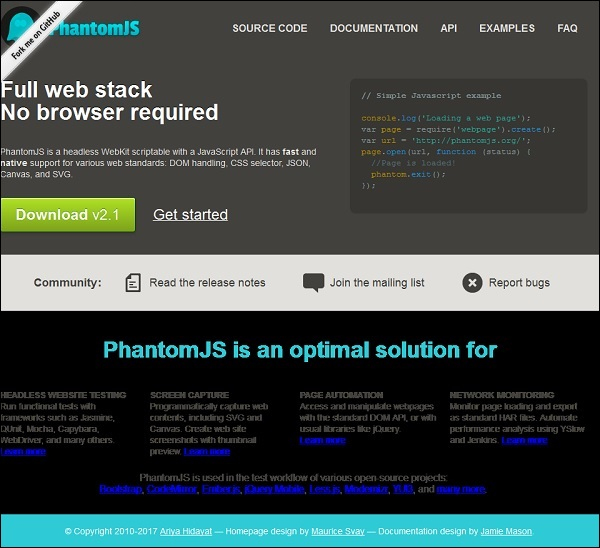

# PhantomJS - Screen Capture
PhantomJS is very helpful in taking a screenshot of a webpage and converting a webpage into a PDF. We have given here a simple example to demonstrate how it works.

## Example
```
var page = require('webpage').create();
page.open('http://phantom.org/',function(status){
   page.render('phantom.png');
   phantom.exit();
});
```
Execute the above program and the output will be saved as **phantom.png**.



## Convert Webpages into PDFs
PhantomJS also helps to convert webpages into PDFs with header and footer added to it. Take a look at the following example to understand how it works.

```
var wpage = require('webpage').create(); 
var url = "https://en.wikipedia.org/wiki/Main_Page"; 
var output = "test.pdf"; 

wpage.paperSize = { 
   width: screen.width+'px', 
   height: '1500px', 
   
   margin: {
      'top':'50px', 
      'left':'50px', 
      'rigtht':'50px' 
   }, 
   orientation:'portrait', 
   header: { 
      height: "1cm", 
      contents: phantom.callback(function(pageNumber, nPages) { 
         return "<h5>Header <b>" + pageNumber + " / " + nPages + "</b></h5>"; 
      }) 
   }, 
   footer: { 
      height: "1cm", 
      contents: phantom.callback(function(pageNumber, nPages) {   
         return "<h5>Footer <b>" + pageNumber + " / " + nPages + "</b></h5>"; 
      }) 
   } 
} 
wpage.open(url, function (status) { 
   if (status !== 'success') { 
      console.log('Page is not opening'); 
      phantom.exit(); 
   } else { 
      wpage.render(output); 
      phantom.exit();     
   } 
});
```
The above program generates the following **output**.

```
The above will convert the page into pdf and will be saved in test.pdf
```
## Convert a Canvas to an Image
Phantomjs can easily convert a Canvas to an Image. Take a look at the following example to understand how it works.

```
var page = require('webpage').create(); 
page.content = '<html><body><canvas id="surface" width="400" height="400"></canvas></body></html>'; 

page.evaluate(function() {
   var context,e1; 
   el = document.getElementById('surface'); 
   
   context = el.getContext('2d'); 
   context.font = "30px Comic Sans MS"; 
   context.fillStyle = "red"; 
   context.textAlign = "center"; 
   context.fillText("Welcome to PhantomJS ", 200, 200); 
   
   document.body.style.backgroundColor = 'white'; 
   document.body.style.margin = '0px'; 
}); 
page.render('canvas.png'); 
phantom.exit();
```
The above program generates the following **output**.


[Previous Page](../phantomjs/phantomjs_command_line_interface.md) [Next Page](../phantomjs/phantomjs_page_automation.md) 
