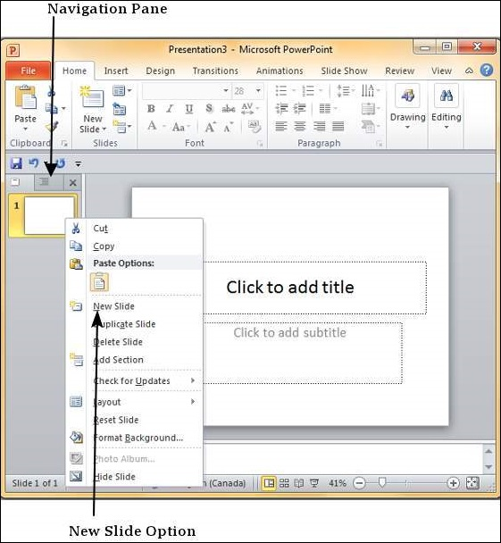
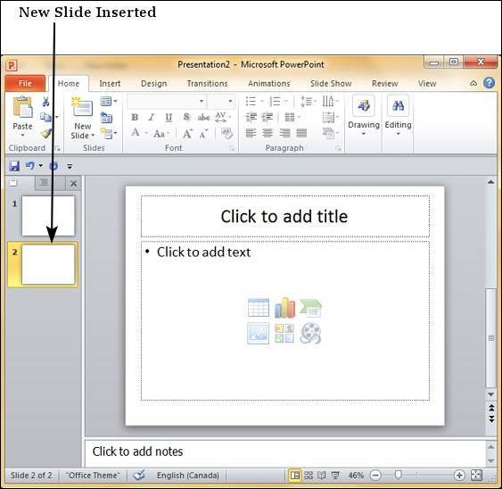
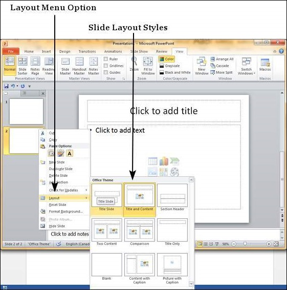

# Add New Slides in Powerpoint 2010
In this chapter, we will understand how to add new slides in an existing presentation. Here are the steps that allow you to insert a new slide in the deck −

**Step 1** − Right-click in the **Navigation Pane** under any existing slide and click on the **New Slide** option.

**Step 2** − The new slide is inserted. You can now change the layout of this slide to suit your design requirements.

**Step 3** − To change the slide layout, right-click on the newly inserted slide and go to the **Layout** option where you can choose from the existing layout styles available to you.

You can follow the same steps to insert a new slide in between existing slides or at the end on the slide list.

When we insert a new slide, it inherits the layout of its previous slide with one exception. If you are inserting a new slide after the first slide (**Title** slide), the subsequent slide will have the **Title and Content** layout.

You will also notice that if you right-click in the first step without selecting any slide the menu options you get are different, although you can insert a new slide from this menu too.

[Previous Page](../powerpoint/powerpoint_create_presentation.md) [Next Page](../powerpoint/powerpoint_adding_text_in_boxes.md) 
