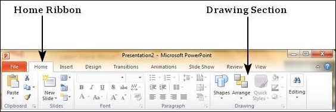
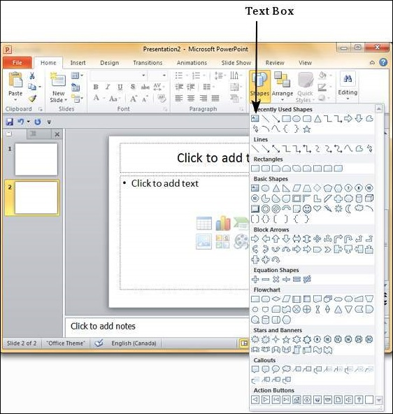
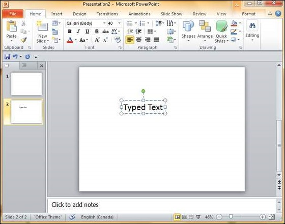
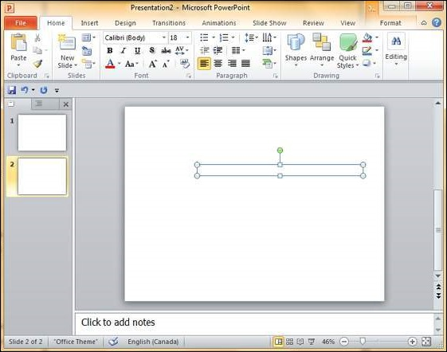
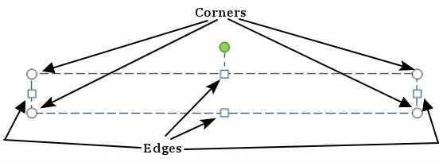

# Adding New Text Boxes in Powerpoint 2010
This chapter will teach you how to add new text boxes in a slide. Most of the standard layouts come with the text box option. As mentioned in the previous chapter, text boxes will have "**Click to add text**" as the default text. Here are the steps to add new text boxes in slide.

**Step 1** − Click on the **Text Box** icon in the **Home** ribbon under the **Drawing** section.

**Step 2** − You will get the insert text box cursor that looks like an inverted cross.

**Step 3** − Click to insert a text box. You can now start typing directly into the text box.

**Step 4** − Alternately, you can click and drag the cursor without releasing the click to create a text box.

The size of the text box can be adjusted by selecting one of the edges marked by squares or corners marked by circles.

[Previous Page](../powerpoint/powerpoint_adding_text_in_boxes.md) [Next Page](../powerpoint/powerpoint_deleting_existing_slide.md) 
