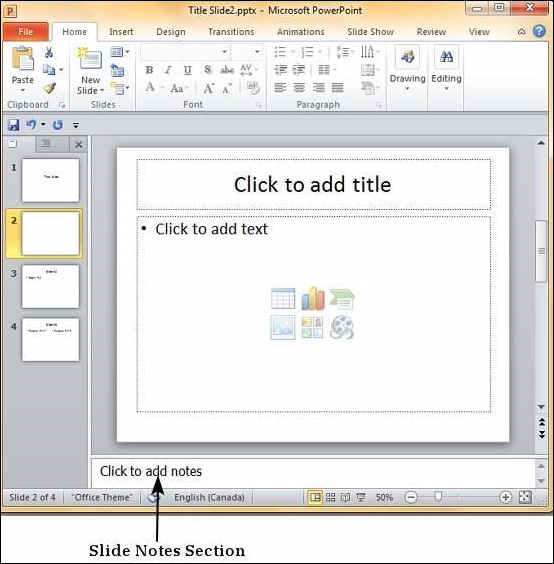
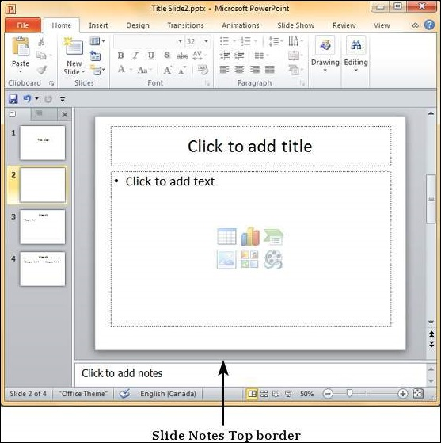
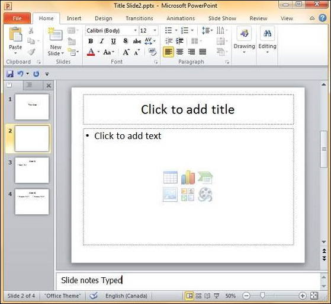
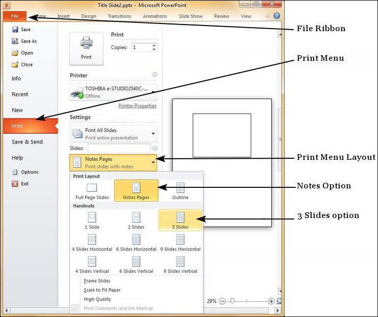

# Adding Slide Notes Powerpoint 2010
Slide notes can be very useful tools for presentation. These notes are not displayed on the screen in the **Slideshow** mode, but the presenter can see them so they can prepare well to present the slides. Depending on your Print settings, you can also print the slide notes along with the slides.

This chapter will show you how to add slide notes to an existing presentation.

**Step 1** − To locate the slide notes, set the view in **Normal** mode.

**Step 2** − The Slide Notes section is indicated by "**Click to add notes**".

**Step 3** − You can click on the top border and drag the section to increase its size to make it easier to type.

**Step 4** − Type your text in this section as slide notes.

You can only use bullets, numbering and alignment functions in the Slide Notes section. All other functions can be selected, but can be applied only to the selected slide, not the notes.

Slide notes can be printed from the print menu under the Backstage view. From the Print Layout option, select **Notes Pages** or **3 Slides**. Notes Pages will print a single slide with the slide notes below it. The 3 Slides will print all three slides with notes on the right side.

[Previous Page](../powerpoint/powerpoint_rearranging_slides.md) [Next Page](../powerpoint/powerpoint_managing_sections.md) 
