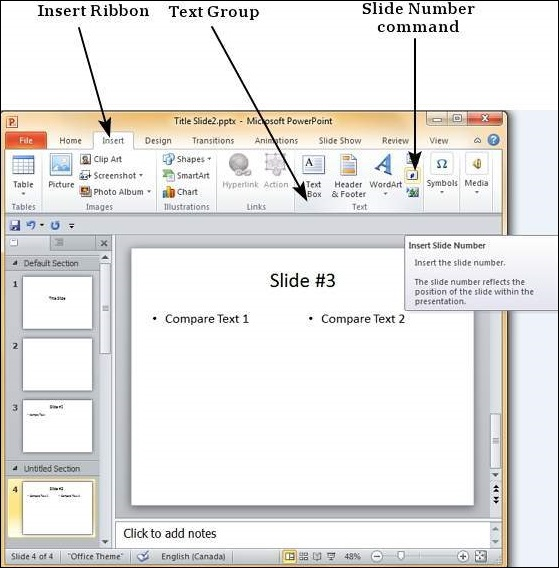
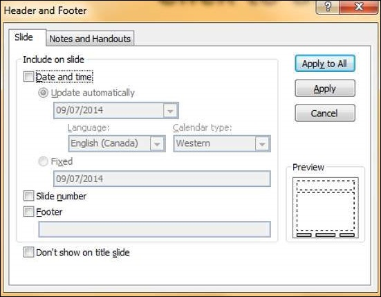
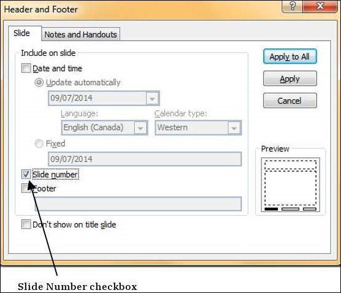
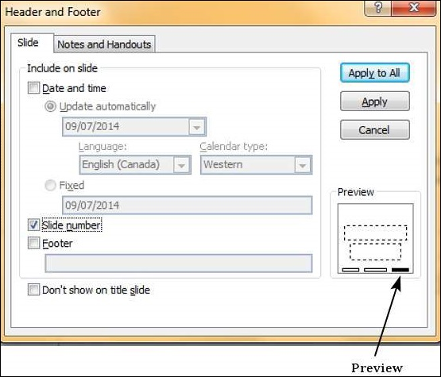
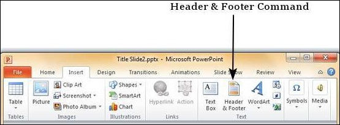

# Adding Slide Numbers in Powerpoint 2010
Just like you have page numbers for books, it is usually a good idea to add slide numbers to presentations. There are two ways you can add slide numbers to your presentation and this chapter will show you both those techniques.

**Step 1** − Under the **Insert** ribbon, **Text** group click on **Slide Number** command.

**Step 2** − The **Header and Footer** dialog opens up.

**Step 3** − Check the **Slide number** check box.

**Step 4** − The Preview shows the section where the slide number will be placed.

Instead of clicking on the **Slide Number** command, you can also click on the **Header & Footer** menu item to launch the same dialog as in Step 2.

[Previous Page](../powerpoint/powerpoint_review_presentation.md) [Next Page](../powerpoint/powerpoint_adding_header_footer.md) 
