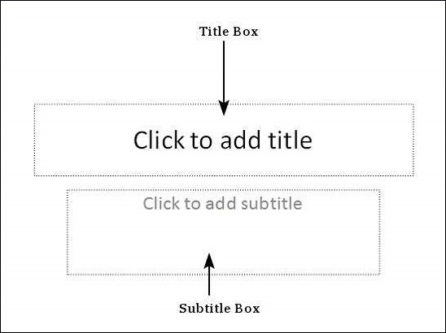
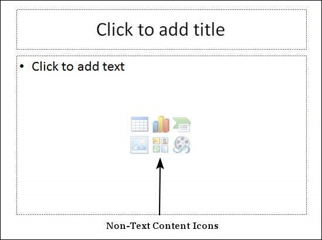
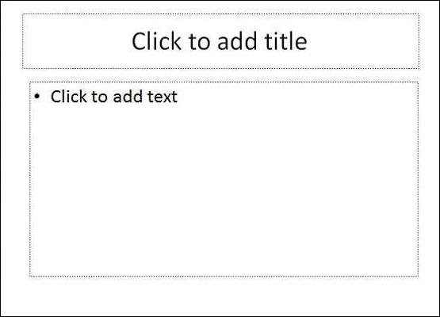

# Adding Text in Boxes in Powerpoint 2010
PowerPoint allows users to add text to the slide in a well-defined manner to ensure the content is well distributed and easy to read. The procedure to add the text in a PowerPoint slide is always the same - just click in the text box and start typing. The text will follow the default formatting set for the text box, although this formatting can be changed later as required. What changes is the different kinds of content boxes that support text in a PowerPoint slide.

Given below are some of the most common content blocks you will see in PowerPoint.

## Title Box
This is typically found on slides with the title layout and in all the slides that have a title box in them. This box is indicated by "**Click to add title**".

## Subtitle Box
This is found only in slides with the **Title** layout. This is indicated by "**Click to add subtitle**"

## Content Box
This is found in most of the slides that have a placeholder for adding content. This is indicated by "**Click to add text**". As you can see, this box allows you to add text as well as non-text content. To add text to such a box, click anywhere on the box, except on one of the content icons in the center and start typing.

## Text Only Box
This is not a default content box available in PowerPoint, but you can create it using Slide Master, if required. This is also indicated by "**Click to add text**". The only difference between the **Text Only Box** and the **Content Box** is that the former only supports text in the content area.

[Previous Page](../powerpoint/powerpoint_add_new_slides.md) [Next Page](../powerpoint/powerpoint_adding_new_text_boxes.md) 
