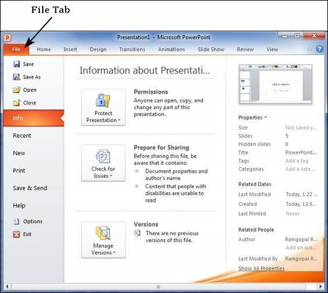
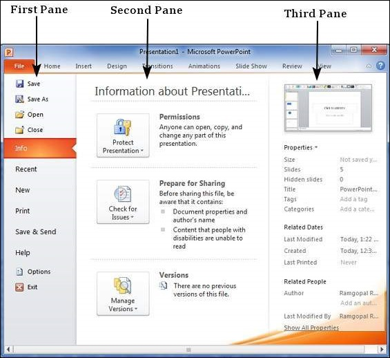

# Backstage View in Powerpoint 2010
In Office 2010, Microsoft replaced the traditional file menu with the new **Backstage** view. This view not only offers all the menu items under the file menu, but additional details which makes management of your files a lot easier.

## Accessing Backstage View
You can access the Backstage view simply by clicking on the File tab. You can exit this view by clicking on any tab (including the File tab again). You can also press the '**Esc**' button on the keyboard.

## Organization of Backstage View
The backstage view has three sections or panes.

   * **First Pane** − This is the commands pane which consists of all the commands you would typically find in the file menu of older versions. You also have the **Options** menu which lets you edit the options on the program like customizing the ribbon.

Various commands under the first pane are described in the table below −

   * **Second Pane** − This is the subcommands pane. This will list all the commands related to the main command you choose in the first pane. For example, if you select Print in the first pane, you get to choose the printer and adjust the print settings in the second pane.
   * **Third Pane** − This is the preview or file information page. Depending on the command and the subcommand you select, this pane will either display the properties of the file or give you a preview of the file.

[Previous Page](../powerpoint/powerpoint_explore_window.md) [Next Page](../powerpoint/powerpoint_create_presentation.md) 
