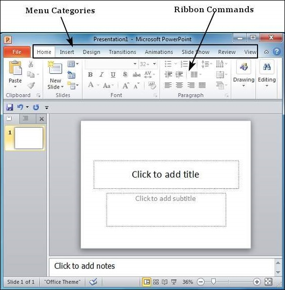

# Create Presentation using Powerpoint 2010
PowerPoint offers a host of tools that will aid you in creating a presentation. These tools are organized logically into various ribbons in PowerPoint. The table below describes the various commands you can access from the different menus.

Besides these depending on the objects selected in the slide, there are other menu tabs that get enabled.

[Previous Page](../powerpoint/powerpoint_backstage.md) [Next Page](../powerpoint/powerpoint_add_new_slides.md) 
