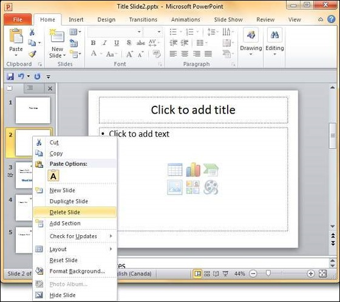
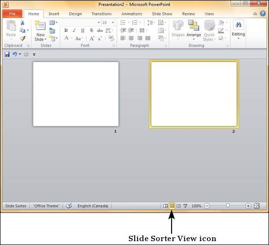
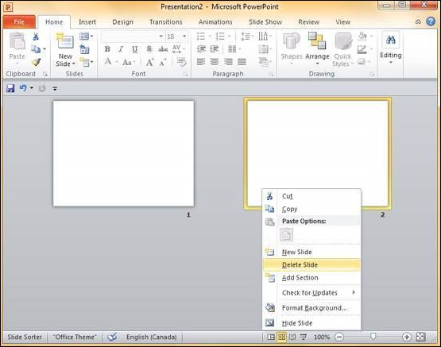

# Deleting Existing Slide in Powerpoint 2010
There are times while building a slide deck, you may need to delete some slides. This can be done easily from PowerPoint. You can delete the slides from the **Normal** view as well as the **Slide Sorter** view. In each view, you can delete the slides in two ways.

## Deleting from Normal View
**Step 1** − Go to the Normal view.

**Step 2** − Right-click on the slide to be deleted and select the **Delete Slide** option.

Alternately, you can select the slide and press the **Delete** button on your key board.

## Deleting from Slide Sorter View
Let us now understand how to deleted slides from the Slide Sorter View.

**Step 1** − Go to the Slide Sorter view.

**Step 2** − Right-click on the slide to be deleted and select the **Delete Slide** option.

Alternately, you can select the slide and press the **Delete** button on your key board.

[Previous Page](../powerpoint/powerpoint_adding_new_text_boxes.md) [Next Page](../powerpoint/powerpoint_rearranging_slides.md) 
