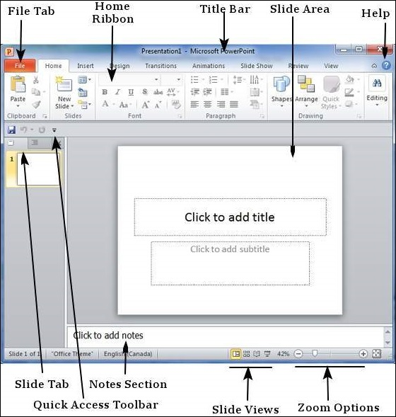
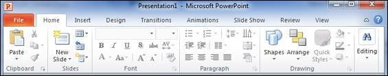
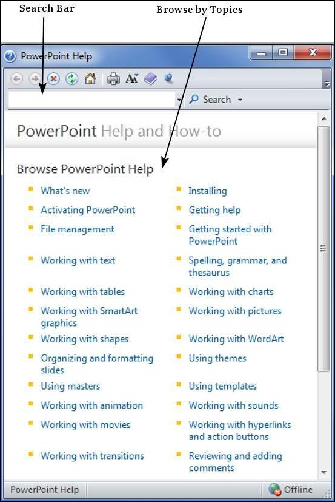

# Explore Windows in Powerpoint 2010
The following screenshot shows the various areas in a standard PowerPoint file. It is important to familiarize yourself with these areas as it makes learning and using PowerPoint easier.

## File Tab
This tab opens the **Backstage** view which basically allows you to manage the file and settings in PowerPoint. You can save presentations, open existing ones and create new presentations based on blank or predefined templates. The other file related operations can also be executed from this view.

## Ribbon

The ribbon contains three components −

   * **Tabs** − They appear across the top of the Ribbon and contain groups of related commands. **Home**, **Insert**, **Page Layout** are examples of ribbon tabs.
   * **Groups** − They organize related commands; each group name appears below the group on the Ribbon. For example, a group of commands related to fonts or a group of commands related to alignment, etc.
   * **Commands** − Commands appear within each group as mentioned above.

## Title Bar
This is the top section of the window. It shows the name of the file followed by the name of the program which in this case is Microsoft PowerPoint.

## Slide Area
This is the area where the actual slide is created and edited. You can add, edit and delete text, images, shapes and multimedia in this section.

## Help
The Help Icon can be used to get PowerPoint related help anytime you need. Clicking on the "**?**" opens the PowerPoint Help window where you have a list of common topics to browse from. You can also search for specific topics from the search bar at the top.

## Zoom Options
The zoom control lets you zoom in for a closer look at your text. The zoom control consists of a slider that you can slide left or right to zoom in or out, you can click on the - and + buttons to increase or decrease the zoom factor. The maximum zoom supported by PowerPoint is 400% and the 100% is indicated by the mark in the middle.

## Slide Views
The group of four buttons located to the left of the Zoom control, near the bottom of the screen, lets you switch between PowerPoint views.

   * **Normal Layout view** − This displays page in normal view with the slide on the right and a list of thumbnails to the left. This view allows you to edit individual slides and also rearrange them.
   * **Slide Sorter view** − This displays all the slides as a matrix. This view only allows you to rearrange the slides but not edit the contents of each slide.
   * **Reading View** − This view is like a slideshow with access to the Windows task bar in case you need to switch windows. However, like the slideshow you cannot edit anything in this view.

## Notes Section
This sections allows you to add notes for the presentation. These notes will not be displayed on the screen during the presentation; these are just quick reference for the presenter.

## Quick Access Toolbar
The Quick Access Toolbar is located just under the ribbon. This toolbar offers a convenient place to group the most commonly used commands in PowerPoint. You can customize this toolbar to suit your needs.

## Slide Tab
This section is available only in the Normal view. It displays all the slides in sequence. You can **add**, **delete** and **reorder** slides from this section.

[Previous Page](../powerpoint/powerpoint_getting_started.md) [Next Page](../powerpoint/powerpoint_backstage.md) 
