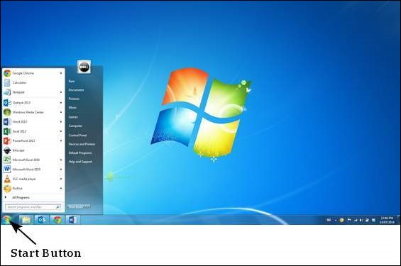
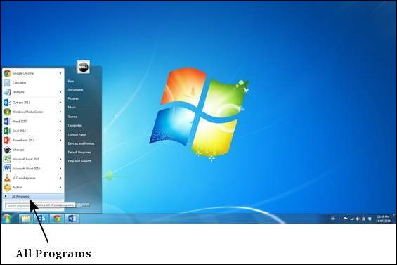
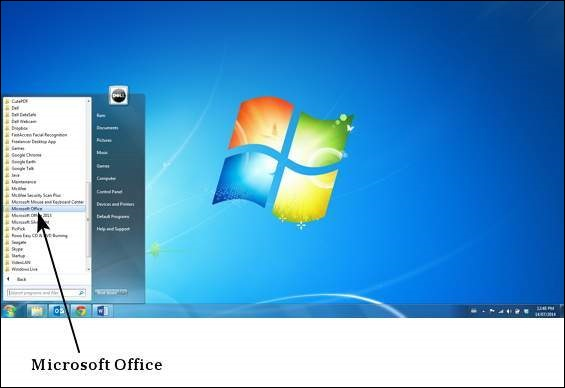
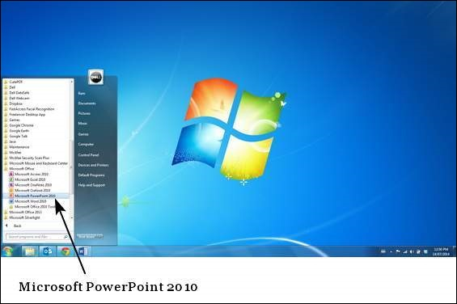
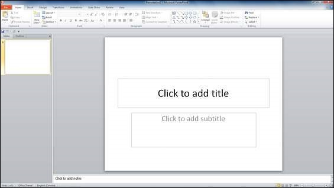

# Getting Started with Powerpoint 2010
In this chapter, we will understand how to get started with PowerPoint 2010. We will understand how to start PowerPoint 2010 application in simple steps. To access PowerPoint 2010, you must have Microsoft Office 2010 installed in your PC. Only Office 2010 Home and Student, Home and Business, Standard, Professional and Professional Plus packages have PowerPoint included in them. Other packages may have a viewer, but you cannot create presentations with them.

**Step 1** − Click the **Start** button.

**Step 2** − Click **All Programs** option from the menu.

**Step 3** − Search for **Microsoft Office** from the sub menu and click it.

**Step 4** − Search for **Microsoft PowerPoint 2010** from the submenu and click it.

This will launch the Microsoft PowerPoint 2010 application and you will see the following presentation window.

[Previous Page](../powerpoint/index.md) [Next Page](../powerpoint/powerpoint_explore_window.md) 
