# Managing Sections in Powerpoint 2010
Given the popularity of PowerPoint and its versatility, there are situations when you are dealing with very large slide decks or just collaborating with different people to build the slides. In such cases, it is always helpful to be able to segregate the slides into smaller groups and work with these groups. PowerPoint 2010 introduces the concept of sections to achieve this. Here are the main functions you can execute with sections.

## Creating Sections
The steps to create a new section are as follows. You can execute these steps from the Normal view or the Slide Sorter view.

**Step 1** − In the **Normal** view or the **Slide Sorter** view, right-click at the position where you want to add the section and select **add section**.

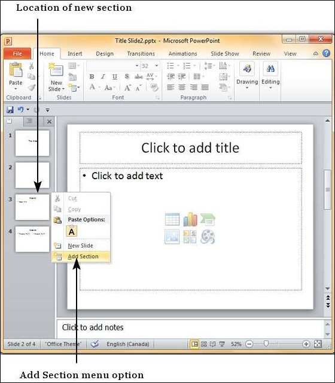

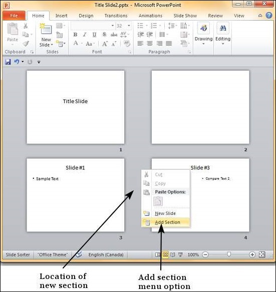

**Step 2** − The new section gets added to the presentation with all the subsequent slides being included in this section.

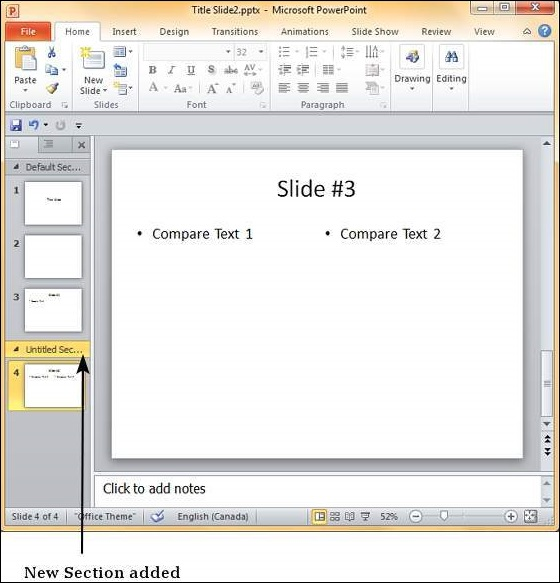

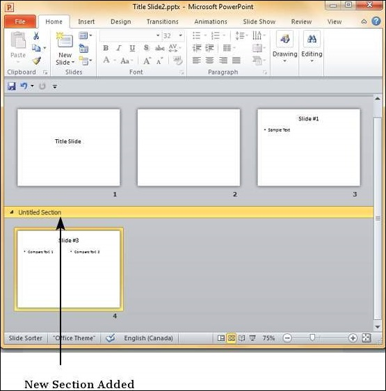

**Step 3** − By default, the new section is named "**Untitled Section**" but you can change the section name. Right-click on the section and select "**Rename Section**".

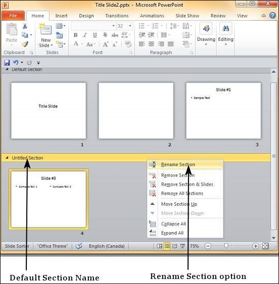

**Step 4** − In the **Rename Section** dialog box, enter the new section name. This accepts all the characters including alphabets, numbers, special characters, punctuations, etc.

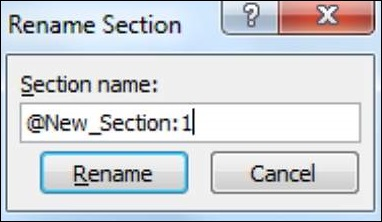

**Step 5** − Click on the "**Rename**" button on the dialog to rename the section.

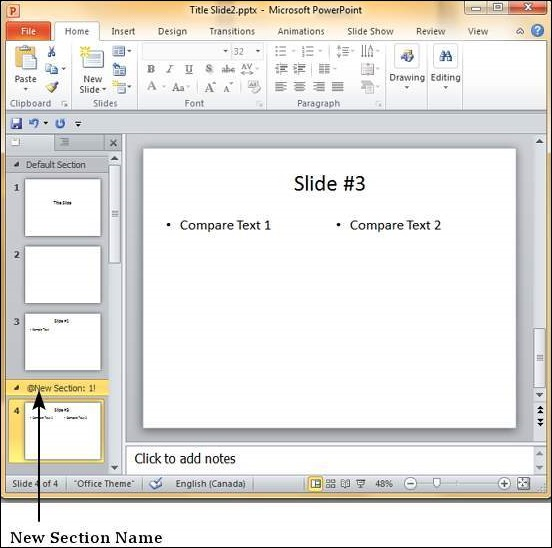

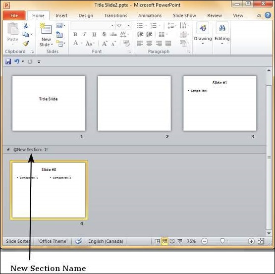

## Rearranging Sections
One of the advantages of sections is that you can not only group slides together, but also rearrange them as one set. Instead of having to move each slide individually, you can move the entire section. Just like rearranging slides you can drag and move the sections. Alternately, you can right-click on the section and move it up or down as shown below.

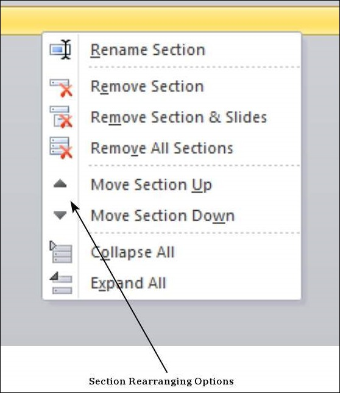

If there are many slides to work with, you can collapse them so you view just the sections. This makes rearranging them less confusing too.

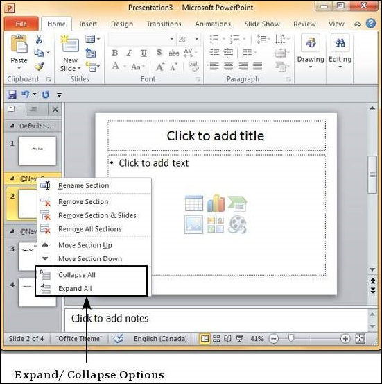

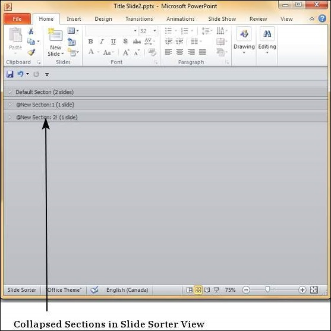

## Deleting Sections
PowerPoint 2010 provides three options to delete sections. The table below explains the function of each option.

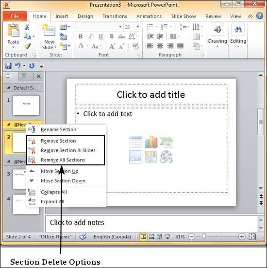

[Previous Page](../powerpoint/powerpoint_adding_slide_notes.md) [Next Page](../powerpoint/powerpoint_working_with_outlines.md) 
