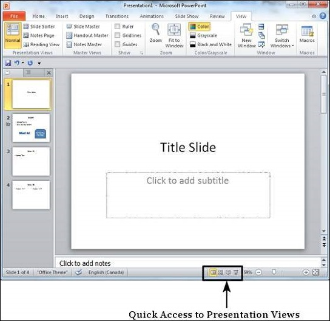
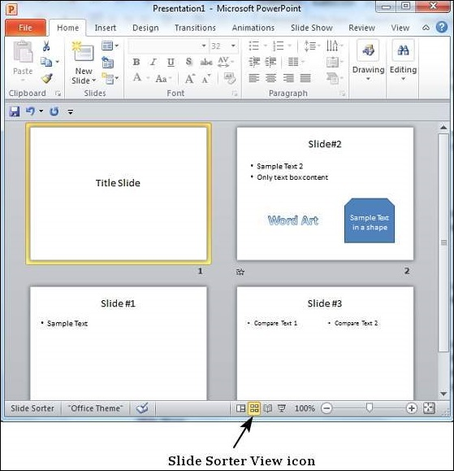
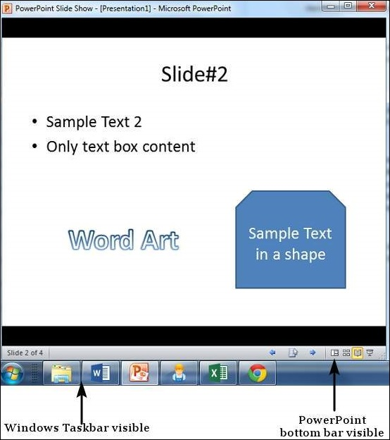
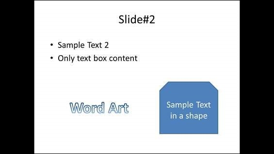

# Presentation Views in Powerpoint 2010
PowerPoint supports multiple views to allow users to gain the maximum from the features available in the program. Each view supports a different set of functions and is designed accordingly.

PowerPoint views can be accessed from two locations.

   * Views can be accessed quickly from the bottom bar just to the left of the zoom settings.

   * Views can also be accessed from the **Presentation Views** section in the View ribbon

Here is a short description of the various views and their features.

## Normal View
This is the default view in PowerPoint and this is primarily used to create and edit slides. You can create/ delete/ edit/ rearrange slides, add/ remove/ modify content and manipulate sections from this view.

## Slide Sorter View
This view is primarily used to sort slides and rearrange them. This view is also ideal to add or remove sections as it presents the slides in a more compact manner making it easier to rearrange them.

## Reading View
This view is new to PowerPoint 2010 and it was created mainly to review the slideshow without losing access to rest of the Windows applications. Typically, when you run the slideshow, the presentation takes up the entire screen so other applications cannot be accessed from the taskbar. In the reading view the taskbar is still available while viewing the slideshow which is convenient. You cannot make any modifications when on this view.

## SlidesShow
This is the traditional slideshow view available in all the earlier versions of PowerPoint. This view is used to run the slideshow during presentation.

[Previous Page](../powerpoint/powerpoint_sidebar.md) [Next Page](../powerpoint/powerpoint_setting_backgrounds.md) 
