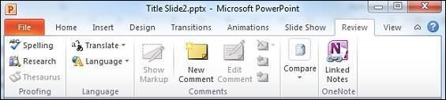

# Review Presentation in Powerpoint 2010
Reviewing the presentation can be a very powerful way of eliminating the errors and perfecting the slides. PowerPoint offers a wide range of reviewing options for you to use. Some of them are automatic or system driven, while others aid other users to collaborate and review the slides. All the reviewing tools are grouped under the **Review** ribbon.

[Previous Page](../powerpoint/powerpoint_saving_presentation.md) [Next Page](../powerpoint/powerpoint_adding_slide_numbers.md) 
