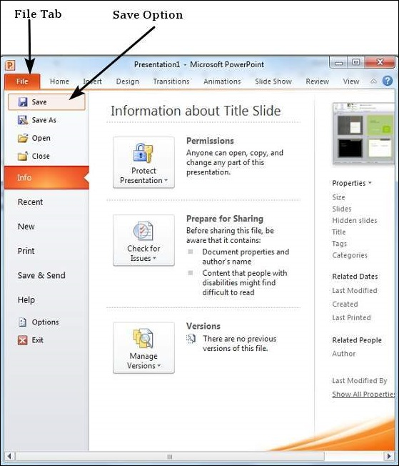
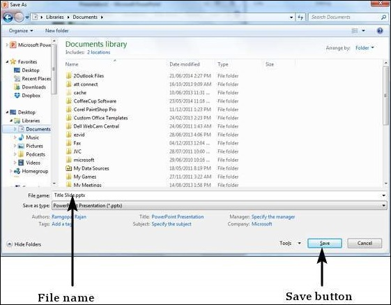
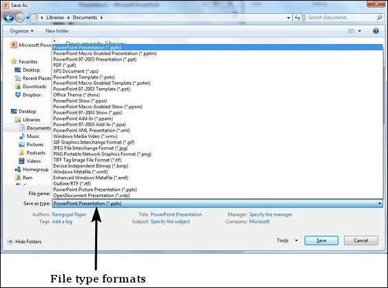
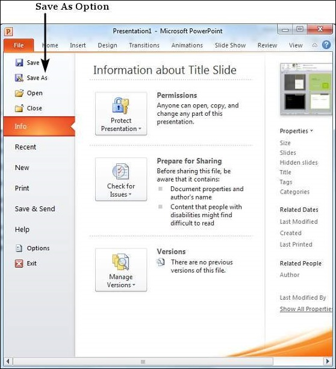

# Saving Presentation in Powerpoint 2010
One of the most basic tasks in PowerPoint is being able to save your work; this is probably the most important task as well. There are many users who have burnt their fingers for not saving their work in time and losing hours of hard work. The following are the basic steps to save a presentation.

**Step 1** − Click on the **File** tab to launch the **Backstage** view and select **Save**.

**Step 2** − In the **Save As** dialog, type in the file name and click "Save".

**Step 3** − The default file format is **.pptx**. If you want to save the file with a different name, choose one of the file types from the "**Save as type**" dropdown list.

If you are working on an already saved file, the "Save" option in the **Backstage** view will directly save the file in the existing format with the existing name. If you want to change the format or filename of an existing file, use the **Save As** option instead.

[Previous Page](../powerpoint/powerpoint_slide_orientations.md) [Next Page](../powerpoint/powerpoint_review_presentation.md) 
