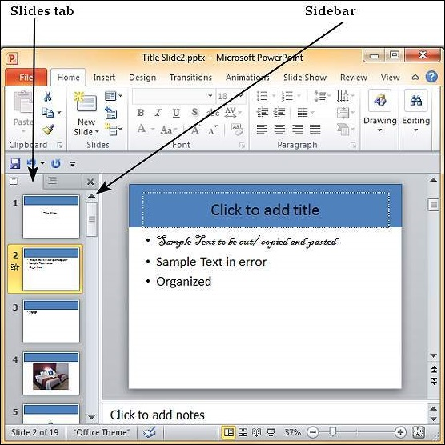
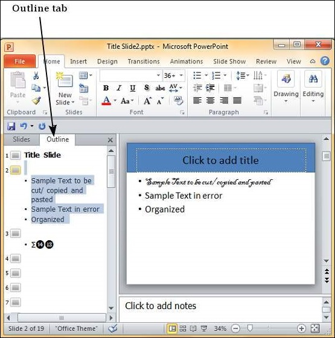
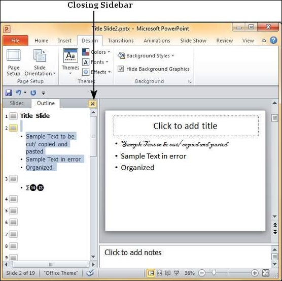

# Sidebars in Powerpoint 2010
 PowerPoint slides have a left-hand side bar which offers two invaluable views. These views are great to review the slides and edit them. The side bar is available in the Normal view and by default, it is set to the **Slides** tab.

## Slides Tab
This tab shows all the slides stacked vertically in a sequential manner. You can select individual slides from this tab and also perform some tasks like changing slide layouts, reordering slides, inserting new slides, deleting slides, etc. Although you cannot edit the slide contents from this tab, you can select the slide and make edits from the slide displayed to the right.

## Outline Tab
This is the tab right next to the Slides tab and as the name suggests, this provides the outline for the slide. This section just displays all the textual content from every slide - this can be very useful if there is a lot of non-text content in the slide and reviewing just the written part gets difficult. Unlike in the slides tab, you can edit the text from this section.

If you need greater viewing space, you can close the sidebar by click on the X on the top right of this bar.

To recover the sidebar, just click on the **Normal** view icon again.

[Previous Page](../powerpoint/powerpoint_working_with_outlines.md) [Next Page](../powerpoint/powerpoint_presentation_views.md) 
