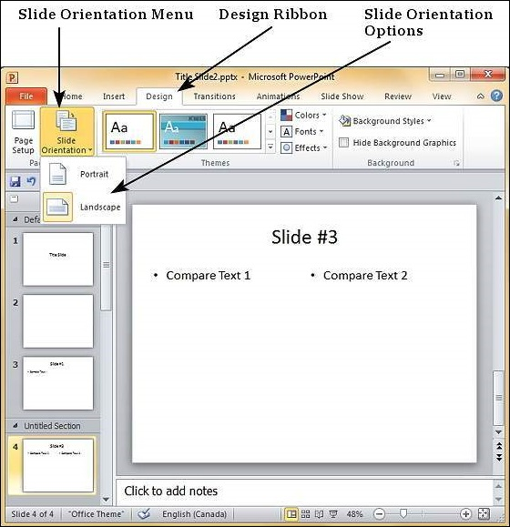

# Slide Orientations in Powerpoint 2010
In the recent years, presentations are being used for more than just as a high end replacement for transparencies and projectors. With its unique features, PowerPoint is becoming quite versatile in the kind of information it can depict and very flexible in its usage. The slide orientations are invaluable part of this improved list of PowerPoint features. Like most other applications PowerPoint supports two orientations: **landscape** and **portrait**.

The **Landscape** layout is the default PowerPoint layout and it is probably the more commonly used one. In the landscape layout, the longer edge is horizontal so the slides align better with the screens and projectors.

The **Portrait** layout is where the shorter edge is horizontal. This is sometimes better for print depending on the kind of content you want to present.

Slide orientations in PowerPoint can be changed from the **Design** ribbon using the **Slide** Orientation command.

[Previous Page](../powerpoint/powerpoint_setting_backgrounds.md) [Next Page](../powerpoint/powerpoint_saving_presentation.md) 
