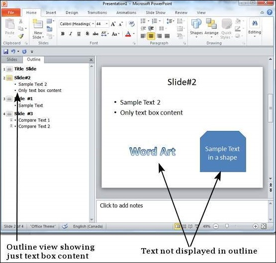
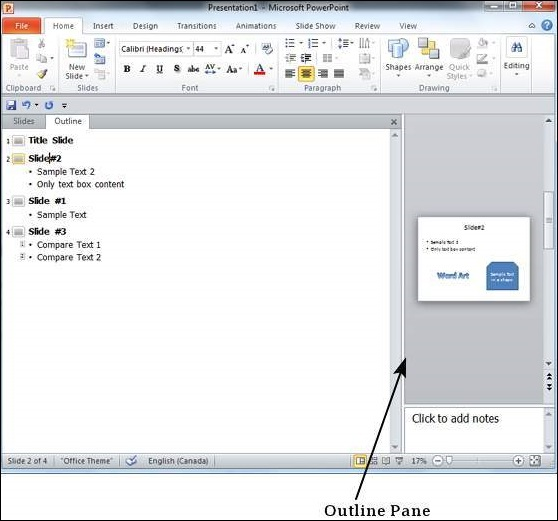

# Working With Outlines in Powerpoint 2010
PowerPoint is a great program that allows you to bring together text, images, shapes and multimedia. However, sometimes you may just want to review the text without focusing on the non-text aspects of the slide deck. This is where the **Outline** view in PowerPoint is quite useful. The Outline view can be accessed from the tab adjacent to the Slide tab in the **Normal** view.

The outline view shows just the text content from various slides. This view does not show the text entered in the non-text box like SmartArt, WordArt or any other shapes.

By default, the outline pane size is the same as the slide tab pane; hence it is small. However, you can drag the pane out to increase the size to improve readability.

[Previous Page](../powerpoint/powerpoint_managing_sections.md) [Next Page](../powerpoint/powerpoint_sidebar.md) 
