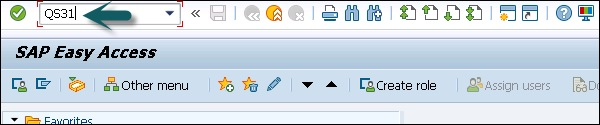
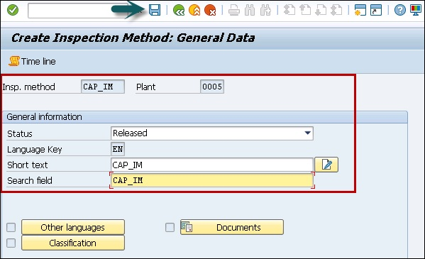
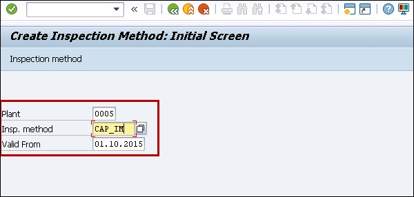

# SAP QM - Inspection Methods
You can use the inspection method to perform the inspection. An inspection method can be assigned to master inspection characteristics or directly to an inspection characteristics in an inspection plan.

An Inspection method can be created in one plant and the same method can be used in other plants.

## Creating an Inspection Method
To create an inspection method, use **T-Code: QS31**.

**Step 1** − The following image shows you how to run the T-code for creating an Inspection method.

**Step 2** − In next screen, enter the following details −

   * Enter status as Released.
   * Enter the short text of the inspection method and search field for searching for inspection methods.

**Step 3** − To save the Inspection method, click the save button.

**Step 4** − In next window, enter the following details −

   * Enter Plant Code.
   * Enter inspection method to be created.
   * Enter the valid from the date that determines the inspection method valid date.

Press ENTER to go to the next screen.

[Previous Page](../sap_qm/sap_qm_master_data.md) [Next Page](../sap_qm/sap_qm_sampling.md) 
