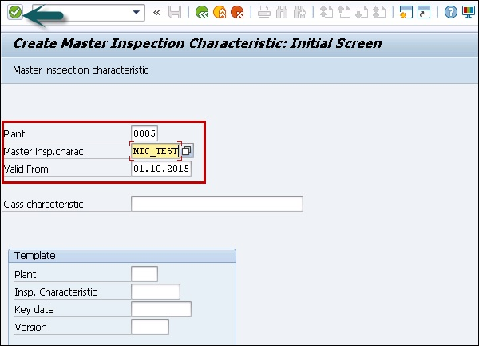
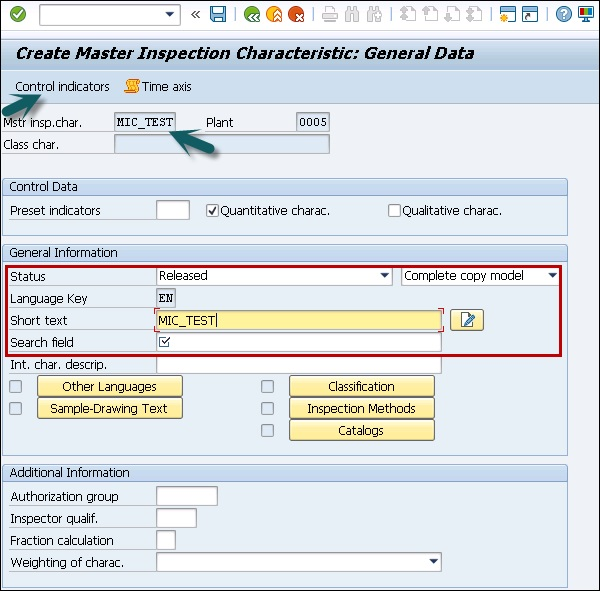
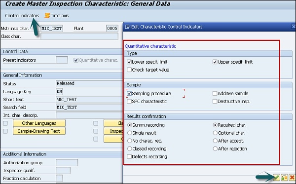
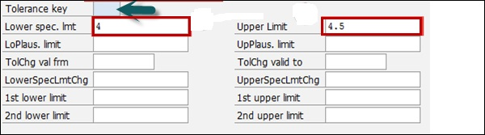
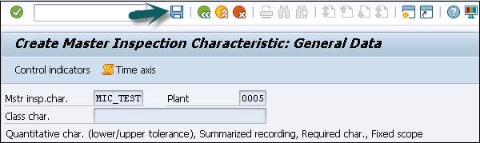

# SAP QM - Master Data
To perform the quality process, you need to maintain data related to inspection planning in SAP system. You need to maintain the data for quality planning to maintain standard reports related to material master, supplier, and customer complaints.

The following master records have to be created related to Quality planning −

## Master Inspection Characteristics (MIC)
You can define inspection specifications for the materials. For example, dimensions of inspected material width, length and height of the material, etc. Master inspections are specified at the production level and you can organize the master inspection specifications to remove duplicate specifications.

These specifications are used in the inspection plan, and equipment’s specifications are used in the inspection plan.

You can define the following type of master inspection specifications in SAP QM system −

### Quantitative specifications
You can directly get the results for quantitative specifications from inspection while recording the result. You can set the limits like minimum and maximum value for each parameter at the master level. You can also attach the inspection method to the inspection specification level.

### Qualitative specifications
These specifications can take values like true/false or OK/Not OK.

## Creating a Master Inspection Characteristic
To create a master inspection, follow the steps given below −

**Step 1** − Use the **T-Code: QS21** in SAP Easy access. In the following screenshot, you can see how to start creating an MIC.

**Step 2** − In the next window, enter the following details −

   * Enter Plant Code.
   * Enter master inspection characteristic code to be created.
   * Enter the valid from date and click ENTER.

**Step 3** − In the next screen, enter the following details −

   * Select the checkbox for quantitative if you are creating Quantitative Characteristic which can be measured.
   * Select the status as **"Released"**
   * Select **Complete copy model** from the drop-down list as the MIC data needs to be maintained completely.
   * Enter the Short text and search field as per your choice.
   * Click the **Control indicators** button at the top to maintain other important data like lower and upper limits. You can define the range when material is accepted for production.

**Step 4** − Once you click the **Control Indicator** button, a new dialog box appears. This is to maintain the lower and upper limit data.

   * Select Lower specification limit.
   * Select upper specification limit.
   * Select sampling procedure to use sampling procedure.

**Step 5** − To move to the next screen, press ENTER and you will be redirected to the Tolerance window.

**Step 6** − Click the tick mark and you will be on the main screen. To save the master inspection characteristics, click the save button.

[Previous Page](../sap_qm/sap_qm_integration.md) [Next Page](../sap_qm/sap_qm_inspection_methods.md) 
